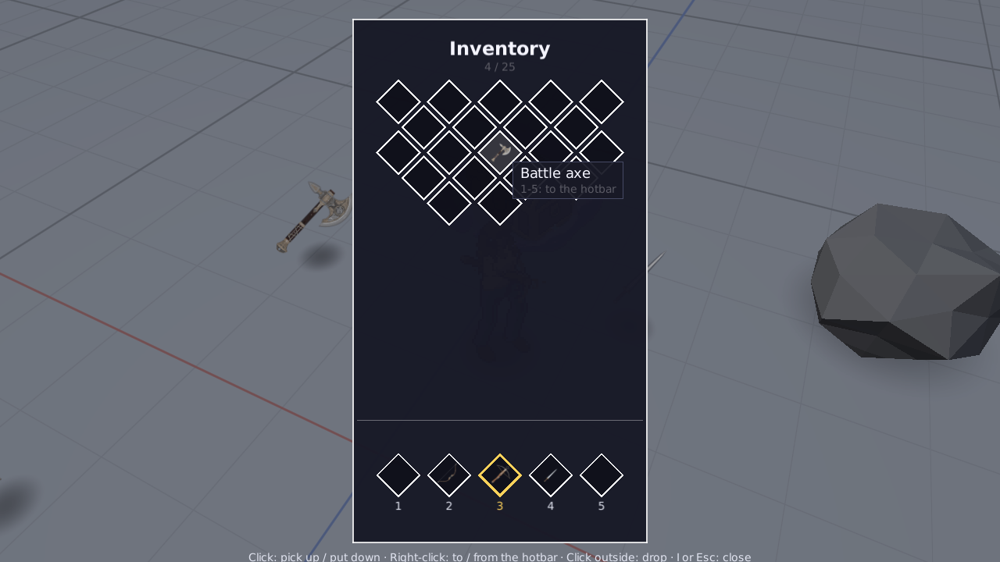
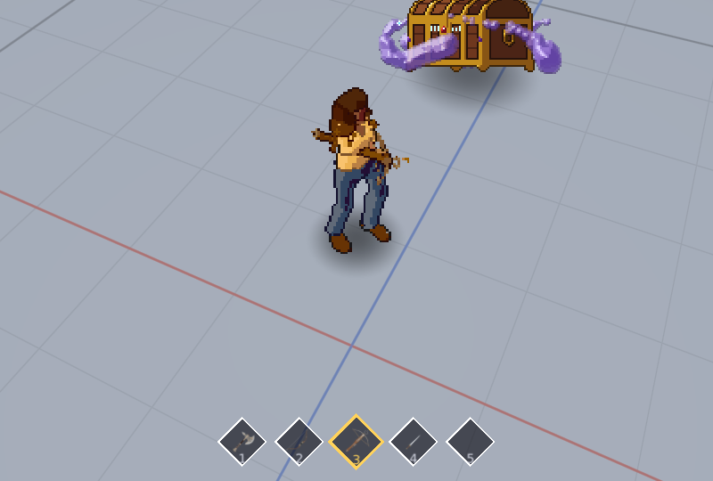
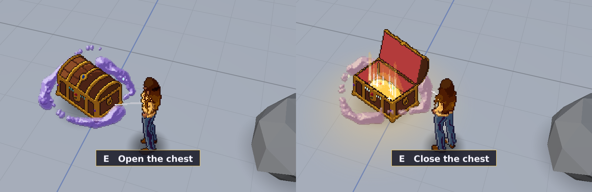
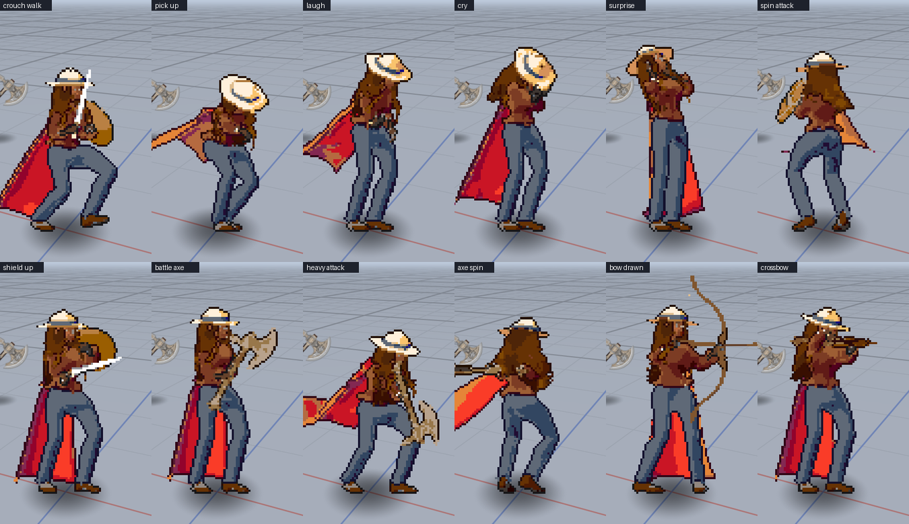
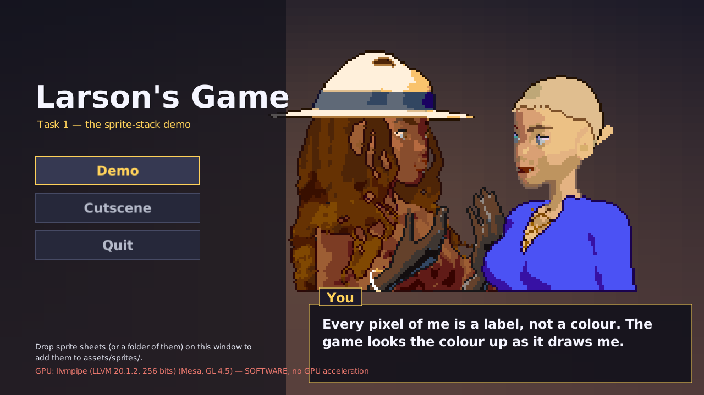
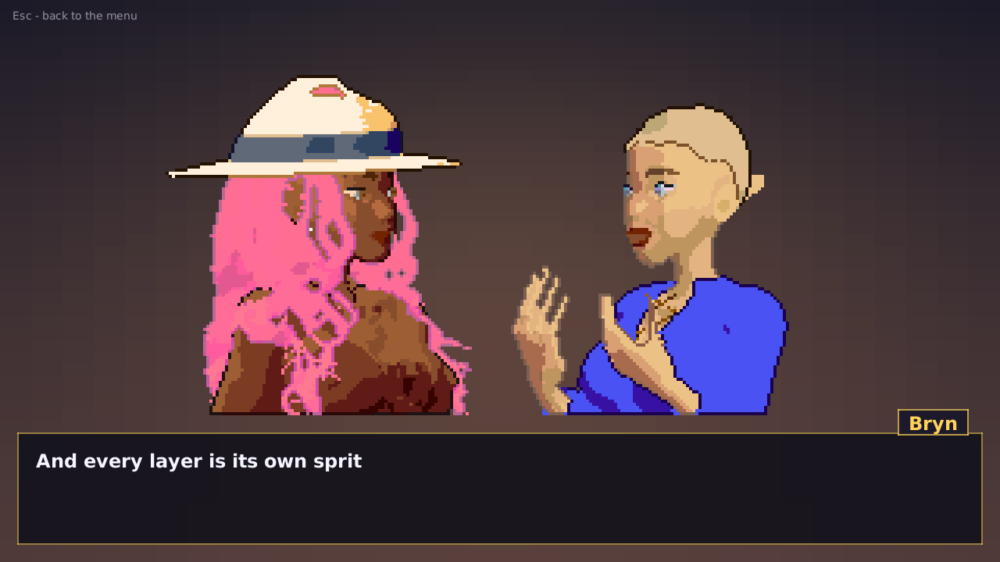
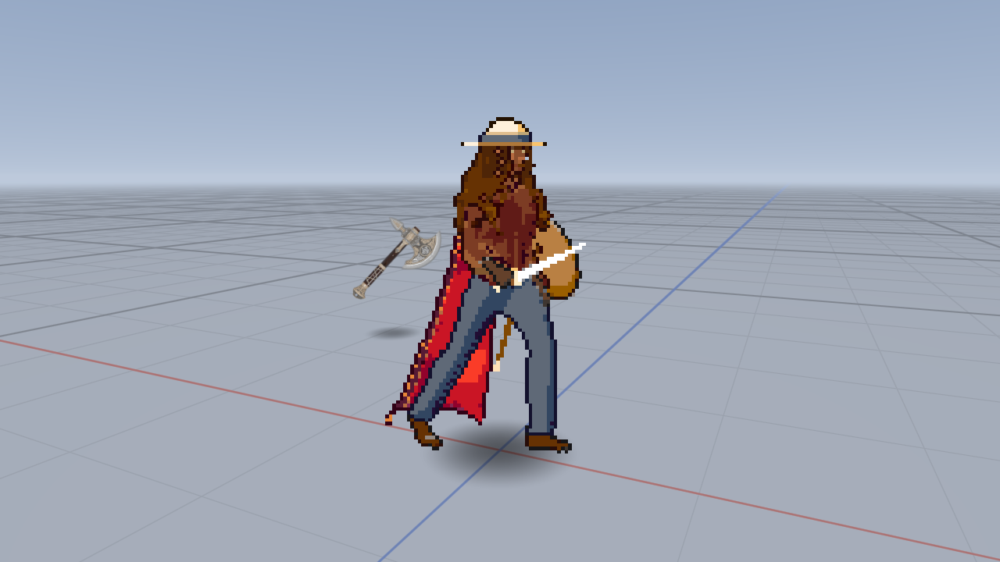
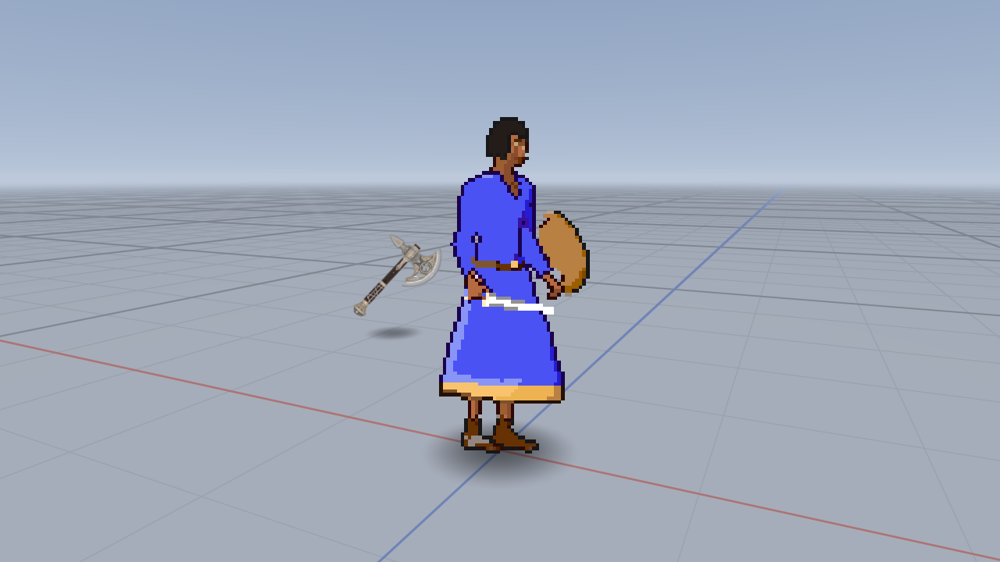
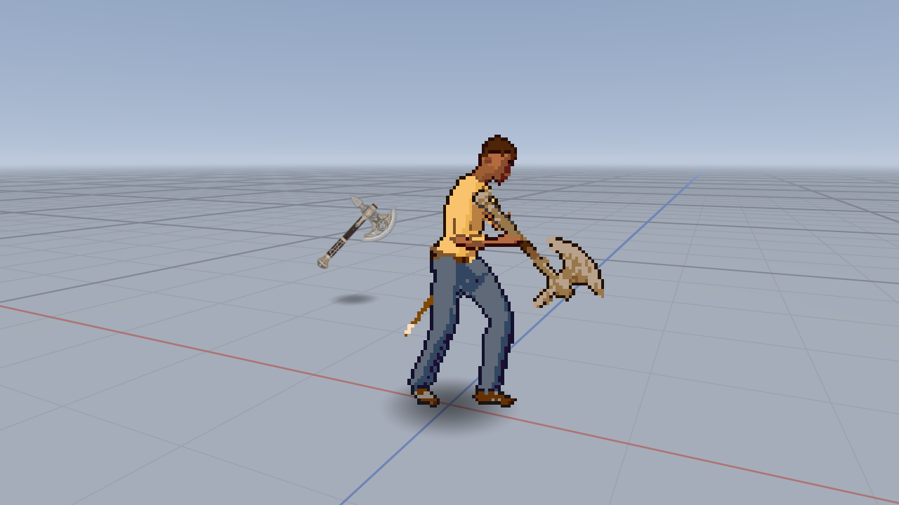
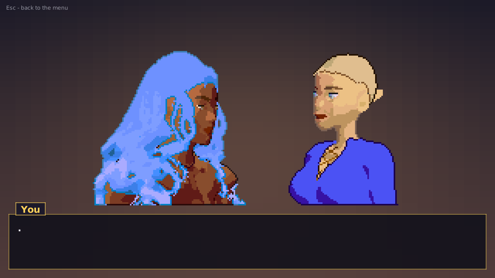

# Larson's Game

A 3D game whose characters and items are **2D sprites** — pre-rendered in
Blender from eight directions and three heights, and stacked layer by layer so
every shirt, hat and sword is its own sprite sheet — built on mechanics from
[Larsons-Game-Engine](https://github.com/Larleeloo/Larsons-Game-Engine).
Everything is drawn on the GPU with OpenGL.

<p align="center">
  
  
</p>

This README is also the plan: each task is a set of chunks, and each chunk is
ticked off as it lands.

- [Quick start](#quick-start)
- [Controls](#controls)
- [What's in the demo](#whats-in-the-demo)
- [The sprite stack](#the-sprite-stack)
- [The inventory and the hotbar](#the-inventory-and-the-hotbar)
- [The treasure chest](#the-treasure-chest)
- [Sound](#sound)
- [GPU acceleration](#gpu-acceleration)
- [Project layout](#project-layout)
- [What came from the engine](#what-came-from-the-engine)
- [Tests and scripted runs](#tests-and-scripted-runs)
- [The plan](#the-plan)

---

## Quick start

Needs **JDK 21** and a graphics driver with **OpenGL 3.3** (anything from the
last decade). Gradle comes with the repository.

**IntelliJ IDEA:** open the folder, let it import the Gradle project, and pick
**Run Game (GPU)** from the run-configuration dropdown.

**Command line:**

```bash
./gradlew runGpu        # the game, GPU acceleration on (what the IntelliJ profile runs)
./gradlew run           # the same game, letting the OS pick the GPU
./gradlew test          # unit tests — no GPU needed
./gradlew sampleSprites # a stand-in sprite set in build/sample-sprites/ to try the importer on
./gradlew gameJar       # build/libs/larsons-game.jar, LWJGL included (put assets/ beside it)
```

The main menu has one entry, **Demo**, which loads the void.

## Controls

| Key | Action |
|---|---|
| **W A S D** | walk, relative to the camera |
| **Shift** / **Ctrl** (while moving) | run / sprint (crouched: Shift is the fast crouch walk) |
| **C** | crouch / stand up |
| **Space** | jump - with the sword, the axe, the bow or the crossbow |
| **Left click** or **F** | attack - with the bow, hold to draw and let go to loose |
| **X** / **R** / **Q** | heavy attack (the axe) / spin attack (sword or axe) / parry |
| **B** (held) / **V** | block - the shield up, or the weapon held across / shield bash (or attack while blocking) |
| **1 – 5** or the **mouse wheel** | choose a hotbar slot - what is in it is in her hands: a battle axe, bow or crossbow in its stance, the sword (or an empty slot) the sword and shield |
| **I** | the inventory - click an item to pick it up, click a slot to put it there, right-click to move it to or from the hotbar, click outside to drop it; 1 – 5 over a slot swaps it into that hotbar slot |
| **F1 – F4** | laugh, cry, surprise, anger |
| **E** / **G** | pick up the item you are standing by (she reaches for it), or open / shut the chest / drop what you are holding |
| **Right-drag** (or middle-drag), **arrow keys** | orbit the camera — yaw and height |
| **+ / −**, the wheel while orbiting | zoom |
| **Tab** | camera height preset: side → 45° → top-down |
| **[ / ]** | loop the previous / next of all 56 states in place |
| **Backspace** | stop looping |
| **, / .** | turn the character 45° |
| **T** | turntable — step through all eight directions |
| **H** / **P** | hide the HUD / the 3D props |
| **F9** | animations: new / classic - the first version of the weapon moves, to compare (also Pause → Settings → Animations) |
| **F12** | screenshot (to `screenshots/`) |
| **Esc** | pause menu — Wardrobe, Settings, Controls, Import help, Main menu, Quit (or closes the inventory) |

Drop sprite sheets on the window at any time to import them.

## What's in the demo

- **A blank 3D void** — an endless floor with a metre grid fading into a soft
  sky, drawn in a single full-screen GPU pass that ray-casts the ground plane
  per pixel, so it has no edge and a clean horizon at any zoom.
- **The character**, standing in the middle as a stack of sprite layers, in
  **56 animation states**, each from **8 directions × 3 heights**: idle, walk,
  run, sprint, jump and attack; crouching (an idle, a walk and a fast walk);
  reaching down to pick something up, standing or crouched; four emotes -
  laughing, crying, surprise and anger; the sword's spin attack and parry and
  the shield held ready and bashed; and the three weapons' stances below. The
  HUD names the exact sheet each layer is drawing (and, where a set has no
  sheets for a state, the state it is shown as instead), and a gauge at the
  top right shows the camera's angle against the three height zones.
- **A sword, a battle axe, a longbow and a crossbow** hovering over their
  shadows nearby. Walk up and press **E**: she reaches out for it (crouched,
  if she is) and it is hers as her hand closes on it - in the first free
  slot of her [hotbar](#the-inventory-and-the-hotbar), which is selected,
  so it is in her hands. The sword goes into her
  weapon hand - its own sprite layer, playing frame for frame with the body.
  The others are each a **stance** of its own, with its own idle, walk, run,
  sprint, jump, crouch and crouch walk: the **battle axe** in both hands (an attack,
  a heavy overhead blow, a spin attack, a crouched sweep, a parry, a block),
  the **bow** (drawn while the attack is held, loosed when it is let go, crouched
  too; a parry and a block), the **crossbow** (a shot, crouched too; a parry and
  a block). **1 – 5** or the mouse wheel choose between the hotbar's slots,
  **G** puts down what she holds. A
  left-handed character (Pause → Wardrobe → Hand) takes everything in the other
  hand and fights left-handed.
- **An inventory** (**I**) of diamond-shaped slots on a background of your
  own, with a **hotbar** of five along the bottom of the screen - see
  [The inventory and the hotbar](#the-inventory-and-the-hotbar).

  
  
- **An ornate treasure chest** on the ground, drawn like the character from
  all 8 directions and 3 heights in 128-pixel pixel art, magical smoke
  swirling round it. **E** throws its lid open: it lights up from inside,
  light welling out of it and its smoke glowing, and **E** again slams it
  shut. Every one of its animations has a sound hook - see
  [The treasure chest](#the-treasure-chest).

  
- **Sound for every animation** - both bodies' 56 states, the chest's four,
  picking up and dropping each item, the inventory - from MP3 (or WAV)
  files dropped into `assets/sounds/`, with the engine's MP3 decoder and
  mixer. Every slot is silent until it has a file - see [Sound](#sound).

  
- **3D scenery** round the edge — a cottage, trees, rocks — real low-poly
  geometry, depth-tested against the sprites so the character can walk behind a
  tree.
- **A pause menu** with the **Wardrobe**: all 23 cosmetic layers, each cycling
  through the items found for it on disk and, for the pixel-art items, through
  the colours they come in (swatches beside the item; the body's colour is the
  skin tone of every layer), plus the drawing style and the hand - with a live
  preview you can turn through the eight directions, tip through the three
  heights and play in every state.
- **A cutscene** behind the main menu: **your own character** - exactly as
  the wardrobe has her - talking with Bryn, close up, so their faces show:
  every character a stack of close-up layers, one per item she wears, each
  in any colour, with lines that type themselves out, colours that fade
  mid-sentence and warm and cold light. **Cutscene** in the menu plays it
  full screen. See [Cutscenes](#cutscenes).

  
  
- **Drag-and-drop importing** of sprite sheets into the repository.
- **A rendered character** in `assets/sprites/`: the rigged feminine model from
  [3D-Modeling](https://github.com/Larleeloo/3D-Modeling) with 52 items for the
  24 layers — eleven haircuts, three shirts (flannel, a laced linen shirt, a
  laced dress), jeans, briefs, bralette, boots, gloves, a belt, a necklace,
  bangles on either wrist, scabbards on either hip, a sun hat and a beanie, a
  long mantle (a cape to the ankles), a sword and a shield for either hand,
  and the face's ears, noses, eyes, eyebrows, makeup and mouths — each in all
  56 states from all 24 views (a carried item in the states of its stance),
  the clothes and mantle cloth-simulated per animation; and the battle axe,
  the longbow and the crossbow in theirs. They are **pixel art**,
  in 128- and 64-pixel frames in one 128-colour palette, right- and
  left-handed, and every one can be recoloured: fourteen hair colours (royal
  blue among them) for the hair, the clothes, the eyes, lips, brows and makeup
  and the skin, gold or silver for the jewellery. The first outfit's 26 items
  are also 512-pixel renders; Pause → Wardrobe → Style switches the whole
  character between the renders and the two pixel sizes. Put them on in the
  Wardrobe (or see [the list](assets/sprites/README.md#the-sheets-in-this-folder)
  for a ready-made `config/wardrobe.json`).

  
  
  
  
  
  
  
- **A second body**, the masculine model (1.80 m) from 3D-Modeling's
  `generic_masculine_model/`, in `assets/sprites_masculine/`: every one of
  the 52 items - the laced dress, the bralette, the makeup and the long hair
  styles too - and the three weapons drawn on him as they are on her: the
  same states (a carried item in its stance's) from the same 24 views, in
  128- and 64-pixel frames, right- and left-handed, in the same palette and
  colours, with his own cutscene close-ups. Pause → Wardrobe →
  Base body switches body, and the outfit carries over: each item is drawn
  for the body that wears it.

  
  
  
  
- **A fallback character** when no Blender renders are present: a 32 × 32 pixel
  figure generated from a tiny rigged box model and rendered from the same 24
  camera positions the real sheets use, scaled up with crisp pixels.

<p align="center">
  
  <br><sub>One frame of the fallback walk from all 24 views — 8 directions × side, middle and top.
  The sword is its own layer, cut away wherever the hand or body is in front of it.</sub>
</p>

<p align="center">
  
  
  <br><sub>Pause → Wardrobe, and the importer after a folder of sheets was dropped on the window.
  (Captured headlessly by a scripted run on a software renderer — hence the red GPU line.)</sub>
</p>

## The sprite stack

The full contract — folder layout, naming, the Blender camera, `profile.json`,
the layer order and the holdout rule — is in
[`assets/sprites/README.md`](assets/sprites/README.md). In short:

```
assets/sprites/<layer>/<item>/<state>_<elevation>_<direction>.png
assets/sprites/body/hero/walk_middle_ne.png
assets/sprites/carry_right/sword/attack_top_s.png
assets/sprites/items/sword/icon.png                 (the pickup, lying in the world)
```

- **Bodies.** A body can have its own sprites folder beside `assets/sprites/`,
  named after it (`assets/sprites_masculine/`), holding every item drawn on
  that body under the same names; the body a character wears picks the folder
  its items come from, so one outfit (`hair: bob`) fits either body.
- **Views.** The camera's angle above the character picks the set: **side**
  (rendered at 0°) from 0° to 33°, **middle** (45°) from 34° to 75°, **top**
  (90°, birds-eye) from 75° to 90°. The direction is worked out per character
  from where the camera is, so a character across the room is seen from its own
  angle.
- **Frames.** 512 × 512, 30 fps, any count per state, left to right then top to
  bottom.
- **Layers** draw in a fixed order — body, underwear, bra, shoes, pants, shirt,
  belt, necklace, gloves, right and left wrist, sheath, ears, earrings, nose,
  eyes, eyebrows, makeup, mouth, hair, hat, other, left hand, right hand (the
  hands swap for a left-handed character; the cape draws first when she faces
  the camera and just under the hair otherwise) — every one on the body's frame
  index. Each is rendered in
  Blender with the body as a **holdout**, so the sword is already cut away where
  the hand grips it and the game only has to draw layers on top of each other.
- **Placement.** Each frame is a camera-facing card placed so the feet in the
  picture land on the character's spot on the ground — the feet stay on the
  shadow from every angle and every zoom.
- **Colours.** An item with a `variants.json` can be drawn in any of the
  colours it lists - or any colour at all, `#rrggbb`, shaded like the item's
  own. Its sheets are palette PNGs, uploaded once as their palette indices
  (a byte a texel); the sprite shader colours each layer from a palette of
  its own as it draws it (`gfx/PaletteAtlas`), so every colour of a sheet is
  one texture, two characters can wear it in different colours in the same
  draw call, and a colour can change every frame.
- **Stances.** Every state has a stance - what is in her hands while it plays
  (`sprite/Stance`): the wardrobe's own carried items (the sword and shield),
  the battle axe, the bow or the crossbow, or nothing at all (the emotes and the
  pick-ups). The hands draw the stance's: a weapon of a stance is drawn from
  `carry_right/battle_axe`, `carry_left/longbow` or `carry_right/crossbow` (the
  twin hand, mirrored, for a left-handed character) whatever the wardrobe holds,
  and the other hand is empty.
- **Fallbacks.** No body sheet for a state from a view → the first state along
  its fallbacks that has one (a crouch walk is shown as the walk, the axe's
  block as the axe's idle and then the idle; every chain ends in one of the
  first six), and every layer plays that state with it - so the 512-pixel
  renders, made before the new states, still play them all. No body sheet at
  all → the generated 32-pixel body for that view. No cosmetic sheet → that
  layer is left blank. A missing west-facing view borrows the east-facing one
  mirrored.
- **Loading.** Sheets load on demand, decode on worker threads, are cropped to
  the part of the frame they use and live in a video-memory budget with
  least-recently-used eviction; what may be needed next (the other states of
  the same stance, the neighbouring directions) is loaded ahead only into room
  the budget has spare.
  A layer change is only shown once every layer of it is ready, so a sword is
  never a frame out of step with the arm holding it.

### Importing sprite sheets

Drag sheets, a folder of them, or Blender's loose numbered frames from your file
manager onto the game window. The importer:

1. reads every name (forgivingly — `Walk-45-NorthEast.png` is fine) and every
   PNG header, and shows what it found per state, how many of the 24 views, and
   how many frames;
2. guesses the layer and item name from the folder you dropped — dropping
   `hat/red_cap/` means layer `hat`, item `red_cap` — and lets you change both;
3. stitches numbered frames into sheets, copies finished sheets as they are, and
   writes them to `assets/sprites/<layer>/<item>/` under canonical names —
   **inside the repository**, ready to commit;
4. reloads the library and, if *Wear it after importing* is ticked, puts the new
   item on the character.

## The inventory and the hotbar

The player carries an **inventory** (`world/Inventory`) of any number of
slots - 25 by default, `-Dlarsons.inventory.slots=N` for another number (a
script's `slots <n>` changes it while the game runs; anything that no longer
fits is put on the ground). The first five slots are the **hotbar**:

- **1 – 5** or the **mouse wheel** choose a hotbar slot, and what is in it is
  what she holds. The battle axe, the bow and the crossbow are each taken up
  in their own stance; the sword - worn in the wardrobe's weapon hand - or an
  empty slot is the sword-and-shield stance, the wardrobe's own carried items.
  (The emotes, which were on 5 – 8, are on **F1 – F4**; stopping a preview,
  which was 0, is **Backspace**; the wheel zooms while orbiting, and **+ / −**
  always do.)
- Picking an item up puts it in the first free slot, the hotbar first; when
  that is a hotbar slot it is selected, so it is in her hands. With every slot
  full, nothing is picked up.
- **G** drops what is in the selected slot.

**I** opens the inventory over the middle of the screen: every slot a
**diamond** - a square stood on its corner - with a **white border**, the rest
of the inventory in an interlocking lattice that fits however many slots
there are (`InventoryPanel.lattice`), the hotbar's five in a row along the
bottom, the selected one in gold. Click an item to pick it up, click a slot to
put it there (swapping with what was in it), click outside the panel to put it
on the ground; right-click (or Shift-click) moves an item between the hotbar
and the rest; 1 – 5 over a slot swaps it into that hotbar slot. She stands
still while it is open; **I** or **Esc** closes it.

**The background** is `assets/ui/inventory_background.png`, a **432 × 768**
picture, scaled to the height of the window (never above its own size) and
kept in its shape; until there is one, a plain dark panel is drawn. It is read
again whenever the file changes, so a new background shows the next time the
inventory opens. Where things go on it, as fractions of the picture: the title
in the top 10 %, the lattice in the box 7 – 93 % across and 11 – 74 % down
(from its top), the hotbar's row 78 – 96 % down.

## The treasure chest

An **ornate treasure chest** stands a few metres behind her at the start:
dark planks under gold straps, corner posts and a gold rim, an amethyst on
each front post, a ruby in the lock plate, a sapphire in a medallion on the
lid, a row of glowing runes - and **magical smoke** winding round it, three
twisting wisps of violet with sparkles in them. It is a 2D sprite like the
character, pre-rendered from the same **8 directions × 3 heights** as **128 ×
128 pixel art** at the character's scale, and drawn as a stack of three layers
(`sprite/ObjectSprites`, `sprite/ObjectStack`):

```
assets/sprites/objects/ornate_chest/profile.json                frame 2.4 m, aimed 0.6 m up, 24 fps
assets/sprites/objects/ornate_chest/smoke_back/swirl_<elev>_<dir>.png    48 frames, loops
assets/sprites/objects/ornate_chest/chest/idle_<elev>_<dir>.png          48 frames, loops
assets/sprites/objects/ornate_chest/chest/open_<elev>_<dir>.png          20 frames, once
assets/sprites/objects/ornate_chest/chest/opened_<elev>_<dir>.png        48 frames, loops
assets/sprites/objects/ornate_chest/chest/close_<elev>_<dir>.png         16 frames, once
assets/sprites/objects/ornate_chest/smoke_front/swirl_<elev>_<dir>.png   48 frames, loops
```

- **Idle**: shut, the runes pulsing, a glint running over its gems.
- **Open** (**E** beside it): the lid rattles, is thrown back past open and
  settles, and the chest **lights up from inside** - the velvet lining and the
  heap of gold coins lit warm, light welling up out of it in shafts, a pool of
  light on the ground round it - and holds **open** (lit, the light
  flickering, sparkles over the coins). **E** again **closes** it: the lid
  slams, the light goes.
- **The smoke** is its own two layers, the part behind the chest's middle
  (drawn under it) and the part in front (over it), playing one loop on the
  world's clock whatever the chest does, so it never jumps when the lid moves;
  as the light comes up it is tinted warm, on the GPU, by a palette swap.
- **Sound hooks** on all four: `idle` and `opened` loop while they hold, `open`
  and `close` play once as they start - quieter the farther you are, panned to
  the chest's side of the screen (`chests/ornate_chest/<state>.mp3`, see
  [Sound](#sound)).
- She cannot walk into it (it pushes her back out), and the prompt says
  whether E opens or shuts it, or picks up an item nearer to her.

It is meant to become a loot chest: `world/Chest` is a small state machine
(`IDLE → OPENING → OPEN → CLOSING`) with `isOpen()` for what is found in it
to hang off. The sheets are drawn by
[3D-Modeling](https://github.com/Larleeloo/3D-Modeling)'s
`items/ornate_treasure_chest/ornate_chest_sprites.py`, which models the chest
in Blender and draws the pixel art; any object laid out like it under
`assets/sprites/objects/` can be drawn the same way (see
[`assets/sprites/README.md`](assets/sprites/README.md#objects)).

## Sound

The sound system is Larsons-Game-Engine's (`audio/`): its own **MP3 decoder**
(a pure-Java port of the public-domain minimp3, so no codec or library is
needed - WAV, AIFF and AU load through the JDK), a software **mixer** that
plays any number of sounds at once, each at its own pitch, volume and stereo
position, with every one-shot at a slightly different pitch each time, and
the **sound pack**: sound keys resolved to files by name. A machine with no
audio device is silent rather than broken.

**Every animation is a sound hook** (`audio/AnimationSound`, updated each
frame by `audio/WorldSounds`): the animation's sound starts with it - looping
for as long as a held animation holds (a walk, an idle, the chest standing
open), once for a one-shot (a swing, the lid thrown open), again when it starts
over. Picking up, dropping and taking an item in hand, and the inventory,
play where they happen. Every sound is **silent until it has a file**:

```
assets/sounds/
  SOUND_KEYS.txt          every sound in the game and the file to name it (kept up to date by the game)
  README.md               how to name and add sounds
  soundpack.json          volume, pitch, pitch variation, per-sound overrides
  player/feminine/        <state>.mp3 for each of her 56 animations: idle.mp3, walk.mp3, axe_attack.mp3 ...
  player/masculine/       ... and each of his
  chests/ornate_chest/    idle.mp3, open.mp3, opened.mp3, close.mp3
  items/<item>/           pickup.mp3, drop.mp3, equip.mp3
  ui/                     inventory_open.mp3, inventory_close.mp3, hotbar_select.mp3
```

A body's sounds are the body the wardrobe wears (any style of it), and a file
one folder up covers both bodies until one has its own: `player/walk.mp3` is
both walks, `player/masculine/walk.mp3` his alone. The same for every chest
(`chests/open.mp3`) and every item (`items/pickup.mp3`). New files are heard
the next time the game starts.

## Cutscenes

A cutscene is a script of actors and lines, played over close-up layers:

```
assets/cutscenes/<scene>.cut                          the script (menu.cut: the main menu's)
assets/closeups/<layer>/<item>_px128/<clip>_side_se.png    one layer's clip, close up (and _px64)
```

- **Close-ups** are the wardrobe's items again, rendered waist-up and close
  from the front-left three-quarter view - a face about 50 pixels tall in a
  128-pixel frame instead of 12 - for five looping conversation clips:
  `listen`, `talk`, `explain`, `laugh` and `surprise`, with mouth shapes,
  blinks, brows, nods and gestures. Every item of a layer that can show in
  the frame has them (shoes, trousers and what the hands carry are below it
  or put away), each its own layer cut against the outfit like the game
  sprites, so **any character - the player's own included - can play a
  cutscene**, in any items and any colours. A character on the right of a
  two-shot is drawn mirrored, so the two face each other.
- **Actors** (`cutscene/Actor`) are a wardrobe each - a copy of the player's,
  or dressed in the script - playing clips, and what the scene does to their
  look: a layer's colour fading to another (an option or any `#rrggbb`), a
  flash, a tint (warm light, cold light) and a fade. All of it is palette and
  vertex-colour work at draw time; no sheet is ever re-uploaded.
- **The script** (`cutscene/Cutscene`): `actor`, `stand`, `say`, `clip`,
  `colour`, `wear`, `flash`, `tint`, `fade`, `wait`, `loop` - see
  [`assets/cutscenes/README.md`](assets/cutscenes/README.md). `say` plays the
  speaker's clip for the length of the line while the others listen.
- **The stage** (`cutscene/CutsceneStage`) draws it: a backdrop, the actors'
  layers in the game's draw order at whole-pixel zoom, and the line in a box
  with the speaker's name. Layers load through the sprite library (its memory
  budget, its decoders); an actor's other clips load ahead, and while a new
  clip is still loading the actor holds its last complete frame.

## GPU acceleration

**The whole game renders through OpenGL 3.3 core** (via LWJGL 3.3.3): the void,
the 3D props, every sprite layer and shadow, and the entire UI, text included.
AWT is only used off-screen — to decode PNGs, rasterise the font atlas once,
and generate the fallback sprites.

- Rendering is premultiplied-alpha throughout, and the 512-pixel sheets get
  trilinear mipmaps, so minified characters have clean edges without dark
  fringes. The 32-pixel fallback is sampled nearest-neighbour.
- 4× MSAA and vsync are on by default.
- The renderer reports what it got — shown in the HUD, the Settings page and
  the console. On a software rasteriser (Mesa llvmpipe, "GDI Generic", Microsoft
  Basic Render) it still runs, and says so.

**The IntelliJ profile "Run Game (GPU)"** (`.idea/runConfigurations/Run_Game__GPU_.xml`)
runs the Gradle task `runGpu`, which on top of a plain `run`:

- asks for the **discrete GPU** on hybrid Linux laptops (`DRI_PRIME=1`, plus
  NVIDIA PRIME render offload when the NVIDIA driver is loaded). On Windows,
  set `java.exe` to *High performance* once in Settings → System → Display →
  Graphics; macOS switches to the discrete GPU by itself;
- turns on 4× MSAA and vsync explicitly;
- sets `larsons.gpu=required`, so a software renderer is flagged in red.

Launch options, all forwarded by Gradle like the engine's `-Dlarsons.*` flags:

| Option | Default | |
|---|---|---|
| `-Dlarsons.gpu.msaa=4` | 4 | multisample anti-aliasing (0 = off) |
| `-Dlarsons.gpu.vsync=on` | on | wait for the display refresh |
| `-Dlarsons.sprites.scale=1` | 1 | shrink sprite frames on load (0.5 = half) |
| `-Dlarsons.sprites.vramMB=1536` | 1536 | sprite-cache video memory budget |
| `-Dlarsons.assets=assets` | `./assets` | where `assets/sprites` is |
| `-Dlarsons.start=menu` | menu | `demo` to skip the main menu |
| `-Dlarsons.inventory.slots=25` | 25 | the player's inventory slots, the hotbar's five included |
| `-Dlarsons.script=…` | — | a scripted run (see below) |

## Project layout

```
src/main/java/com/larsons/game/
  Main.java                 entry point (headless AWT, macOS first-thread relaunch)
  core/                     Game (window, loop, overlays), Settings, Scene, Autopilot, Screenshot
  audio/                    the engine's sound system: Mp3Decoder, Mp3Tables, PcmClip, SoundLoader, SoundMixer,
                            Sounds, SoundPack, SoundKeys, SoundDef, SoundStore; the hooks: AnimationSound,
                            WorldSounds
  gfx/                      the GPU layer: Window (GLFW), Shader, Texture, Batch, PaletteAtlas, Font,
                            Mesh, GpuInfo
  math/                     Vec3, Mat4
  input/                    Input — keys, mouse, typed text, dropped files
  sprite/                   Facing, Elevation, AnimState, Slot, SpriteView, SpriteProfile,
                            SpriteNames, SheetImage, SheetTexture, SpriteLibrary, LayerStack, Wardrobe,
                            Variants, Palettes, ObjectSprites and ObjectStack (things that are not characters)
  cutscene/                 CloseupLibrary, Actor, Cutscene (the script), CutsceneStage
  sprite/fallback/          the 32×32 fallback: Puppet (rigged box figure), PuppetRaster, FallbackSprites
  importer/                 SpriteImport — plan and save a drag-and-drop
  world/                    OrbitCamera, Player, World, ItemDef, Inventory, Chest, Props, VoidRenderer,
                            WorldRenderer
  scene/                    MainMenuScene, DemoScene, CutsceneScene, PauseMenu, WardrobePanel, InventoryPanel
  ui/                       Ui (immediate-mode GPU UI), MenuList, Theme, ImportPanel
  tools/                    SampleSprites
  util/                     Json
assets/sprites/             the sprite sheets (one folder per layer) and their contract; objects/: the chest
assets/sounds/              the sound pack: a folder per body, chest and item, SOUND_KEYS.txt
assets/ui/                  inventory_background.png (432 × 768) when there is one
assets/closeups/            the cutscene close-ups (one folder per layer, like the sprites)
assets/sprites_masculine/,  the masculine body's sheets and close-ups, laid out the same
  assets/closeups_masculine/
assets/cutscenes/           cutscene scripts (menu.cut) and their language
.idea/runConfigurations/    Run Game (GPU), Tests
```

## What came from the engine

From [Larsons-Game-Engine](https://github.com/Larleeloo/Larsons-Game-Engine),
either **copied** or **adapted** to a game that is GPU-first and has a single
window:

| Here | From the engine | |
|---|---|---|
| `util/Json` | `util/Json` | copied — the dependency-free JSON parser/writer (plus typed getters) |
| `sprite/Facing` | `graphics/Facing` | copied — the eight directions, their keys, the mirrored-twin rule |
| `gradlew`, `gradle/wrapper`, `gradle/lwjgl-natives.gradle.kts` | same | copied — Gradle 9 wrapper, LWJGL 3.3.3 native selection |
| `build.gradle.kts` | same | adapted — `-Dlarsons.*` forwarding to forked JVMs, the runnable-jar task |
| `ui/Theme` | `ui/MenuTheme.dark()` | copied — the menu palette |
| `gfx/Window`, `gfx/GpuInfo` | `gl/GlContext`, `gl/GlWindow` | adapted — GL 3.3 core context hints, GLFW callbacks into latched input, the driver report, vsync |
| `core/MacLauncher` | `core/MacGlLauncher` | adapted — relaunch on macOS's first thread for a double-clicked jar |
| `math/Mat4` | `graphics/Mat4` | adapted — immutable column-major matrices, switched to OpenGL's −Z convention |
| `sprite/SheetImage` | `graphics/SpriteSheet` | adapted — left-to-right, top-to-bottom frame slicing |
| `sprite/AnimState` | `graphics/Animation` | adapted — delta-driven frame timing, looping vs. held one-shots |
| `sprite/fallback/*` | `graphics/DirectionalSprites` | adapted — generated per-facing fallback art (here from a 3D figure, for all three heights) |
| `input/Input` | `input/InputManager` | adapted — press latching, repeats, typed text |
| `ui/MenuList` | `ui/Menu` | adapted — keyboard and mouse menu navigation |
| `audio/Mp3Decoder`, `Mp3Tables`, `PcmClip`, `SoundLoader` | `audio/` same | copied — the pure-Java MP3 decoder (minimp3, public domain), WAV/AIFF/AU through the JDK, the decoded-clip cache |
| `audio/SoundMixer` | `audio/SoundMixer` | copied — the software mixer (pitch, overlap, loops, headless-safe), plus moving a playing sound's pan |
| `audio/Sounds`, `SoundDef`, `SoundStore`, `SoundPack` | same | adapted — play by key, fresh pitch, per-sound overrides, `soundpack.json`, `SOUND_KEYS.txt`; the pack in `assets/sounds/`, no synthesized voices or music |
| `audio/SoundKeys` | `audio/SoundKeys` | adapted — the game's catalogue: a folder per body, chest and item, every animation a key |
| `audio/WorldSounds` | `audio/SceneSounds` | adapted — the frame-by-frame hooks: here every animation, through `AnimationSound` |

The engine's Java2D backend, level system, creative mode and mini-games were
left behind: this game draws everything through its own OpenGL renderer.

## Tests and scripted runs

`./gradlew test` (or the **Tests** run configuration) runs the unit tests, none
of which need a GPU: view selection for all 8 × 3 views, the zone boundaries,
file-name parsing, sheet slicing and packing, the fallback character (all 144
views, and that body + held-out sword composites to exactly the picture of both
rendered together), the importer (copying, stitching, layer/name guessing), the
library's lookup and mirroring rules, palette sheets staying palette indices
(one texture whatever the colours), palette swaps and custom colours, the
palette rows a batch shares, cutscene scripts and their timeline, actors'
colour fades and flashes, the close-up folders, the camera and the player's
state machine; the inventory (slots, the hotbar, resizing, what the selected
slot puts in her hands, dropping), the inventory screen's diamonds (every
slot placed, none overlapping, for any number), the chest's states and light,
the object sheets (names, layer order, all 24 views of every state of the
chest), the sound catalogue (a sound for every animation of both bodies), the
pack's lookup and fallbacks, its key list being up to date, and the engine's
MP3 decoder tests.

The game can also drive itself, for smoke tests and screenshots on a headless
machine:

```bash
xvfb-run ./gradlew run -Dlarsons.script="scene demo; wait 1; pitch 12; state walk; \
  wait 0.5; shot walk-side.png; key escape; click 640 267; shot wardrobe.png; quit"
```

Commands: `wait`, `scene`, `shot`, `key`, `click`, `drop <path>`,
`importsave [layer/name]`, `importclose`, `quit`, and in the demo `pitch`,
`yaw`, `zoom`, `state`, `face`, `move`, `jump`, `attack`, `draw` / `loose` (the
bow), `crouch [on|off]`, `heavy`, `spin`, `parry`, `block on|off`, `bash`,
`emote <laugh|cry|surprise|angry>`, `stance <sword|axe|bow|crossbow>`, `teleport`, `pickup`,
`dropitem`, `inventory [open|close]`, `hotbar <1-5>`, `slots <n>`, `give <item>`,
`chest` (open or shut it), `chest goto`, `pause`, `resume`, `hud`, `props`, `style` (`rendered`, `px128`,
`px64`), `wear <layer> [item]` (no item: take it off), `colour <layer> [option]`
(an option or any `#rrggbb`; the body's colour is the skin tone; no option:
the item's own colours) and
`hand` (`auto`, `right`, `left`). Opening the wardrobe saves the outfit to
`config/wardrobe.json` when it closes, a scripted run included.

---

## The plan

This is a descriptive plan for a new game that uses mechanics from Larson's Game
Engine. Each section is broken up into chunks, or tasks to be done.

### Task 1: Create the game layout ✅

- This game is a **3D environment with 2D entities** for the player and items.
- The player renders from **8 directions** like the sprites from Larson's Game
  Engine, and from **3 vertical rendering zones** for the different
  third-person heights you can view the character from:

  | Zone | Rendered at | Used while the camera is |
  |---|---|---|
  | side | 0° | 0° – 33° above the character |
  | middle | 45° | 34° – 75° |
  | top (birds-eye) | 90° | 75° – 90° |

  Zoom in/out is a feature.
- All characters (playable or otherwise) are rendered as a series of
  **stackable sprite sheets**. The elements for each character line up with
  their animations: a sprite sheet for a held sword renders in-hand for a player
  character. The character and sword sheets have the same number of frames
  (30 fps, 512 × 512 frames) for any given animation state, and the sword
  follows the character's movements when held. The sword is cut out where the
  player's hand is, so it renders correctly in the stack of sprite sheets. The
  sheets are pre-rendered in Blender.
- **Items** are 2D sprites as well that hover with a shadow on the ground. They
  always face the camera from any angle.
- All other **environmental elements** (trees, rocks, houses, etc.) are
  rendered in 3D.

**To do**

- [x] Create a blank 3D void area that can render the animations (all 8 points
      and 3 heights for each) for the character sprite in the states idle, walk,
      run, sprint, jump and attack — *the Demo scene; preview any state with
      `[ ]`, turn with `, .` or `T`, change height with `Tab` - and since then
      50 more states: crouching, pick-ups, emotes, the sword's and shield's
      moves and the battle axe's, bow's and crossbow's stances*
- [x] Create room for cosmetics as sprite-sheet layers over the base character
      sheet — shirts, pants, underwear, bras, shoes, hairs, noses, eyes, mouths,
      ears, earrings, wristwear, gloves, hats, carried items (left and right
      hand) and "other" — all editable from a generic pause menu — *24 layers
      under `assets/sprites/` (belts, necklaces, a left wrist, sheaths, eyebrows
      and makeup since), edited in Pause → Wardrobe*
- [x] Render one pick-up-able item in the scene — *a sword that hovers over its
      shadow and renders in hand when equipped (E / G)*
- [x] Create a fallback profile for each animation for when the base player
      character is not provided — roughly 32 × 32 pixels, scaled up; cosmetics
      left blank if not provided — *generated from a rigged box figure for all
      144 views, with a matching sword layer*
- [x] Make a main menu scene that only loads "demo" for the blank void scene
- [x] Create a drag-and-drop file system for saving sprite sheets to the
      repository — *drop on the window; saved to `assets/sprites/`*
- [x] Copy over all pertinent code and enable GPU acceleration for the entire
      game — *OpenGL 3.3 core for everything; see
      [What came from the engine](#what-came-from-the-engine)*
- [x] Create an IntelliJ profile to run the game with GPU acceleration on —
      *Run Game (GPU)*
- [x] Refine the README.md with added features and polish the formatting

### Task 2: An inventory, a treasure chest and sound ✅

**To do**

- [x] Create an inventory system that can handle a variable number of slots
      and is opened with **I** — *`world/Inventory`, any size
      (`-Dlarsons.inventory.slots`); the screen lays out however many there
      are*
- [x] Give it 5 hotbar slots, navigated with the scroll wheel or 1 – 5 — *what
      is in the selected slot is in her hands; picking up puts an item in the
      hotbar first*
- [x] Stop handling animations with the number keys — *the weapons are chosen
      from the hotbar, the emotes are F1 – F4, stopping a preview is
      Backspace*
- [x] Draw the inventory as square diamond-shaped slots with a white border
      over the screen, on a background loaded from the assets folder —
      *`assets/ui/inventory_background.png`, 432 × 768*
- [x] Add an ornate treasure chest on the ground, viewable from 8 directions
      and 3 heights like the player — *`assets/sprites/objects/ornate_chest/`,
      modelled and drawn in 3D-Modeling*
- [x] Give it an opening animation the player triggers and an idle animation,
      at 128 × 128 pixels, with swirling magical smoke circling it — *idle,
      open, opened and close, and the smoke as two layers of its own*
- [x] Light it up from inside when it opens — *the lining and the hoard lit,
      light rising out of it, the smoke tinted, a pool of light on the ground*
- [x] Attach sound hooks to its animations, using the engine's MP3 sound
      system and sound asset storage — *`audio/`, `assets/sounds/chests/`*
- [x] Give every player animation, masculine and feminine, sound asset
      storage — *`assets/sounds/player/feminine/` and `masculine/`, a sound
      key and a hook for all 56 states*
- [ ] Make the chest a loot chest for in-game items

### Task 3: TBD
