# Larson's Game

A 3D game whose characters and items are **2D sprites** — pre-rendered in
Blender from eight directions and three heights, and stacked layer by layer so
every shirt, hat and sword is its own sprite sheet — built on mechanics from
[Larsons-Game-Engine](https://github.com/Larleeloo/Larsons-Game-Engine).
Everything is drawn on the GPU with OpenGL.

<p align="center">
  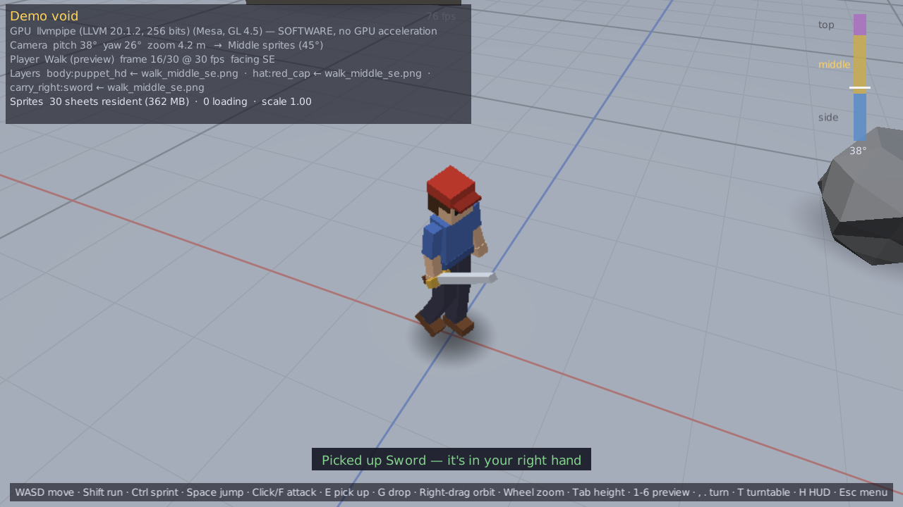
  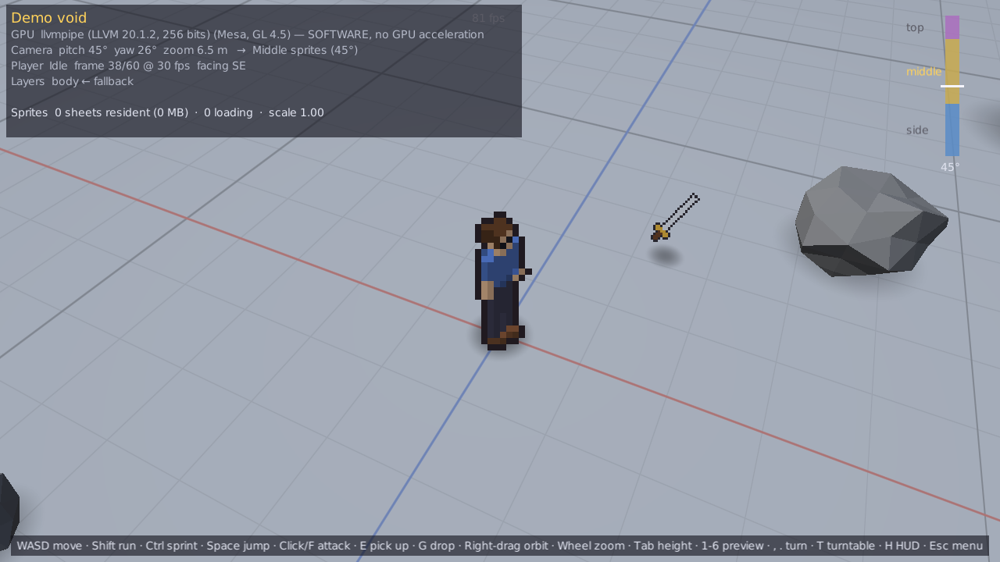
</p>

This README is also the plan: each task is a set of chunks, and each chunk is
ticked off as it lands.

- [Quick start](#quick-start)
- [Controls](#controls)
- [What's in the demo](#whats-in-the-demo)
- [The sprite stack](#the-sprite-stack)
- [GPU acceleration](#gpu-acceleration)
- [Project layout](#project-layout)
- [What came from the engine](#what-came-from-the-engine)
- [Tests and scripted runs](#tests-and-scripted-runs)
- [The plan](#the-plan)

---

## Quick start

Needs **JDK 21** and a graphics driver with **OpenGL 3.3** (anything from the
last decade). Gradle comes with the repository.

**IntelliJ IDEA:** open the folder, let it import the Gradle project, and pick
**Run Game (GPU)** from the run-configuration dropdown.

**Command line:**

```bash
./gradlew runGpu        # the game, GPU acceleration on (what the IntelliJ profile runs)
./gradlew run           # the same game, letting the OS pick the GPU
./gradlew test          # unit tests — no GPU needed
./gradlew sampleSprites # a stand-in sprite set in build/sample-sprites/ to try the importer on
./gradlew gameJar       # build/libs/larsons-game.jar, LWJGL included (put assets/ beside it)
```

The main menu has one entry, **Demo**, which loads the void.

## Controls

| Key | Action |
|---|---|
| **W A S D** | walk, relative to the camera |
| **Shift** / **Ctrl** (while moving) | run / sprint |
| **Space** | jump |
| **Left click** or **F** | attack |
| **E** / **G** | pick up the item you are standing by / drop what you are holding |
| **Right-drag** (or middle-drag), **arrow keys** | orbit the camera — yaw and height |
| **Mouse wheel**, **+ / −** | zoom |
| **Tab** | camera height preset: side → 45° → top-down |
| **1 – 6** | loop idle, walk, run, sprint, jump or attack in place |
| **0** | stop looping |
| **, / .** | turn the character 45° |
| **T** | turntable — step through all eight directions |
| **H** / **P** | hide the HUD / the 3D props |
| **F12** | screenshot (to `screenshots/`) |
| **Esc** | pause menu — Wardrobe, Settings, Controls, Import help, Main menu, Quit |

Drop sprite sheets on the window at any time to import them.

## What's in the demo

- **A blank 3D void** — an endless floor with a metre grid fading into a soft
  sky, drawn in a single full-screen GPU pass that ray-casts the ground plane
  per pixel, so it has no edge and a clean horizon at any zoom.
- **The character**, standing in the middle as a stack of sprite layers, in six
  animation states — **idle, walk, run, sprint, jump, attack** — each from
  **8 directions × 3 heights**. The HUD names the exact sheet each layer is
  drawing, and a gauge at the top right shows the camera's angle against the
  three height zones.
- **A sword** hovering over its shadow nearby. Walk up, press **E**, and it is
  in the character's weapon hand — its own sprite layer, playing frame for
  frame with the body. **G** puts it down again. A left-handed character
  (Pause → Wardrobe → Hand) takes it in the left hand and fights left-handed.
- **3D scenery** round the edge — a cottage, trees, rocks — real low-poly
  geometry, depth-tested against the sprites so the character can walk behind a
  tree.
- **A pause menu** with the **Wardrobe**: all 23 cosmetic layers, each cycling
  through the items found for it on disk and, for the pixel-art items, through
  the colours they come in (swatches beside the item; the body's colour is the
  skin tone of every layer), plus the drawing style and the hand - with a live
  preview you can turn through the eight directions, tip through the three
  heights and play in every state.
- **A cutscene** behind the main menu: **your own character** - exactly as
  the wardrobe has her - talking with Bryn, close up, so their faces show:
  every character a stack of close-up layers, one per item she wears, each
  in any colour, with lines that type themselves out, colours that fade
  mid-sentence and warm and cold light. **Cutscene** in the menu plays it
  full screen. See [Cutscenes](#cutscenes).
- **Drag-and-drop importing** of sprite sheets into the repository.
- **A rendered character** in `assets/sprites/`: the rigged feminine model from
  [3D-Modeling](https://github.com/Larleeloo/3D-Modeling) with 52 items for the
  24 layers — eleven haircuts, three shirts (flannel, a laced linen shirt, a
  laced dress), jeans, briefs, bralette, boots, gloves, a belt, a necklace,
  bangles on either wrist, scabbards on either hip, a sun hat and a beanie, a
  long mantle (a cape to the ankles), a sword and a shield for either hand,
  and the face's ears, noses, eyes, eyebrows, makeup and mouths — each in all
  six states from all 24 views, the clothes and mantle cloth-simulated per
  animation. They are **pixel art**,
  in 128- and 64-pixel frames in one 128-colour palette, right- and
  left-handed, and every one can be recoloured: fourteen hair colours (royal
  blue among them) for the hair, the clothes, the eyes, lips, brows and makeup
  and the skin, gold or silver for the jewellery. The first outfit's 26 items
  are also 512-pixel renders; Pause → Wardrobe → Style switches the whole
  character between the renders and the two pixel sizes. Put them on in the
  Wardrobe (or see [the list](assets/sprites/README.md#the-sheets-in-this-folder)
  for a ready-made `config/wardrobe.json`).

  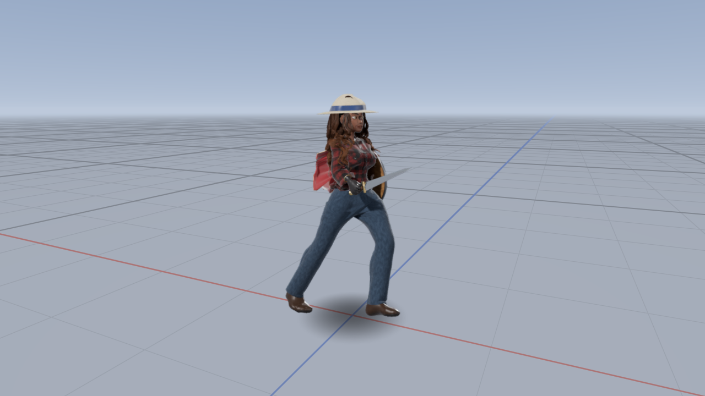
  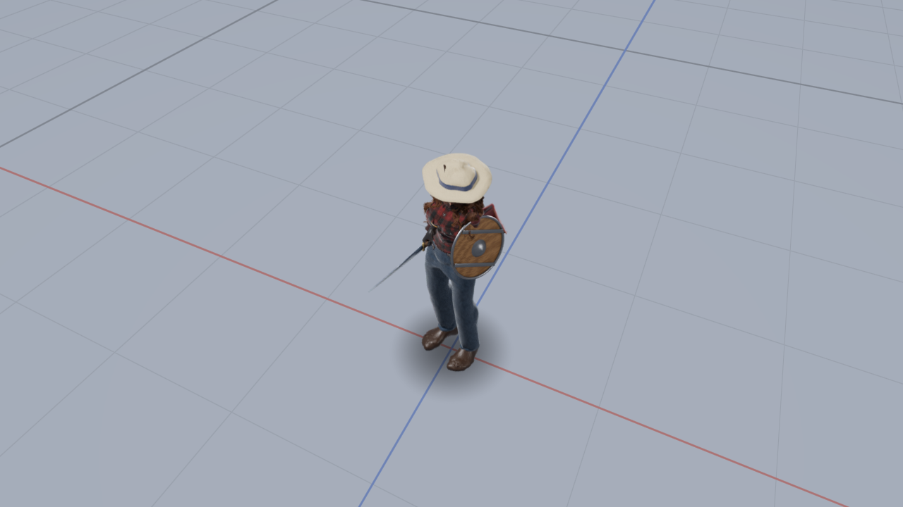
  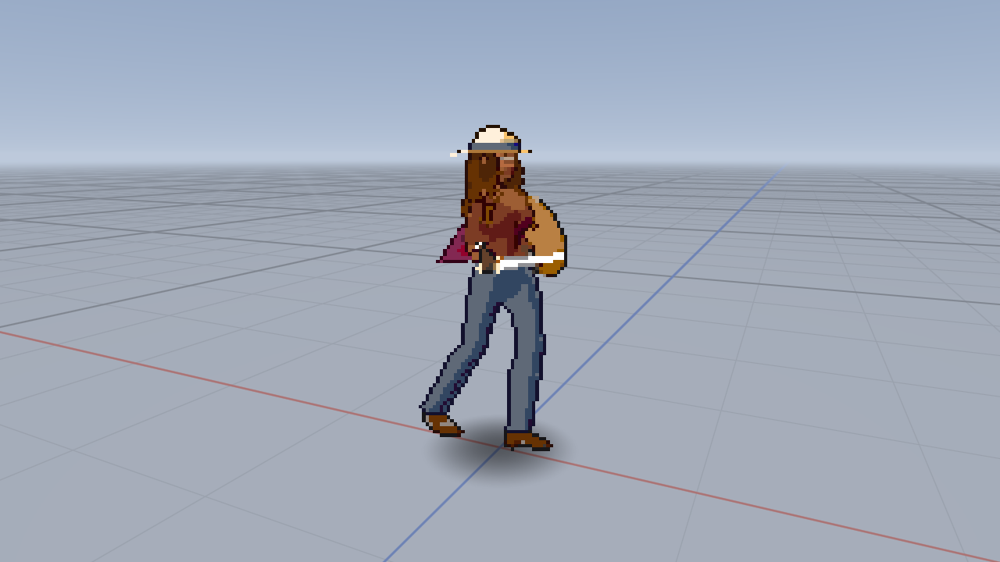
  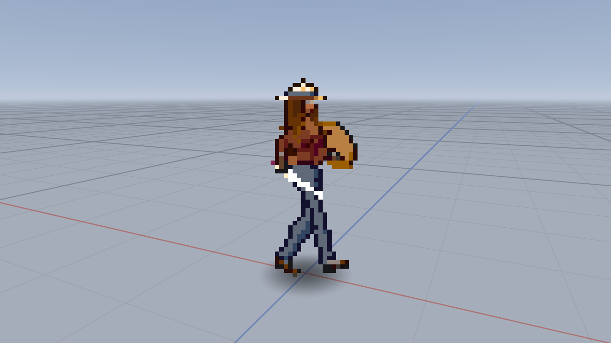
  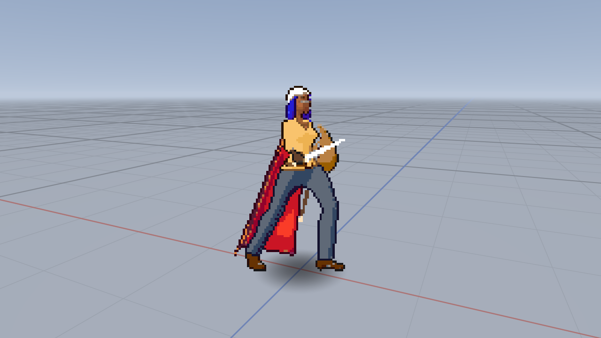
  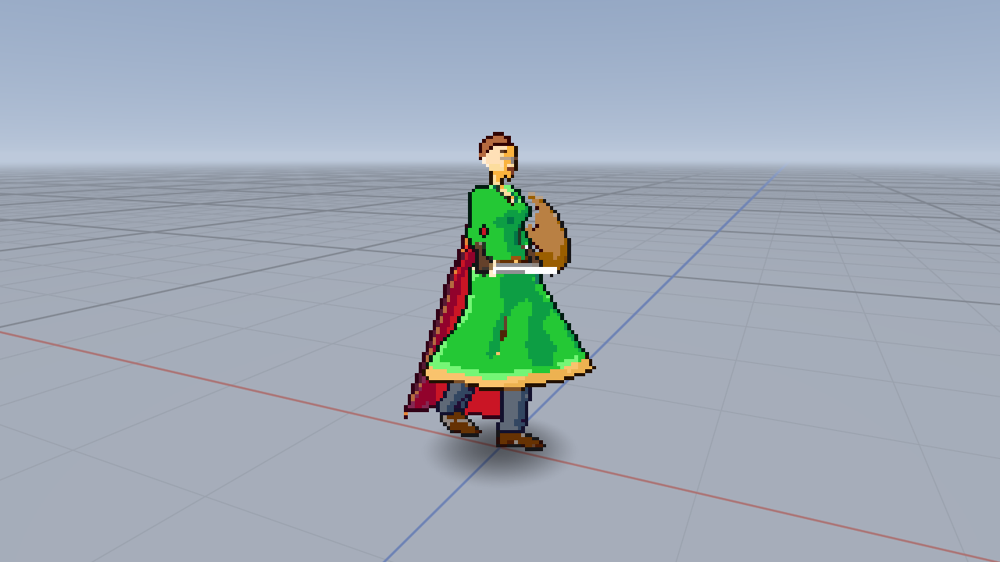
  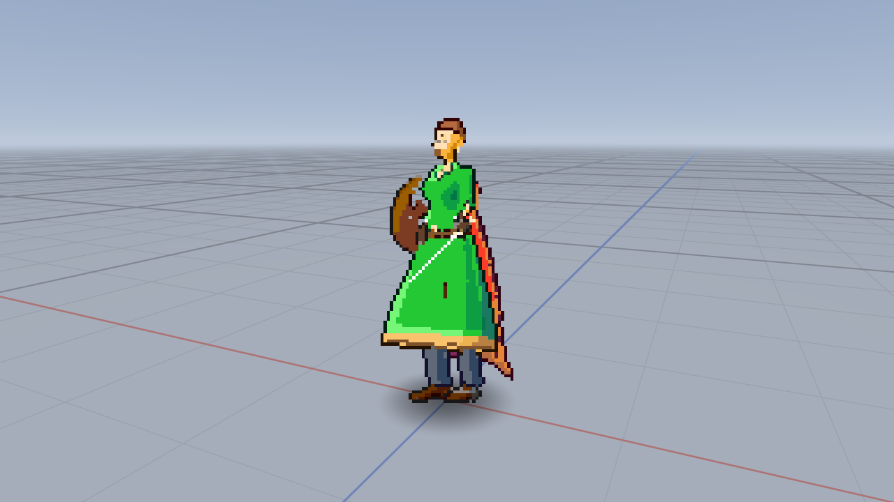
- **A fallback character** when no Blender renders are present: a 32 × 32 pixel
  figure generated from a tiny rigged box model and rendered from the same 24
  camera positions the real sheets use, scaled up with crisp pixels.

<p align="center">
  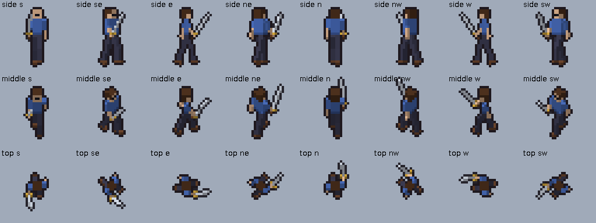
  <br><sub>One frame of the fallback walk from all 24 views — 8 directions × side, middle and top.
  The sword is its own layer, cut away wherever the hand or body is in front of it.</sub>
</p>

<p align="center">
  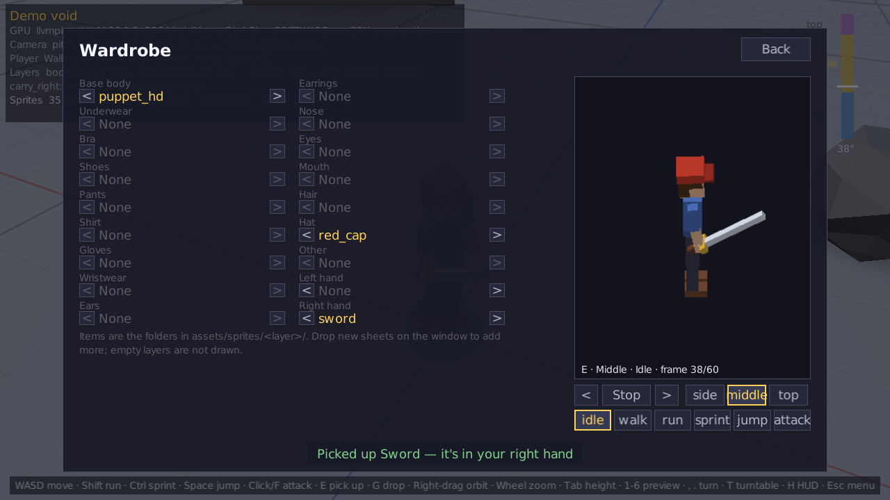
  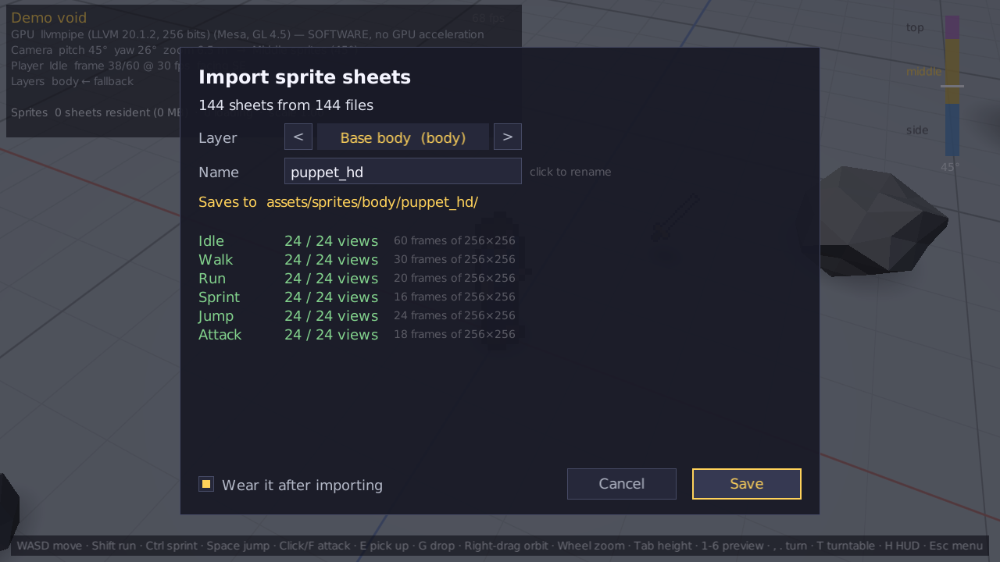
  <br><sub>Pause → Wardrobe, and the importer after a folder of sheets was dropped on the window.
  (Captured headlessly by a scripted run on a software renderer — hence the red GPU line.)</sub>
</p>

## The sprite stack

The full contract — folder layout, naming, the Blender camera, `profile.json`,
the layer order and the holdout rule — is in
[`assets/sprites/README.md`](assets/sprites/README.md). In short:

```
assets/sprites/<layer>/<item>/<state>_<elevation>_<direction>.png
assets/sprites/body/hero/walk_middle_ne.png
assets/sprites/carry_right/sword/attack_top_s.png
assets/sprites/items/sword/icon.png                 (the pickup, lying in the world)
```

- **Views.** The camera's angle above the character picks the set: **side**
  (rendered at 0°) from 0° to 33°, **middle** (45°) from 34° to 75°, **top**
  (90°, birds-eye) from 75° to 90°. The direction is worked out per character
  from where the camera is, so a character across the room is seen from its own
  angle.
- **Frames.** 512 × 512, 30 fps, any count per state, left to right then top to
  bottom.
- **Layers** draw in a fixed order — body, underwear, bra, shoes, pants, shirt,
  belt, necklace, gloves, right and left wrist, sheath, ears, earrings, nose,
  eyes, eyebrows, makeup, mouth, hair, hat, other, left hand, right hand (the
  hands swap for a left-handed character; the cape draws first when she faces
  the camera and just under the hair otherwise) — every one on the body's frame
  index. Each is rendered in
  Blender with the body as a **holdout**, so the sword is already cut away where
  the hand grips it and the game only has to draw layers on top of each other.
- **Placement.** Each frame is a camera-facing card placed so the feet in the
  picture land on the character's spot on the ground — the feet stay on the
  shadow from every angle and every zoom.
- **Colours.** An item with a `variants.json` can be drawn in any of the
  colours it lists - or any colour at all, `#rrggbb`, shaded like the item's
  own. Its sheets are palette PNGs, uploaded once as their palette indices
  (a byte a texel); the sprite shader colours each layer from a palette of
  its own as it draws it (`gfx/PaletteAtlas`), so every colour of a sheet is
  one texture, two characters can wear it in different colours in the same
  draw call, and a colour can change every frame.
- **Fallbacks.** No body sheet for a view → the generated 32-pixel body for that
  view. No cosmetic sheet → that layer is left blank. A missing west-facing view
  borrows the east-facing one mirrored.
- **Loading.** Sheets load on demand, decode on worker threads, are cropped to
  the part of the frame they use and live in a video-memory budget with
  least-recently-used eviction; what may be needed next (the other states, the
  neighbouring directions) is loaded ahead only into room the budget has spare.
  A layer change is only shown once every layer of it is ready, so a sword is
  never a frame out of step with the arm holding it.

### Importing sprite sheets

Drag sheets, a folder of them, or Blender's loose numbered frames from your file
manager onto the game window. The importer:

1. reads every name (forgivingly — `Walk-45-NorthEast.png` is fine) and every
   PNG header, and shows what it found per state, how many of the 24 views, and
   how many frames;
2. guesses the layer and item name from the folder you dropped — dropping
   `hat/red_cap/` means layer `hat`, item `red_cap` — and lets you change both;
3. stitches numbered frames into sheets, copies finished sheets as they are, and
   writes them to `assets/sprites/<layer>/<item>/` under canonical names —
   **inside the repository**, ready to commit;
4. reloads the library and, if *Wear it after importing* is ticked, puts the new
   item on the character.

## Cutscenes

A cutscene is a script of actors and lines, played over close-up layers:

```
assets/cutscenes/<scene>.cut                          the script (menu.cut: the main menu's)
assets/closeups/<layer>/<item>_px128/<clip>_side_se.png    one layer's clip, close up (and _px64)
```

- **Close-ups** are the wardrobe's items again, rendered waist-up and close
  from the front-left three-quarter view - a face about 50 pixels tall in a
  128-pixel frame instead of 12 - for five looping conversation clips:
  `listen`, `talk`, `explain`, `laugh` and `surprise`, with mouth shapes,
  blinks, brows, nods and gestures. Every item of a layer that can show in
  the frame has them (shoes, trousers and what the hands carry are below it
  or put away), each its own layer cut against the outfit like the game
  sprites, so **any character - the player's own included - can play a
  cutscene**, in any items and any colours. A character on the right of a
  two-shot is drawn mirrored, so the two face each other.
- **Actors** (`cutscene/Actor`) are a wardrobe each - a copy of the player's,
  or dressed in the script - playing clips, and what the scene does to their
  look: a layer's colour fading to another (an option or any `#rrggbb`), a
  flash, a tint (warm light, cold light) and a fade. All of it is palette and
  vertex-colour work at draw time; no sheet is ever re-uploaded.
- **The script** (`cutscene/Cutscene`): `actor`, `stand`, `say`, `clip`,
  `colour`, `wear`, `flash`, `tint`, `fade`, `wait`, `loop` - see
  [`assets/cutscenes/README.md`](assets/cutscenes/README.md). `say` plays the
  speaker's clip for the length of the line while the others listen.
- **The stage** (`cutscene/CutsceneStage`) draws it: a backdrop, the actors'
  layers in the game's draw order at whole-pixel zoom, and the line in a box
  with the speaker's name. Layers load through the sprite library (its memory
  budget, its decoders); an actor's other clips load ahead, and while a new
  clip is still loading the actor holds its last complete frame.

## GPU acceleration

**The whole game renders through OpenGL 3.3 core** (via LWJGL 3.3.3): the void,
the 3D props, every sprite layer and shadow, and the entire UI, text included.
AWT is only used off-screen — to decode PNGs, rasterise the font atlas once,
and generate the fallback sprites.

- Rendering is premultiplied-alpha throughout, and the 512-pixel sheets get
  trilinear mipmaps, so minified characters have clean edges without dark
  fringes. The 32-pixel fallback is sampled nearest-neighbour.
- 4× MSAA and vsync are on by default.
- The renderer reports what it got — shown in the HUD, the Settings page and
  the console. On a software rasteriser (Mesa llvmpipe, "GDI Generic", Microsoft
  Basic Render) it still runs, and says so.

**The IntelliJ profile "Run Game (GPU)"** (`.idea/runConfigurations/Run_Game__GPU_.xml`)
runs the Gradle task `runGpu`, which on top of a plain `run`:

- asks for the **discrete GPU** on hybrid Linux laptops (`DRI_PRIME=1`, plus
  NVIDIA PRIME render offload when the NVIDIA driver is loaded). On Windows,
  set `java.exe` to *High performance* once in Settings → System → Display →
  Graphics; macOS switches to the discrete GPU by itself;
- turns on 4× MSAA and vsync explicitly;
- sets `larsons.gpu=required`, so a software renderer is flagged in red.

Launch options, all forwarded by Gradle like the engine's `-Dlarsons.*` flags:

| Option | Default | |
|---|---|---|
| `-Dlarsons.gpu.msaa=4` | 4 | multisample anti-aliasing (0 = off) |
| `-Dlarsons.gpu.vsync=on` | on | wait for the display refresh |
| `-Dlarsons.sprites.scale=1` | 1 | shrink sprite frames on load (0.5 = half) |
| `-Dlarsons.sprites.vramMB=1536` | 1536 | sprite-cache video memory budget |
| `-Dlarsons.assets=assets` | `./assets` | where `assets/sprites` is |
| `-Dlarsons.start=menu` | menu | `demo` to skip the main menu |
| `-Dlarsons.script=…` | — | a scripted run (see below) |

## Project layout

```
src/main/java/com/larsons/game/
  Main.java                 entry point (headless AWT, macOS first-thread relaunch)
  core/                     Game (window, loop, overlays), Settings, Scene, Autopilot, Screenshot
  gfx/                      the GPU layer: Window (GLFW), Shader, Texture, Batch, PaletteAtlas, Font,
                            Mesh, GpuInfo
  math/                     Vec3, Mat4
  input/                    Input — keys, mouse, typed text, dropped files
  sprite/                   Facing, Elevation, AnimState, Slot, SpriteView, SpriteProfile,
                            SpriteNames, SheetImage, SheetTexture, SpriteLibrary, LayerStack, Wardrobe,
                            Variants, Palettes
  cutscene/                 CloseupLibrary, Actor, Cutscene (the script), CutsceneStage
  sprite/fallback/          the 32×32 fallback: Puppet (rigged box figure), PuppetRaster, FallbackSprites
  importer/                 SpriteImport — plan and save a drag-and-drop
  world/                    OrbitCamera, Player, World, ItemDef, Props, VoidRenderer, WorldRenderer
  scene/                    MainMenuScene, DemoScene, CutsceneScene, PauseMenu, WardrobePanel
  ui/                       Ui (immediate-mode GPU UI), MenuList, Theme, ImportPanel
  tools/                    SampleSprites
  util/                     Json
assets/sprites/             the sprite sheets (one folder per layer) and their contract
assets/closeups/            the cutscene close-ups (one folder per layer, like the sprites)
assets/cutscenes/           cutscene scripts (menu.cut) and their language
.idea/runConfigurations/    Run Game (GPU), Tests
```

## What came from the engine

From [Larsons-Game-Engine](https://github.com/Larleeloo/Larsons-Game-Engine),
either **copied** or **adapted** to a game that is GPU-first and has a single
window:

| Here | From the engine | |
|---|---|---|
| `util/Json` | `util/Json` | copied — the dependency-free JSON parser/writer (plus typed getters) |
| `sprite/Facing` | `graphics/Facing` | copied — the eight directions, their keys, the mirrored-twin rule |
| `gradlew`, `gradle/wrapper`, `gradle/lwjgl-natives.gradle.kts` | same | copied — Gradle 9 wrapper, LWJGL 3.3.3 native selection |
| `build.gradle.kts` | same | adapted — `-Dlarsons.*` forwarding to forked JVMs, the runnable-jar task |
| `ui/Theme` | `ui/MenuTheme.dark()` | copied — the menu palette |
| `gfx/Window`, `gfx/GpuInfo` | `gl/GlContext`, `gl/GlWindow` | adapted — GL 3.3 core context hints, GLFW callbacks into latched input, the driver report, vsync |
| `core/MacLauncher` | `core/MacGlLauncher` | adapted — relaunch on macOS's first thread for a double-clicked jar |
| `math/Mat4` | `graphics/Mat4` | adapted — immutable column-major matrices, switched to OpenGL's −Z convention |
| `sprite/SheetImage` | `graphics/SpriteSheet` | adapted — left-to-right, top-to-bottom frame slicing |
| `sprite/AnimState` | `graphics/Animation` | adapted — delta-driven frame timing, looping vs. held one-shots |
| `sprite/fallback/*` | `graphics/DirectionalSprites` | adapted — generated per-facing fallback art (here from a 3D figure, for all three heights) |
| `input/Input` | `input/InputManager` | adapted — press latching, repeats, typed text |
| `ui/MenuList` | `ui/Menu` | adapted — keyboard and mouse menu navigation |

The engine's Java2D backend, level system, creative mode and mini-games were
left behind: this game draws everything through its own OpenGL renderer.

## Tests and scripted runs

`./gradlew test` (or the **Tests** run configuration) runs the unit tests, none
of which need a GPU: view selection for all 8 × 3 views, the zone boundaries,
file-name parsing, sheet slicing and packing, the fallback character (all 144
views, and that body + held-out sword composites to exactly the picture of both
rendered together), the importer (copying, stitching, layer/name guessing), the
library's lookup and mirroring rules, palette sheets staying palette indices
(one texture whatever the colours), palette swaps and custom colours, the
palette rows a batch shares, cutscene scripts and their timeline, actors'
colour fades and flashes, the close-up folders, the camera and the player's
state machine.

The game can also drive itself, for smoke tests and screenshots on a headless
machine:

```bash
xvfb-run ./gradlew run -Dlarsons.script="scene demo; wait 1; pitch 12; state walk; \
  wait 0.5; shot walk-side.png; key escape; click 640 267; shot wardrobe.png; quit"
```

Commands: `wait`, `scene`, `shot`, `key`, `click`, `drop <path>`,
`importsave [layer/name]`, `importclose`, `quit`, and in the demo `pitch`,
`yaw`, `zoom`, `state`, `face`, `move`, `jump`, `attack`, `teleport`, `pickup`,
`dropitem`, `pause`, `resume`, `hud`, `props`, `style` (`rendered`, `px128`,
`px64`), `wear <layer> [item]` (no item: take it off), `colour <layer> [option]`
(an option or any `#rrggbb`; the body's colour is the skin tone; no option:
the item's own colours) and
`hand` (`auto`, `right`, `left`). Opening the wardrobe saves the outfit to
`config/wardrobe.json` when it closes, a scripted run included.

---

## The plan

This is a descriptive plan for a new game that uses mechanics from Larson's Game
Engine. Each section is broken up into chunks, or tasks to be done.

### Task 1: Create the game layout ✅

- This game is a **3D environment with 2D entities** for the player and items.
- The player renders from **8 directions** like the sprites from Larson's Game
  Engine, and from **3 vertical rendering zones** for the different
  third-person heights you can view the character from:

  | Zone | Rendered at | Used while the camera is |
  |---|---|---|
  | side | 0° | 0° – 33° above the character |
  | middle | 45° | 34° – 75° |
  | top (birds-eye) | 90° | 75° – 90° |

  Zoom in/out is a feature.
- All characters (playable or otherwise) are rendered as a series of
  **stackable sprite sheets**. The elements for each character line up with
  their animations: a sprite sheet for a held sword renders in-hand for a player
  character. The character and sword sheets have the same number of frames
  (30 fps, 512 × 512 frames) for any given animation state, and the sword
  follows the character's movements when held. The sword is cut out where the
  player's hand is, so it renders correctly in the stack of sprite sheets. The
  sheets are pre-rendered in Blender.
- **Items** are 2D sprites as well that hover with a shadow on the ground. They
  always face the camera from any angle.
- All other **environmental elements** (trees, rocks, houses, etc.) are
  rendered in 3D.

**To do**

- [x] Create a blank 3D void area that can render the animations (all 8 points
      and 3 heights for each) for the character sprite in the states idle, walk,
      run, sprint, jump and attack — *the Demo scene; preview any state with
      1–6, turn with `, .` or `T`, change height with `Tab`*
- [x] Create room for cosmetics as sprite-sheet layers over the base character
      sheet — shirts, pants, underwear, bras, shoes, hairs, noses, eyes, mouths,
      ears, earrings, wristwear, gloves, hats, carried items (left and right
      hand) and "other" — all editable from a generic pause menu — *24 layers
      under `assets/sprites/` (belts, necklaces, a left wrist, sheaths, eyebrows
      and makeup since), edited in Pause → Wardrobe*
- [x] Render one pick-up-able item in the scene — *a sword that hovers over its
      shadow and renders in hand when equipped (E / G)*
- [x] Create a fallback profile for each animation for when the base player
      character is not provided — roughly 32 × 32 pixels, scaled up; cosmetics
      left blank if not provided — *generated from a rigged box figure for all
      144 views, with a matching sword layer*
- [x] Make a main menu scene that only loads "demo" for the blank void scene
- [x] Create a drag-and-drop file system for saving sprite sheets to the
      repository — *drop on the window; saved to `assets/sprites/`*
- [x] Copy over all pertinent code and enable GPU acceleration for the entire
      game — *OpenGL 3.3 core for everything; see
      [What came from the engine](#what-came-from-the-engine)*
- [x] Create an IntelliJ profile to run the game with GPU acceleration on —
      *Run Game (GPU)*
- [x] Refine the README.md with added features and polish the formatting

### Task 2: TBD
