# Larson's Game

A 3D game whose characters and items are **2D sprites** — pre-rendered in
Blender from eight directions and three heights, and stacked layer by layer so
every shirt, hat and sword is its own sprite sheet — built on mechanics from
[Larsons-Game-Engine](https://github.com/Larleeloo/Larsons-Game-Engine).
Everything is drawn on the GPU with OpenGL.

<p align="center">
  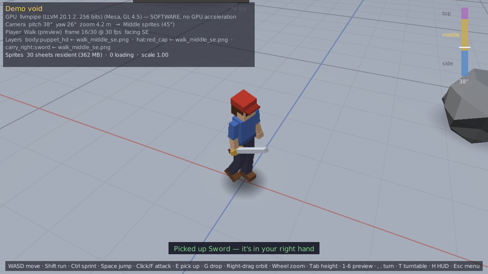
  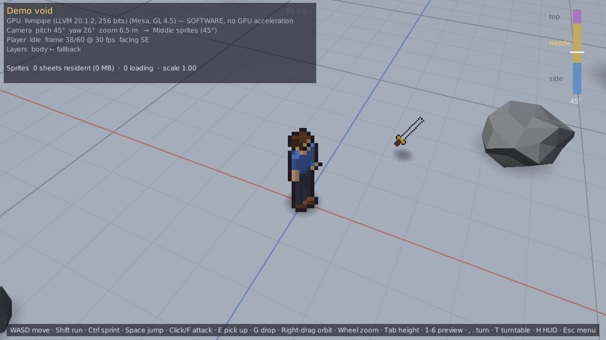
</p>

This README is also the plan: each task is a set of chunks, and each chunk is
ticked off as it lands.

- [Quick start](#quick-start)
- [Controls](#controls)
- [What's in the demo](#whats-in-the-demo)
- [The sprite stack](#the-sprite-stack)
- [The inventory and the hotbar](#the-inventory-and-the-hotbar)
- [Wearing what you own](#wearing-what-you-own)
- [The treasure chest](#the-treasure-chest)
- [Items, rarity and loot](#items-rarity-and-loot)
- [Fighting](#fighting)
- [Sound](#sound)
- [The scenery](#the-scenery)
- [Creative Mode](#creative-mode)
- [GPU acceleration](#gpu-acceleration)
- [Project layout](#project-layout)
- [What came from the engine](#what-came-from-the-engine)
- [Tests and scripted runs](#tests-and-scripted-runs)
- [The plan](#the-plan)

---

## Quick start

Needs **JDK 21** and a graphics driver with **OpenGL 3.3** (anything from the
last decade). Gradle comes with the repository.

**IntelliJ IDEA:** open the folder, let it import the Gradle project, and pick
**Run Game (GPU)** from the run-configuration dropdown.

**Command line:**

```bash
./gradlew runGpu        # the game, GPU acceleration on (what the IntelliJ profile runs)
./gradlew run           # the same game, letting the OS pick the GPU
./gradlew test          # unit tests — no GPU needed
./gradlew sampleSprites # a stand-in sprite set in build/sample-sprites/ to try the importer on
./gradlew gameJar       # build/libs/larsons-game.jar, LWJGL included (put assets/ beside it)
```

The main menu has three tabs: **Play** (the demo, a meadow below the
highlands), **Cutscene** (the menu's cutscene, played on its own) and **Dev**,
which shows only once **1025** has been typed on the menu (either row of
digits) and holds [Creative Mode](#creative-mode), the level editor.

## Controls

| Key | Action |
|---|---|
| **W A S D** | walk, relative to the camera |
| **Shift** / **Ctrl** (while moving) | run / sprint (crouched: Shift is the fast crouch walk) |
| **C** | crouch / stand up |
| **Space** | jump - with the sword, the axe, the bow, the crossbow, the crystal staff, the wand, the mace or the dagger |
| **Left Alt** or **Z** | dodge: a tap **dashes** (a low burst of 3.5 m); held, the dash turns into a **combat roll** (4.7 m, nothing can hurt her in it, she rolls through the dummies) - the way she is moving, or facing, with whatever is in her hands ([Dodging](#dodging)); pressed **in the air**, she lands in a roll, unhurt by the fall ([Heights](#heights)) |
| **L** / **K** | **lock on** to the enemy nearest the middle of the view - a dummy or a flier - (L again: let go) / on to the next one, left to right ([The lock-on](#the-lock-on)) |
| walk into the **vines** | **climb** the vine-covered cliff: W up, S down, A / D along it; Space (or the dodge key, or C) lets go - it costs **stamina** ([Climbing](#climbing-and-stamina)) |
| walk off the **top of the vines** | **climb down**: she turns, steps down over the lip onto the vines and climbs on down while you keep walking out |
| **Left click** or **F** | attack - every blow rolls its [damage dice](#fighting) over her head; with the bow, hold to draw and let go to loose; with a wand or a Magic (or better) staff, cast a spell |
| **X** / **R** / **Q** | heavy attack (the axe, the staff, the wand, the mace or the dagger; once every 10 s) / spin attack (all but the bow and the crossbow) / parry |
| **B** (held) / **V** | block - the shield up, or the weapon held across / shield bash (or attack while blocking) |
| **1 – 5** or the **mouse wheel** | choose a hotbar slot - what is in it is in her hands: a battle axe, bow, crossbow, crystal staff, wand, mace or dagger in its stance, the sword with the sword and shield - or, with no shield worn, the sword alone; an empty slot, empty hands |
| **I** | the inventory - click an item to pick it up, click a slot to put it there, right-click to move it to or from the hotbar, click outside to drop it; 1 – 5 over a slot swaps it into that hotbar slot; **A–Z** / **Rarity** sort it |
| **F1 – F4** | laugh, cry, surprise, anger |
| **E** / **G** | pick up the item you are standing by (she reaches for it), or open / shut the chest / drop what you are holding |
| **Right-drag** (or middle-drag), **arrow keys** | orbit the camera — yaw and height |
| **+ / −**, the wheel while orbiting | zoom |
| **Tab** / **O** | camera height preset: side → 45° → top-down / the [automatic camera height](#the-automatic-camera-height) on the hills, or fixed |
| **[ / ]** | loop the previous / next of all 129 states in place |
| **Backspace** | stop looping |
| **, / .** | turn the character 45° |
| **T** | turntable — step through all eight directions |
| **H** / **P** | hide the HUD / the scenery (trees, grass and rocks) |
| **F9** | animations: new / classic - the first version of the weapon moves, to compare (also Pause → Settings → Animations) |
| **F11** | full screen, with the display switched to its fastest refresh rate - or back to the window ([frame rate](#120-frames-a-second)) |
| **F12** | screenshot (to `screenshots/`) |
| **Num-pad 1 0 2 5** | the debug code: every cosmetic offered in the wardrobe, and **Clear the ground** in the pause menu (every item lying about, the starting weapons and the chests' loot, taken away); typed again, off |
| **Esc** | pause menu — Wardrobe, Settings, Sounds, Controls, Import help, Main menu, Quit (or closes the inventory) |

Drop sprite sheets on the window at any time to import them.

## What's in the demo

- **A meadow** — an endless grass floor, one 512-pixel pixel-art tile
  repeating out to a soft sky, drawn in a single full-screen GPU pass that
  ray-casts the ground plane per pixel, so it has no edge and a clean horizon
  at any zoom; oaks, grass tufts and rocks stand on it (see below).
- **The character**, standing in the middle as a stack of sprite layers, in
  **129 animation states**, each from **8 directions × 3 heights**: idle, walk,
  run, sprint, jump and attack; crouching (an idle, a walk and a fast walk);
  the dash and the combat roll (played with whatever she holds); the bow,
  crossbow, staff and wand **aimed up** at what flies; climbing;
  reaching down to pick something up, standing or crouched; four emotes -
  laughing, crying, surprise and anger; the sword's spin attack and parry and
  the shield held ready and bashed; the sword held alone, with no shield (11
  more: `blade_*`); and the weapons' stances below. The
  HUD names the exact sheet each layer is drawing (and, where a set has no
  sheets for a state, the state it is shown as instead), and a gauge at the
  top right shows the camera's angle against the three height zones.
- **A sword, a battle axe, a longbow, a crossbow, a crystal staff, a wand, a mace and a dagger** hovering over their
  shadows nearby. Walk up and press **E**: she reaches out for it (crouched,
  if she is) and it is hers as her hand closes on it - in the first free
  slot of her [hotbar](#the-inventory-and-the-hotbar), which is selected,
  so it is in her hands. The sword goes into her
  weapon hand - its own sprite layer, playing frame for frame with the body.
  The others are each a **stance** of its own, with its own idle, walk, run,
  sprint, jump, crouch and crouch walk: the **battle axe** in both hands (an attack,
  a heavy overhead blow, a spin attack, a crouched sweep, a parry, a block),
  the **bow** (drawn while the attack is held, loosed when it is let go, crouched
  too; a parry and a block), the **crossbow** (a shot, crouched too; a parry and
  a block), the **crystal staff** (carried in the right hand and used as a
  walking stick on the walk; both hands on it to fight: a cast - the crystal
  thrust out at the enemy -, a heavy slam into the ground, a spin attack, a
  crouched sweep, a parry and a block), and the three one-handed weapons, each
  in the right hand: the **wand** (30 cm of carved wood: a cast - flicked out
  at the enemy -, a great two-handed cast, a casting turn, a flick from the
  crouch, a ward thrown up to parry and a ward held to block), the **mace** (a
  flanged iron head on a 63 cm haft: an overhand smash, a two-handed smash
  into the ground, a spin attack, a low sweep, the haft thrown up overhead to
  parry and held across in both hands to block) and the **dagger** (40 cm, the
  left hand up as a guard: a thrust, a slash and a lunge, a spinning slash, a
  rising stab from the crouch, a parry and a guard). **1 – 5** or the mouse wheel choose between the hotbar's slots,
  **G** puts down what she holds. A
  left-handed character (Pause → Wardrobe → Hand) takes everything in the other
  hand and fights left-handed.
- **An inventory** (**I**) of diamond-shaped slots on a background of your
  own, with a **hotbar** of five along the bottom of the screen - see
  [The inventory and the hotbar](#the-inventory-and-the-hotbar).

  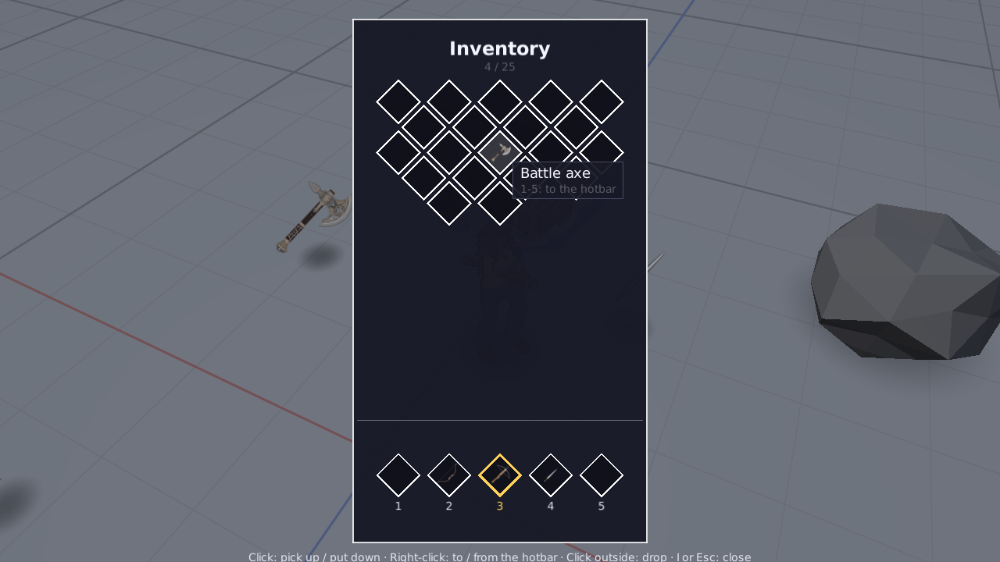
  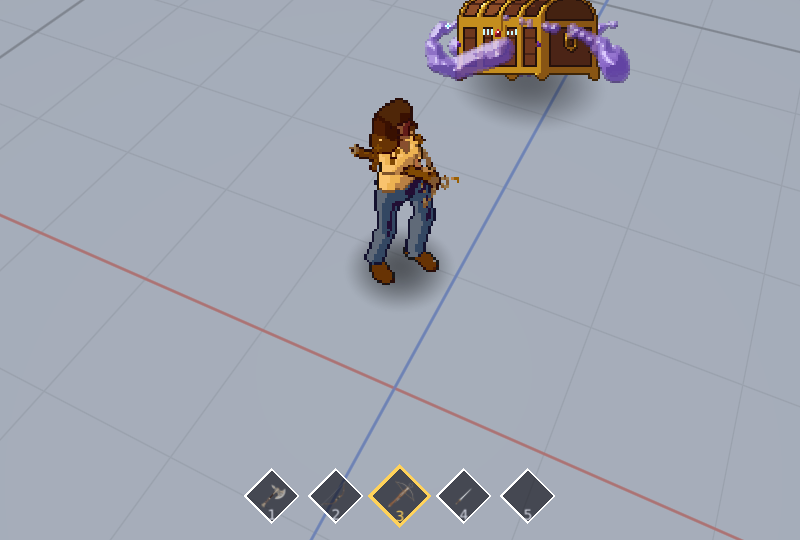
- **An ornate treasure chest** on the ground, drawn like the character from
  all 8 directions and 3 heights in 128-pixel pixel art, magical smoke
  swirling round it. **E** throws its lid open: it lights up from inside,
  light welling out of it and its smoke glowing, and **E** again slams it
  shut. Every one of its animations has a sound hook - see
  [The treasure chest](#the-treasure-chest). It is a **loot chest**: the
  first time it opens it throws out 3 to 7 items, each in a beam of light the
  colour of its rarity - see [Items, rarity and loot](#items-rarity-and-loot).

  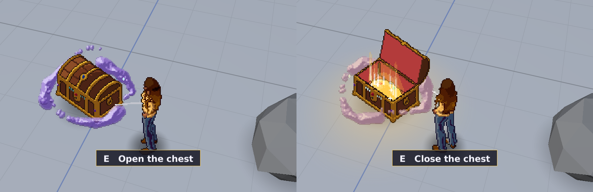
- **The highlands** north of the meadow - a ramp up to a plateau 6 m high
  with a sheer **ledge** to jump off and a **vine-covered cliff** to climb, a
  hill and a hollow - with **fall damage**, a **roll out of a fall**,
  **stamina** and **health**, four more dummies at the feet of the ledge and
  the cliff to shoot down at from the **high ground**, and the camera rising on the peaks and
  sinking in the hollows - see [Heights](#heights).
- **Two flying strike dummies** circling over the meadow and the hollow,
  diving at her when she comes near - roll through them, block, parry or
  shoot them down, aimed up - and a **lock-on** (**L**) for every enemy; see
  [Heights](#heights).
- **Three training dummies** to fight - straw-stuffed burlap on a stake, a
  target painted on the chest. Every swing rolls **D20s over her head** in
  the colour of the weapon's rarity, and their total is the damage; the bow
  and crossbow loose arrows and bolts, wands and staffs cast spells, and her
  **mana** is beside the hotbar - see [Fighting](#fighting).

  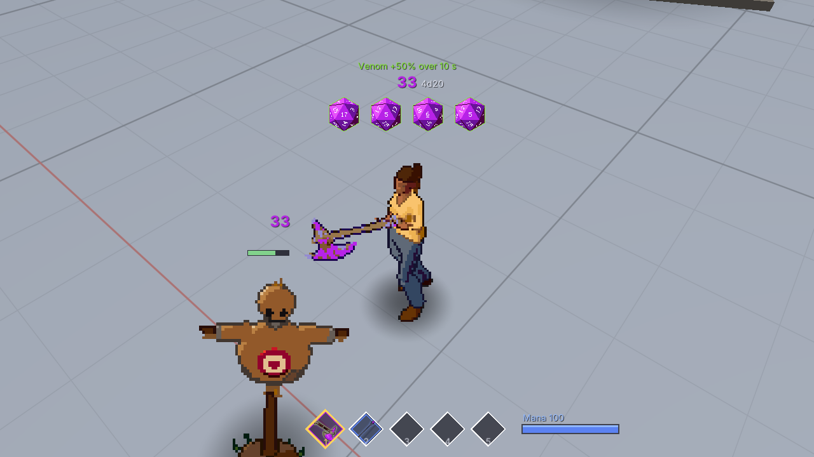
  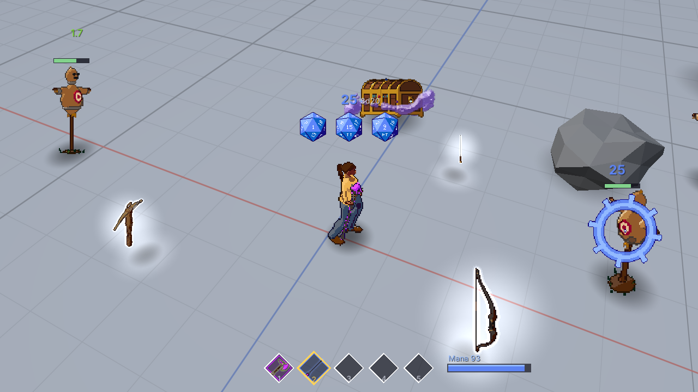
- **Sound for everything that happens** - her footsteps on grass, dirt,
  gravel and the forest floor, every jump, landing, dash, roll and climb,
  each weapon's swing, shot and spell, the dice, the blows, the dummies and
  the flying dummies, the chests and the loot ringing out by rarity, the
  menus, and the breeze over it all: 125 original placeholder sounds, made
  in code, played through the engine's MP3 decoder and mixer. **Pause →
  Sounds** has a tab for each of 9 categories with its own volume, and every
  sound in it can be played, swapped for any MP3 on your computer, muted or
  reset - see [Sound](#sound).
- **Music on the main menu** - "Dream On" as a medieval tavern piece, for
  lute, recorder, harp, fiddle, a portative organ's drone and a hand drum:
  a two-minute seamless loop that fades in as the menu opens and out as it
  is left. Its MIDI is in [`music/`](music/), ready for FL Studio - see
  [Music](#music).

  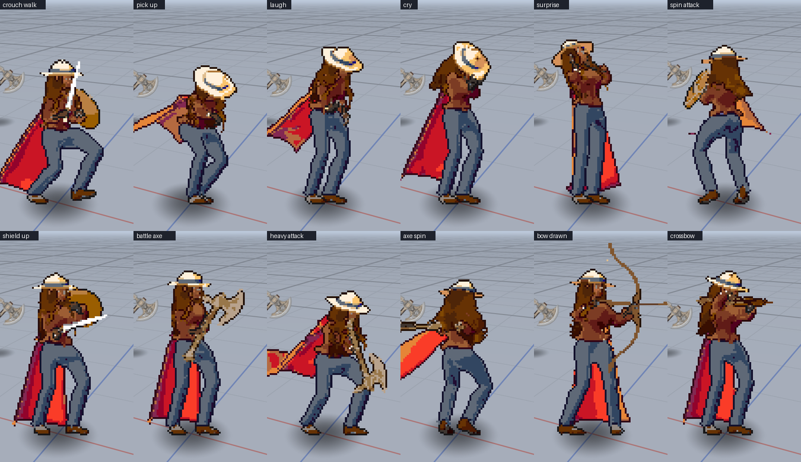
- **Scenery** — oak trees swaying and tufts of grass blowing in the breeze,
  and mossy rocks, all pixel art rendered in Blender and drawn like
  Minecraft's plants: the same sprite on two cards crossed at right angles
  (the rocks on one card facing the camera). The character walks behind a
  tree and in front of it, through the grass, and not through a trunk or a
  rock - see [The scenery](#the-scenery).

  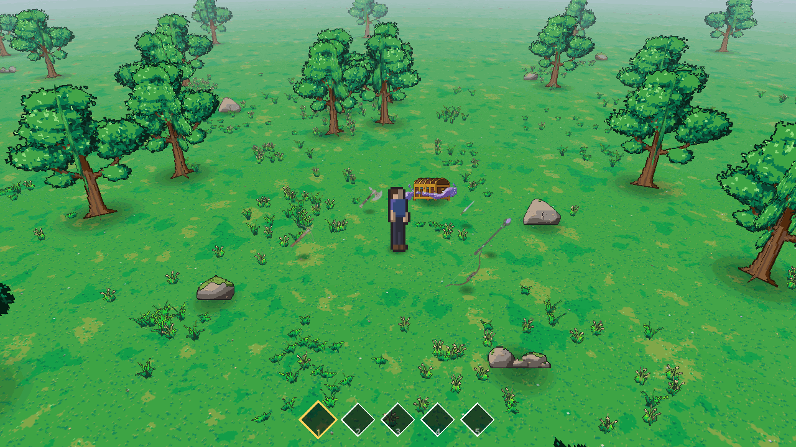
- **A pause menu** with the **Wardrobe**: an oak armoire with its doors open
  (`ui/Medieval`: carved wood, iron brackets, parchment labels, a gilded
  mirror), its shelves every cosmetic layer, each cycling through what she
  owns to wear in it (see [Wearing what you own](#wearing-what-you-own)) and,
  for the pixel-art items, a shelf of colour gems - each unlocked once a dye
  of it is used on that item (the body's colour is the skin tone of every
  layer) - plus the drawing style and the hand, with a live preview in the
  mirror you can turn through the eight directions, tip through the three
  heights and play in every state. The hands are the hotbar's, not the
  wardrobe's.
- **A cutscene** behind the main menu: **your own character** - exactly as
  the wardrobe has her - talking with Bryn, close up, so their faces show:
  every character a stack of close-up layers, one per item she wears, each
  in any colour, with lines that type themselves out, colours that fade
  mid-sentence and warm and cold light. **Cutscene** in the menu plays it
  full screen. See [Cutscenes](#cutscenes).

  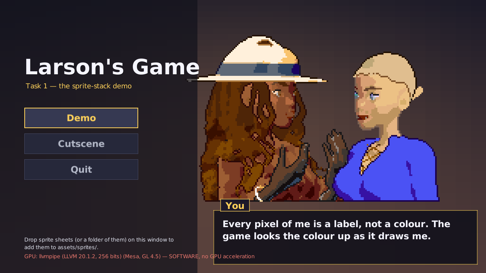
  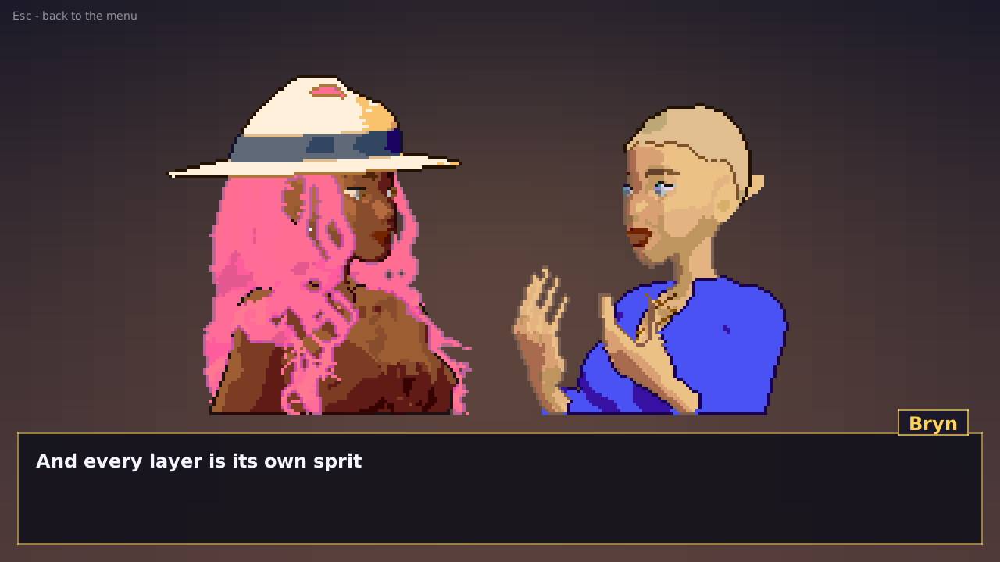
- **Drag-and-drop importing** of sprite sheets into the repository.
- **A rendered character** in `assets/sprites/`: the rigged feminine model from
  [3D-Modeling](https://github.com/Larleeloo/3D-Modeling) with 52 items for the
  24 layers — eleven haircuts, three shirts (flannel, a laced linen shirt, a
  laced dress), jeans, briefs, bralette, boots, gloves, a belt, a necklace,
  bangles on either wrist, scabbards on either hip, a sun hat and a beanie, a
  long mantle (a cape to the ankles), a sword and a shield for either hand,
  and the face's ears, noses, eyes, eyebrows, makeup and mouths — each in all
  80 states from all 24 views (a carried item in the states of its stance),
  the clothes and mantle cloth-simulated per animation; and the battle axe,
  the longbow and the crossbow in theirs. They are **pixel art**,
  in 128- and 64-pixel frames in one 128-colour palette, right- and
  left-handed, and every one can be recoloured: fourteen hair colours (royal
  blue among them) for the hair, the clothes, the eyes, lips, brows and makeup
  and the skin, gold or silver for the jewellery. The first outfit's 26 items
  are also 512-pixel renders; Pause → Wardrobe → Style switches the whole
  character between the renders and the two pixel sizes. Put them on in the
  Wardrobe (or see [the list](assets/sprites/README.md#the-sheets-in-this-folder)
  for a ready-made `config/wardrobe.json`).

  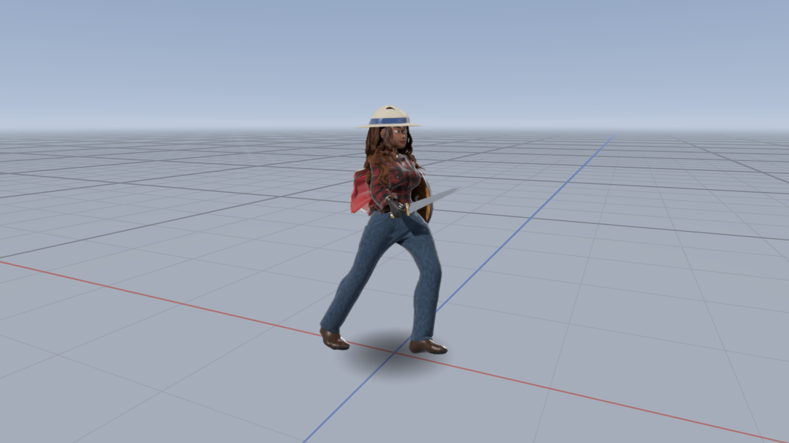
  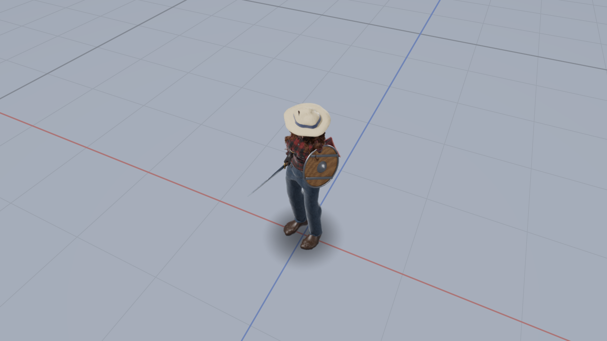
  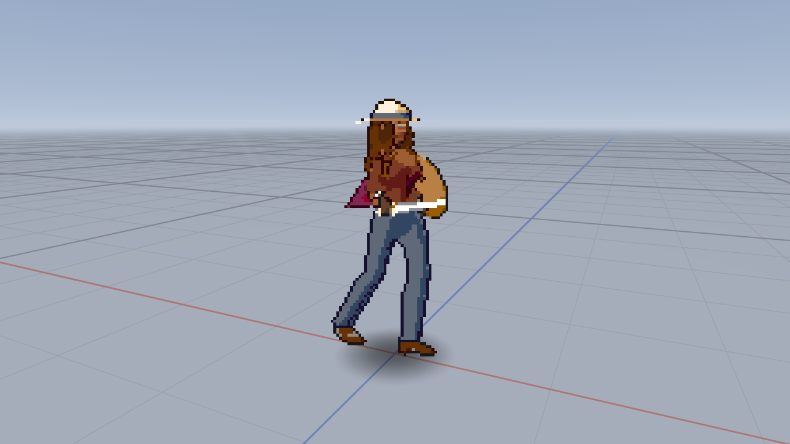
  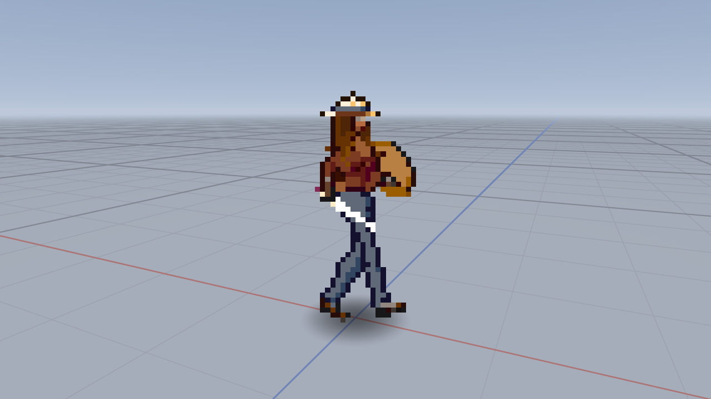
  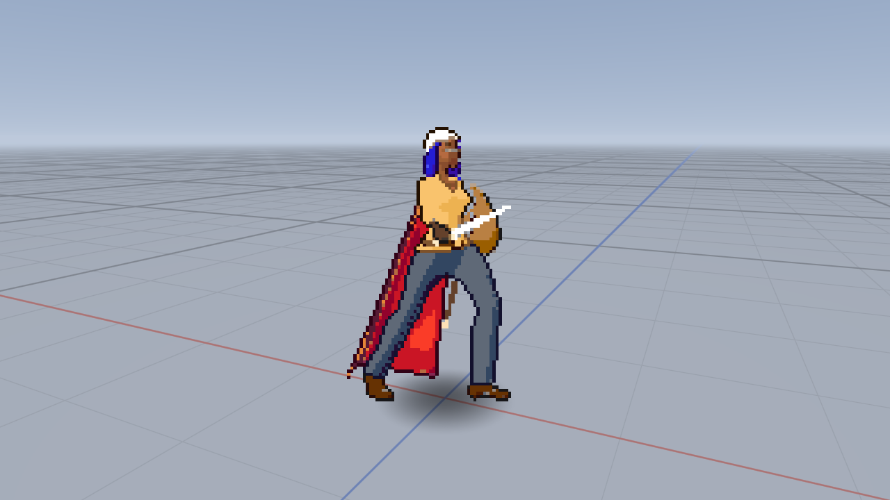
  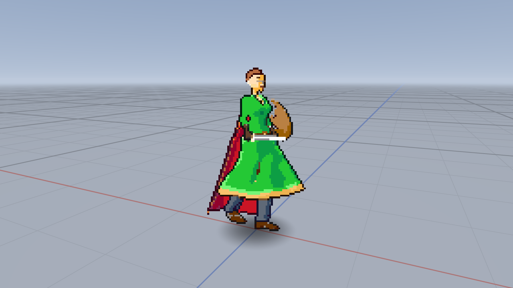
  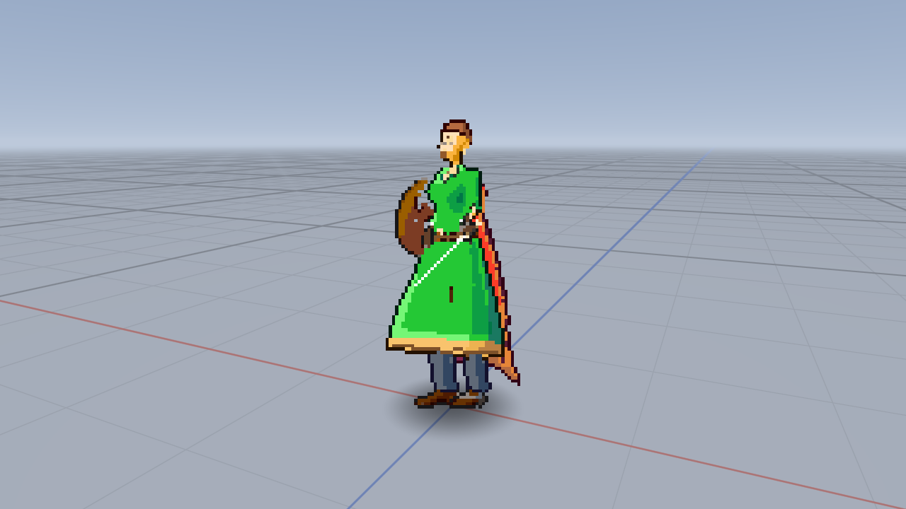
- **A second body**, the masculine model (1.80 m) from 3D-Modeling's
  `generic_masculine_model/`, in `assets/sprites_masculine/`: every one of
  the 52 items - the laced dress, the bralette, the makeup and the long hair
  styles too - and the three weapons drawn on him as they are on her: the
  same states (a carried item in its stance's) from the same 24 views, in
  128- and 64-pixel frames, right- and left-handed, in the same palette and
  colours, with his own cutscene close-ups. Pause → Wardrobe →
  Base body switches body, and the outfit carries over: each item is drawn
  for the body that wears it.

  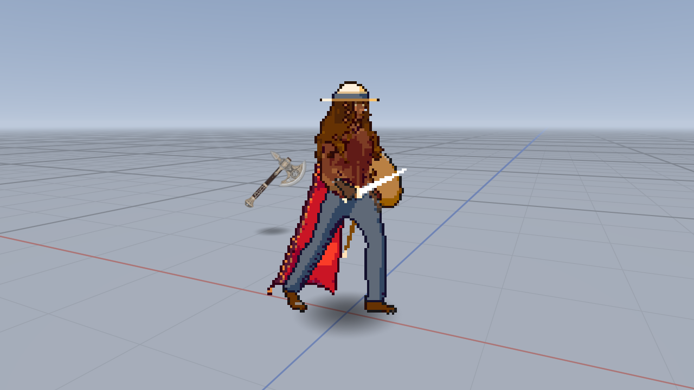
  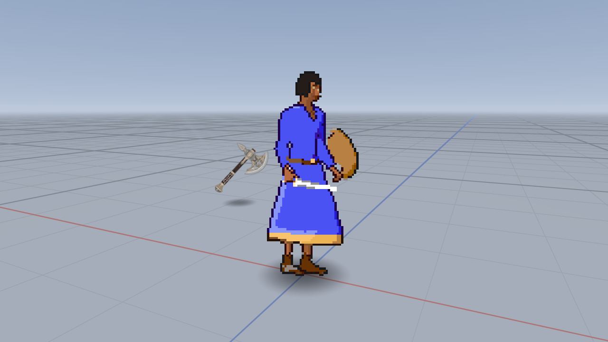
  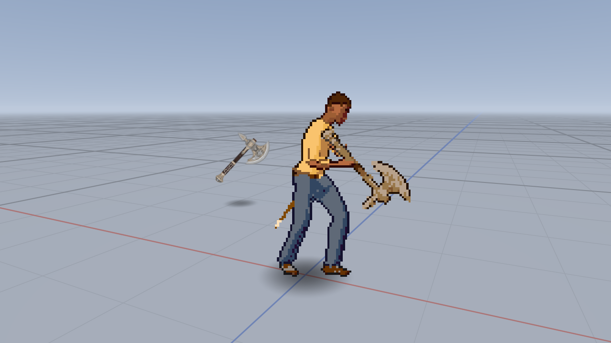
  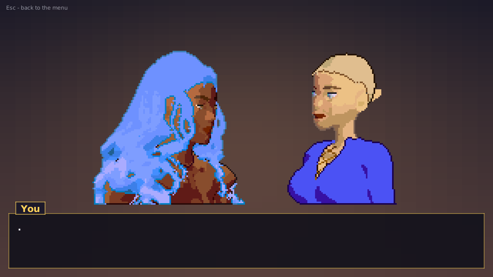
- **A fallback character** when no Blender renders are present: a 32 × 32 pixel
  figure generated from a tiny rigged box model and rendered from the same 24
  camera positions the real sheets use, scaled up with crisp pixels.

<p align="center">
  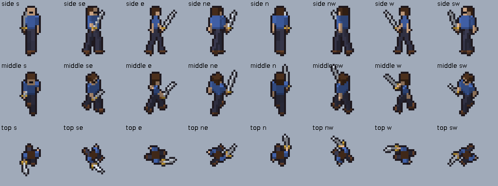
  <br><sub>One frame of the fallback walk from all 24 views — 8 directions × side, middle and top.
  The sword is its own layer, cut away wherever the hand or body is in front of it.</sub>
</p>

<p align="center">
  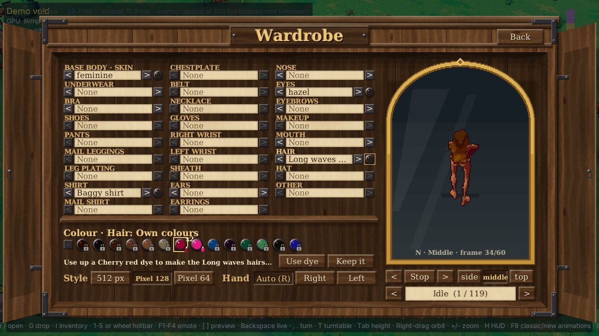
  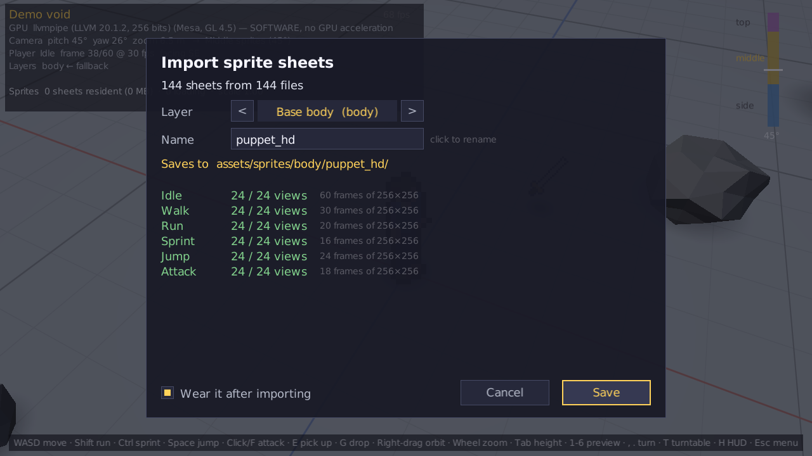
  <br><sub>Pause → Wardrobe, and the importer after a folder of sheets was dropped on the window.
  (Captured headlessly by a scripted run on a software renderer — hence the red GPU line.)</sub>
</p>

## The sprite stack

The full contract — folder layout, naming, the Blender camera, `profile.json`,
the layer order and the holdout rule — is in
[`assets/sprites/README.md`](assets/sprites/README.md). In short:

```
assets/sprites/<layer>/<item>/<state>_<elevation>_<direction>.png
assets/sprites/body/hero/walk_middle_ne.png
assets/sprites/carry_right/sword/attack_top_s.png
assets/sprites/items/sword/icon.png                 (the pickup, lying in the world)
```

- **Bodies.** A body can have its own sprites folder beside `assets/sprites/`,
  named after it (`assets/sprites_masculine/`), holding every item drawn on
  that body under the same names; the body a character wears picks the folder
  its items come from, so one outfit (`hair: bob`) fits either body.
- **Views.** The camera's angle above the character picks the set: **side**
  (rendered at 0°) from 0° to 33°, **middle** (45°) from 34° to 75°, **top**
  (90°, birds-eye) from 75° to 90°. The direction is worked out per character
  from where the camera is, so a character across the room is seen from its own
  angle.
- **Frames.** 512 × 512, 30 fps, any count per state, left to right then top to
  bottom.
- **Layers** draw in a fixed order — body, underwear, bra, shoes, pants, shirt,
  belt, necklace, gloves, right and left wrist, sheath, ears, earrings, nose,
  eyes, eyebrows, makeup, mouth, hair, hat, other, left hand, right hand (the
  hands swap for a left-handed character; the cape draws first when she faces
  the camera and just under the hair otherwise) — every one on the body's frame
  index. Each is rendered in
  Blender with the body as a **holdout**, so the sword is already cut away where
  the hand grips it and the game only has to draw layers on top of each other.
- **Placement.** Each frame is a camera-facing card placed so the feet in the
  picture land on the character's spot on the ground — the feet stay on the
  shadow from every angle and every zoom.
- **Colours.** An item with a `variants.json` can be drawn in any of the
  colours it lists - or any colour at all, `#rrggbb`, shaded like the item's
  own. Its sheets are palette PNGs, uploaded once as their palette indices
  (a byte a texel); the sprite shader colours each layer from a palette of
  its own as it draws it (`gfx/PaletteAtlas`), so every colour of a sheet is
  one texture, two characters can wear it in different colours in the same
  draw call, and a colour can change every frame.
- **Stances.** Every state has a stance - what is in her hands while it plays
  (`sprite/Stance`): the wardrobe's own carried items (the sword and shield -
  or, with no shield in either hand, the sword alone: its own `blade_*`
  states, the free arm down instead of holding a shield up), the battle axe,
  the bow, the crossbow, the crystal staff or a one-handed weapon - the wand, the mace or the dagger -, or nothing at all (the emotes and the pick-ups). The hands draw the stance's: a weapon of a stance is drawn from
  `carry_right/battle_axe`, `carry_left/longbow`, `carry_right/crossbow`, `carry_right/crystal_staff`, `carry_right/wand`, `carry_right/mace` or `carry_right/dagger` (the
  twin hand, mirrored, for a left-handed character) whatever the wardrobe holds,
  and the other hand is empty.
- **Fallbacks.** No body sheet for a state from a view → the first state along
  its fallbacks that has one (a crouch walk is shown as the walk, the axe's
  block as the axe's idle and then the idle; every chain ends in one of the
  first six), and every layer plays that state with it - so the 512-pixel
  renders, made before the new states, still play them all. No body sheet at
  all → the generated 32-pixel body for that view. No cosmetic sheet → that
  layer is left blank. A missing west-facing view borrows the east-facing one
  mirrored.
- **Loading.** Sheets load on demand, decode on worker threads, are cropped to
  the part of the frame they use and live in a video-memory budget with
  least-recently-used eviction; what may be needed next (the other states of
  the same stance, the neighbouring directions) is loaded ahead only into room
  the budget has spare.
  A layer change is only shown once every layer of it is ready, so a sword is
  never a frame out of step with the arm holding it.

### Importing sprite sheets

Drag sheets, a folder of them, or Blender's loose numbered frames from your file
manager onto the game window. The importer:

1. reads every name (forgivingly — `Walk-45-NorthEast.png` is fine) and every
   PNG header, and shows what it found per state, how many of the 24 views, and
   how many frames;
2. guesses the layer and item name from the folder you dropped — dropping
   `hat/red_cap/` means layer `hat`, item `red_cap` — and lets you change both;
3. stitches numbered frames into sheets, copies finished sheets as they are, and
   writes them to `assets/sprites/<layer>/<item>/` under canonical names —
   **inside the repository**, ready to commit;
4. reloads the library and, if *Wear it after importing* is ticked, puts the new
   item on the character.

## The inventory and the hotbar

The player carries an **inventory** (`world/Inventory`) of any number of
slots - 25 by default, `-Dlarsons.inventory.slots=N` for another number (a
script's `slots <n>` changes it while the game runs; anything that no longer
fits is put on the ground). The first five slots are the **hotbar**:

- **1 – 5** or the **mouse wheel** choose a hotbar slot, and what is in it is
  what she holds - and nothing else is. The battle axe, the bow, the crossbow, the crystal staff, the wand, the mace and the dagger are each taken up
  in their own stance; the sword - worn in the wardrobe's weapon hand - is the
  sword-and-shield stance, the wardrobe's own carried items (the sword alone
  when no shield is worn: no shield to block or bash with). An **empty slot**,
  or one holding something worn, is **empty hands**: nothing is drawn in
  either hand (the sword alone's poses, the free arm hanging) and a swing is a
  bare-handed blow, one Common die. The sword is in her hand only while its
  slot is selected - moved out of the hotbar or dropped, it is put away.
  (The emotes, which were on 5 – 8, are on **F1 – F4**; stopping a preview,
  which was 0, is **Backspace**; the wheel zooms while orbiting, and **+ / −**
  always do.)
- Picking an item up puts it in the first free slot, the hotbar first; when
  that is a hotbar slot it is selected, so it is in her hands. A wearable is
  never in her hands: it goes into the rest of the inventory first (the hotbar
  only when that is full), changes neither what she holds nor her stance, and
  is hers to wear from the wardrobe. With every slot full, nothing is picked up.
- **G** drops what is in the selected slot.
- **Whatever leaves the inventory is unequipped**: a weapon is out of her
  hands, a wearable comes off (unless she owns another like it). What she
  wears when the demo starts - the wardrobe is saved, the inventory is not - is
  put in her inventory as hers, so dropping it takes it off too.

**I** opens the inventory over the middle of the screen: every slot a
**diamond** - a square stood on its corner - with a **white border**, the rest
of the inventory in an interlocking lattice that fits however many slots
there are (`InventoryPanel.lattice`), the hotbar's five in a row along the
bottom, the selected one in gold. Click an item to pick it up, click a slot to
put it there (swapping with what was in it), click outside the panel to put it
on the ground; right-click (or Shift-click) moves an item between the hotbar
and the rest; 1 – 5 over a slot swaps it into that hotbar slot. **A–Z** and
**Rarity**, either side of the title, sort the rest of the inventory - by name,
or the rarest first (Mythic down to Common, by name within a rarity) - packed
into its first slots; the hotbar stays as it is. She stands still while it is
open; **I** or **Esc** closes it.

**The background** is `assets/ui/inventory_background.png`, a **432 × 768**
picture, scaled to the height of the window (never above its own size) and
kept in its shape; until there is one, a plain dark panel is drawn. It is read
again whenever the file changes, so a new background shows the next time the
inventory opens. Where things go on it, as fractions of the picture: the title
in the top 10 %, the lattice in the box 7 – 93 % across and 11 – 74 % down
(from its top), the hotbar's row 78 – 96 % down.

## Wearing what you own

What she wears is **items** (`world/Wearables`): clothes, armour, jewellery,
dyes, makeup, lipstick, hair styles and eyebrows are picked up or found in
chests like the weapons, carried in the inventory, and only then offered by
Pause → Wardrobe - each by its name ("Silver wrist band"), a wrist band on
either wrist, a sheath on either hip. The **underwear**, the **bra** and a
starter look - two hair styles, the **long waves** and the short **side
part**, and the **arched eyebrows** - are hers from the start
(`Wearables.OWNED_BY_DEFAULT`); everything else has to be found. **Free**,
not items, as before: the body and the skin tone, the ears, the eyes and their
colour, the nose and the mouth's shape - every folder found for the body. The
hands hold what the hotbar selects; the wardrobe leaves them alone.

| Rarity | Wearables |
|---|---|
| Common | underwear, bra (both owned by default), shoes, pants, baggy shirt, straw sun hat, beanie |
| Uncommon | belt, gloves, sheath, laced shirt, wool mantle, chainmail shirt, chainmail pants |
| Rare | laced dress, silver wrist band, silver necklace, silver hoops, the 14 dyes, makeup (noir, rose, plum), lipstick, the 11 hair styles, eyebrows (arched, soft, thin) - the long waves, the side part and the arched eyebrows owned by default - iron chestplate, iron leg plating, iron gauntlets, iron helmet |
| Epic | gold wrist band, gold necklace, gold hoops, steel chestplate, steel leg plating, steel gauntlets, steel helmet |

The first four rows are Larson's list; the rest are picks he did not make
himself: the chainmail Uncommon, the iron armour Rare and the steel Epic; the
straw sun hat and the beanie Common, the wool mantle Uncommon, the silver
hoops Rare and the gold hoops Epic. The **dyes** are the 14 colours every
item's `variants.json` shares - brown, black, auburn, copper, honey blonde,
platinum, cherry red, pink, electric blue, violet ombre, emerald, mint, green
ombre, royal blue - and the hair styles every folder under `hair/` (long waves,
bob, ponytail, pixie, braids, curls, crew cut, side part, undercut, beanie
long, beanie short).

- **Dyes unlock colours for good.** A dye (`dye_<colour>`) is a universal
  unlock for anything that takes a colour, from the makeup to the clothes:
  the colour shelf shows every colour of what is worn, the locked ones
  padlocked; with a dye of a locked colour in her bag, clicking it asks
  "Use up a red dye to make the bob hairstyle red for good?" and one dye is
  used up to unlock that colour on that item only (`Wearables.useDye`,
  saved in `wardrobe.json` under `unlocked`). An unlocked colour can be put
  on and taken off freely afterwards. The **lips** take every colour once she
  has the **lipstick**; a **metal** wearable only its own - the silver and
  the gold wrist band are one `gold_bangle`, worn in its `silver` or `gold`
  option. The skin tone and the eyes' colour are free.
- **Outfits saved before** keep what they wear, owned or not - it is listed
  in its layer, and so is a colour already on. Once taken off, it is offered
  again only if she owns it.
- **Losing an item** - dropping it, or it spilling out of a smaller inventory -
  takes it off when she has no other that gives the same; losing the lipstick
  takes the lips' colour off unless a dye unlocked it. What is owned by
  default, the free layers and the colours dyes unlocked never come off.
- **Chests** drop the wearables and the armour at their rarities, but never
  what is owned by default. So that the dyes and the hair styles do not drown
  out the weapons, each **family** - the dyes, the hair styles, the eyebrows,
  the makeup - is one drop of its rarity, and when it comes up, any one of it.
- Scripts give them like the weapons: `give silver_necklace`, `give dye_pink`,
  `give hair_long_waves`, `give steel_helmet`.

The armour is drawn on both bodies in every state (`chainmail/`,
`chainmail_legs/`, `chestplate/`, `leg_plating/`, `gloves/iron_gauntlets` ...
- see [`assets/sprites/README.md`](assets/sprites/README.md)) and hides what it
covers: the mail shirt the shirt and the bra, the mail leggings the underwear
and the pants (`Wardrobe.hidden`); a dress under the mail shirt keeps its
skirt and loses only what would poke out above the mail's hem
(`Wardrobe.cutBy`, `SheetImage.cutUnder`).

Lying on the ground and in the inventory, a wearable is one of three turning
128-pixel pickups (`Wearables.pickup`, `items/wearable_hanger/`,
`items/armour_shield/`, `items/dye_bottle/`, drawn by 3D-Modeling's
`items/item_spin_sprites.py`): clothes, jewellery, hair styles, makeup and
the lipstick a **t-shirt on a coat hanger** in their rarity's colour, armour
a **shield** in it, and a dye a **bottle** of its colour (Rare blue glow).
The old `items/<id>/icon.png` renders are only a fallback now.

## The treasure chest

An **ornate treasure chest** stands a few metres behind her at the start:
dark planks under gold straps, corner posts and a gold rim, an amethyst on
each front post, a ruby in the lock plate, a sapphire in a medallion on the
lid, a row of glowing runes - and **magical smoke** winding round it, three
twisting wisps of violet with sparkles in them. It is a 2D sprite like the
character, pre-rendered from the same **8 directions × 3 heights** as **128 ×
128 pixel art** at the character's scale, and drawn as a stack of three layers
(`sprite/ObjectSprites`, `sprite/ObjectStack`):

```
assets/sprites/objects/ornate_chest/profile.json                frame 2.4 m, aimed 0.6 m up, 24 fps
assets/sprites/objects/ornate_chest/smoke_back/swirl_<elev>_<dir>.png    48 frames, loops
assets/sprites/objects/ornate_chest/chest/idle_<elev>_<dir>.png          48 frames, loops
assets/sprites/objects/ornate_chest/chest/open_<elev>_<dir>.png          20 frames, once
assets/sprites/objects/ornate_chest/chest/opened_<elev>_<dir>.png        48 frames, loops
assets/sprites/objects/ornate_chest/chest/close_<elev>_<dir>.png         16 frames, once
assets/sprites/objects/ornate_chest/smoke_front/swirl_<elev>_<dir>.png   48 frames, loops
```

- **Idle**: shut, the runes pulsing, a glint running over its gems.
- **Open** (**E** beside it): the lid rattles, is thrown back past open and
  settles, and the chest **lights up from inside** - the velvet lining and the
  heap of gold coins lit warm, light welling up out of it in shafts, a pool of
  light on the ground round it - and holds **open** (lit, the light
  flickering, sparkles over the coins). **E** again **closes** it: the lid
  slams, the light goes.
- **The smoke** is its own two layers, the part behind the chest's middle
  (drawn under it) and the part in front (over it), playing one loop on the
  world's clock whatever the chest does, so it never jumps when the lid moves;
  as the light comes up it is tinted warm, on the GPU, by a palette swap.
- **Sound hooks** on all four: `idle` and `opened` loop while they hold, `open`
  and `close` play once as they start - quieter the farther you are, panned to
  the chest's side of the screen (`chests/ornate_chest/<state>.mp3`, see
  [Sound](#sound)).
- She cannot walk into it (it pushes her back out), and the prompt says
  whether E opens or shuts it, or picks up an item nearer to her.

It is a **loot chest**: `world/Chest` is a small state machine (`IDLE →
OPENING → OPEN → CLOSING`), and the first time it opens - and again once
everything it gave has been picked up - the world throws its loot out of it
(see [Items, rarity and loot](#items-rarity-and-loot)). The sheets are drawn by
[3D-Modeling](https://github.com/Larleeloo/3D-Modeling)'s
`items/ornate_treasure_chest/ornate_chest_sprites.py`, which models the chest
in Blender and draws the pixel art; any object laid out like it under
`assets/sprites/objects/` can be drawn the same way (see
[`assets/sprites/README.md`](assets/sprites/README.md#objects)).

## Items, rarity and loot

<p align="center">
  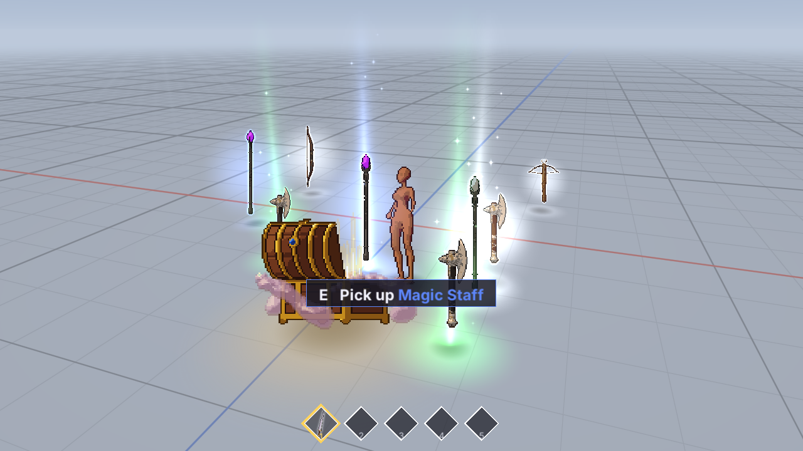
</p>

Every item is an **Item** (`world/Item`): what kind of thing it is
(`ItemDef`), its **tier** where it is a weapon of Larson's chart, its
**rarity**, and the **rare border** it may have dropped with. Its name says
all of it - "Venom Crystal Axe" - and so does a script's word for it:
`battle_axe:crystal:venom`.

| Rarity | Colour | Drops |  | Tier | Rarity | Looks |
|---|---|---|---|---|---|---|
| Common | white | 45 % |  | Basic | Common | as rendered |
| Uncommon | green | 35 % |  | Sharper | Uncommon | a black handle |
| Rare | blue | 15 % |  | Magic | Rare | as rendered (the crystal staff is the Magic Staff); blue projectiles |
| Epic | purple | 3.9 % |  | Crafted | Rare | a black body |
| Legendary | orange | 1 % |  | Honed | Epic | darker wood; yellow projectiles |
| Mythic | cyan (the palette's sea teal) | 0.1 % |  | Crystal | Epic | a pink-purple blade or tip |
|  |  |  |  | Perfect | Legendary | gold |
|  |  |  |  | Mythic | Mythic | smoky purple |

Which weapon comes in which tiers is the chart (`world/Tier.CHART`): the axe,
the sword, the mace and the dagger are Basic, Sharper, Crystal, Perfect or
Mythic; the staff Basic, Magic, Honed, Perfect or Mythic; the longbow and the
crossbow Basic, Crafted, Perfect or Mythic; the wand Magic, Honed, Perfect or
Mythic. Anything without tiers (a wearable) carries its own rarity. The
rarities' and the borders' colours are all entries of the art's 128-colour
palette.

**Rare borders** (`world/Border`), one chance in a hundred each, never two:
**Venom** (lime) - half as much damage again as damage over time for 10
seconds after the first hit; **Mystic** (smoky purple) - +150 % damage for
twice the mana; **Bonded** (pink) - +10 % damage for every living thing hit
with it in the last 5 minutes. The numbers are in `Border` for the fight to
use.

**The loot chest** (`world/Loot`): 3 to 7 items, each one's rarity drawn by
the drop rates, then one of that rarity's drops (any tier of any weapon in
the chart, and anything else added to the table), then perhaps a border; at
least one of them is Rare or better (one is drawn again if none is). They pop
out of the lid one after another, fly in an arc and land round its front.

**In the world** (`world/ItemRenderer`) an item hovers over its shadow and
turns in place - **128 × 128 pixel art**, 32 frames a turn, from the height
the camera sees it from (`assets/sprites/items/<id>/spin_px128/`, drawn by
3D-Modeling's `items/item_spin_sprites.py`) - in its tier's colours, with a
**halo** of its rarity's colour round it and a pool of it on the ground.
Chest loot stands in a **Borderlands beam** of its rarity's colour once it
lands - round the item and 3.6 m up into the air, pulsing, sparks rising in
it. A rare border is a crisp outline in its colour, pulsing, with what comes
off it: Venom's lime drips, Mystic's smoky puffs, Bonded's pink hearts.

<p align="center">
  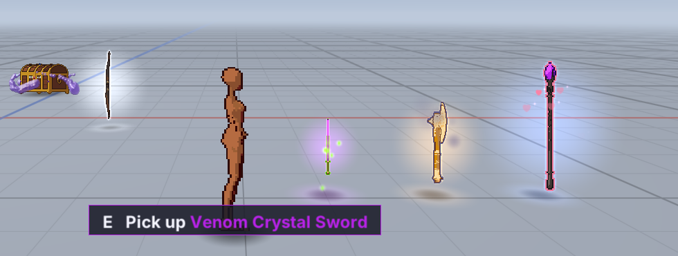
</p>

**Tiers are recoloured in the engine**, never drawn again: a weapon's sheets
name which of their materials is which part (handle, blade, body, wood,
tip, fittings, string - `parts.json` beside the turning sprites, and the
`carried` map in `assets/sprites/tiers.json` for the sheets in her hands),
and `sprite/TierLook` makes each tier's look (`tiers.json`) on those parts as
a palette swap, snapped back to the 128 colours (`sprite/PixelPalette`,
`assets/sprites/pixel_palette.json`). So the weapon on the ground, its icon
and the one in her hands are the same Sharper Axe, Crystal Sword or Perfect
Bow.

<p align="center">
  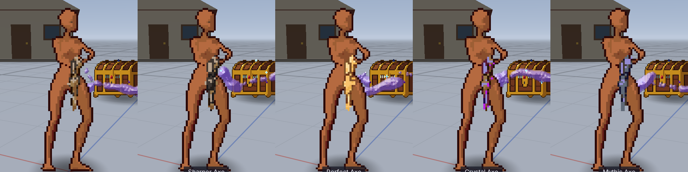
</p>

**In the inventory** each slot is tinted and edged in its item's rarity, the
item drawn from its turning sprite lying corner to corner (turning under the
pointer, or when selected) in its tier's colours, glowing in its rarity's
colour and ringed in its border's; the tooltip gives its name in the rarity's
colour, its rarity and tier and its border's effect. The pick-up prompt and
the hotbar's name are in the rarity's colour too.

<p align="center">
  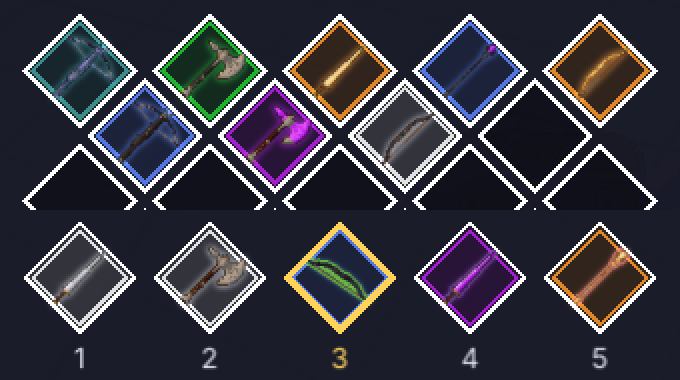
</p>

```
assets/sprites/tiers.json                        each tier's look by part, and which material of the in-hand sheets is which part
assets/sprites/pixel_palette.json                the art's 128 colours (3D-Modeling's generic_feminine_model/pixel_palette.json)
assets/sprites/items/<id>/spin_px128/            profile.json, spin_side/middle/top.png (32 frames), variants.json, parts.json
```

## Fighting

**Three training dummies** stand round her at the start
(`combat/Dummy`): a straw-stuffed burlap figure on a stake with a target
painted on its chest, a 2D sprite like the chest - 8 directions × 3 heights
of 128 × 128 pixel art - drawn by
[3D-Modeling](https://github.com/Larleeloo/3D-Modeling)'s
`items/attack_dummy/attack_dummy_sprites.py`:

```
assets/sprites/objects/attack_dummy/dummy/idle_<elev>_<dir>.png          48 frames, loops: a slow sway
assets/sprites/objects/attack_dummy/dummy/hit_<side>_<elev>_<dir>.png    16 frames: rocks away from the blow, wobbles back
assets/sprites/objects/attack_dummy/dummy/fall_<side>_<elev>_<dir>.png   12 frames: tips over away from the blow
assets/sprites/objects/attack_dummy/dummy/down_<side>_<elev>_<dir>.png    1 frame: lying there
assets/sprites/objects/attack_dummy/dummy/rise_<side>_<elev>_<dir>.png   18 frames: springs back up
```

Every reaction is drawn four ways - struck on its **front**, **back**,
**left** or **right** - and it plays the one for the side the blow came from,
flashing white as it is struck. It takes **100** before it falls, lies for
**6 s** and springs back up whole; lying down, nothing touches it. A health
bar shows over it once it is hurt. She cannot walk through it (she can [roll](#dodging) through it).

### The damage dice

**Every swing rolls D20s above her head**, in the **colour of the weapon's
rarity** (a rare border's colour as the die's rim), tumbling as she swings
and coming up their numbers one after another as the blow lands; **their
total is the damage**, which floats up off whatever was struck in the same
colour. The number of dice is the rarity's:

| Rarity | Dice | Damage |
|---|---|---|
| Common | 1d20 | 1 – 20 |
| Uncommon | 2d20 | 2 – 40 |
| Rare | 3d20 | 3 – 60 |
| Epic | 4d20 | 4 – 80 |
| Legendary | 5d20 | 5 – 100 |
| Mythic | 6d20 | 6 – 120 |

A **heavy** attack (the axe's, the staff's, the mace's and the dagger's) rolls
**one die more**, and her bare hands one Common die. **The wand's heavy
attack** - its great two-handed cast - sends no spell: it is the wand brought
down on what is in front of her, so it rolls **one D20** whatever the wand's
rarity, costs no mana, and its border adds nothing. A heavy attack can be made
**once every 10 seconds**: the orange bar to the left of the hotbar fills back
up after each one ("Heavy (X) ready"), and X before then does nothing. A sword swing, the axe's and the staff's blows and
the spins hit everything alive in front of her within reach (the spins all
round); a swing turns her toward a dummy just off to one side. The dice are
the 64-pixel sheets on an ordinary screen and the 128-pixel ones on a
high-density one (`assets/sprites/combat/d20_px64/`, `d20_px128/`: a
tumbling `roll.png` and `land_01` … `land_20.png`, the die coming down on
that number), drawn once in grey and coloured on the GPU by a palette swap.

### Arrows, bolts and spells

- **The bow** looses an arrow when the draw is let go, **the crossbow** a bolt
  as it fires: they fly in an arc, **aimed at the dummy she faces** (within
  25° either side, 25 m away at most), and **stick in the ground** where they
  miss, fading after 8 s. The roll is made as she shoots and lands on what
  the shot strikes.
- **A wand, or a Magic or better staff**, casts a **spell** (the staff's
  attack) that flies straight and bursts on what it hits or at the end of
  its flight: **blue** for a Magic Staff or wand (and a plain wand), **yellow**
  for a Honed one, otherwise the rarity's colour (a Perfect staff's orange,
  a Mythic one's teal). A Basic staff has no magic in it and thrusts. Each spell costs
  **10 mana**.

### Dodging

**Left Alt** (or **Z**) is the dodge key, and how long it is held decides the
move (`world/Player`):

- **A tap dashes** - she drops her weight and drives off the back foot, low
  and leant into it with the arms swept back and the weapon trailing, glides
  **3.5 m** and brakes on the back foot coming up ready (12 frames, 0.4 s).
  Pale blue afterimages - her silhouette, fading - are left behind her while
  she is going fast.
- **Held, it rolls** - the dash starts the moment the key goes down, so a
  dodge is never late; if the key is still down when the push-off is over (5
  frames, a sixth of a second) the dash turns into the **combat roll** at that
  very frame (the two share their first five frames, so nothing jumps): a dive
  into a tucked shoulder roll, the weapon held across in front of the shins,
  once over onto her feet and up ready - **4.7 m** in 22 frames (0.73 s). From
  the dive until she lands **nothing can hurt her** (`Player.invulnerable()`,
  for the enemies to come), and she rolls straight **through the training
  dummies** (a dash stops at them like walking does).

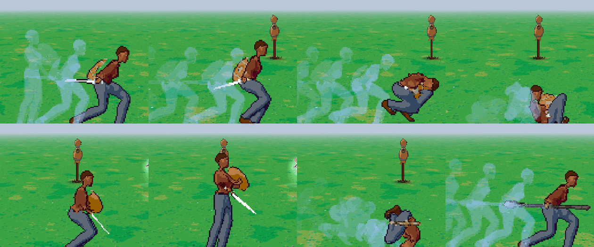

Either goes the way she is moving - she turns to it at once - or, standing
still, the way she faces, with whatever is in her hands: the sword and shield,
the axe, the bow, the crossbow, the staff, a one-handed weapon or nothing (both
states are drawn with every carried item). She can dodge from standing,
walking, running, crouched or from behind the shield, not in the air or in the
middle of a swing, a cast or a shot (an emote is cut short); the next dodge
can start **0.35 s** after the last one ended (`cooldowns.dodgeSeconds`), so
dodging is no quicker a way about than sprinting.

### Mana

Her **mana** is the blue bar beside the hotbar: **100**, filling back up at
**5 a second**. A spell with too little mana fizzles ("Not enough mana", no
dice).

### The rare borders

The borders the [rarity](#items-rarity-and-loot) system gives some
weapons do what they say, and each one's effect is written under the dice:

- **Venom** - the blow's damage again by half, as poison over the next
  **10 s** (a tick a second, in small green numbers): 100 becomes 150. Every
  blow poisons anew.
- **Mystic** - **×2.5** damage (+150 %), for **twice the mana**: a spell costs
  20, and a Mystic melee weapon spends 10 a blow (its bonus is lost when she
  has too little; a Mystic spell fizzles).
- **Bonded** - **+10 %** for each living thing this very weapon has struck in
  the last **5 minutes**, the one it is striking included (a dummy lying
  knocked down does not count until it is up again).

### Tuning

The numbers are in **`assets/combat/combat.json`**, read when the demo
starts - the dice per rarity, the heavy die, the wand's heavy dice
(`dice.wandHeavy`), the heavy attack's cooldown (`cooldowns.heavySeconds`), the wait between dodges
(`cooldowns.dodgeSeconds`), mana, the shots' speeds, range
and aim, how long arrows stay stuck, a dummy's health and how long it lies.
Any value left out keeps its default (`combat/CombatTuning`); the borders'
own numbers are `world/Border`'s. The fighting's other sprites are under
`assets/sprites/combat/`: `arrow/` and `bolt/` (`fly.png`, the head to the
right), `magic_bolt/` (`fly.png`, 8 frames), `magic_burst/` and `hit_spark/`
(`burst.png`), each with a `profile.json` saying how big it is in the world.

## Heights

North of the meadow the ground rises into **the highlands**
(`world/Terrain`): a heightmap on a half-metre grid, drawn as one mesh of
triangles (`world/TerrainRenderer`) in the meadow's own grass, with **rock**
where it is too steep to walk (gravel and strata, mapped on all three axes so
a cliff is not stretched) and **vines** painted on the cliff she can climb.
Everything stands on it - her, the dummies, the chest and its loot, the
items, the trees, the shadows (bent over the slopes) - and outside the
highlands the ground is the flat meadow as before. The meadow is solid
earth: from beside the hollow, its near rim hides its inside.

```
the ramp       3 m wide, from the end of the north path up to the plateau (her pace slows uphill, quickens down)
the plateau    6 m high, 12 x 12 m; the chest on top
the ledge      its west side, sheer: 6 m down, two dummies below it
the cliff      its east side, sheer and hung with vines: climb it (two dummies at its foot)
the hill       7 m high, round and walkable all the way up, west of the plateau
the hollow     2.5 m deep, east of the ramp: a flier circles over it
```

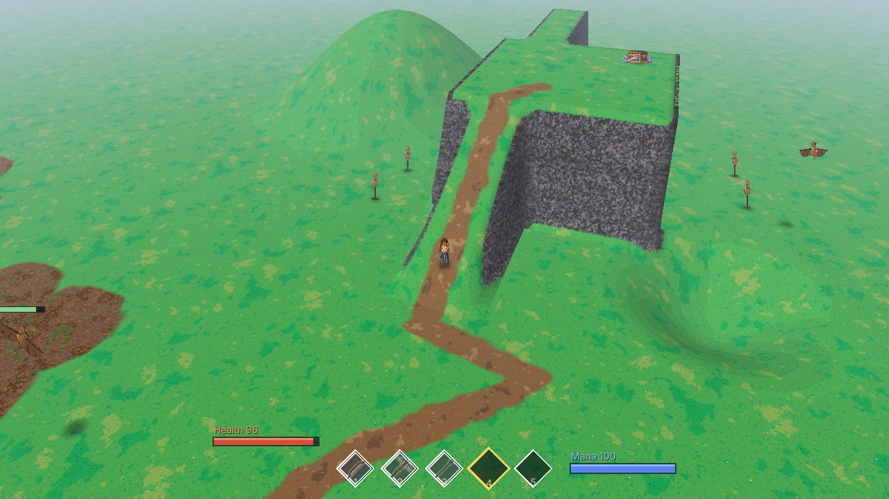

Ground steeper than 1 m up a metre is too steep to walk up (she stops at
its foot, or slides along it); off an edge she **falls** (the stance's jump,
held), and ground too steep to stand on she slides down.

### Falls, health and the roll

A fall of more than **3 m** hurts, **9** for every metre more - the ledge,
about 27. Press the **dodge key in the air** and she lands in a **combat
roll** instead, unhurt (from 1.2 m up). Her **health** (100) is the red bar
on the left, over the heavy attack's; it fills again 5 s after she was last hurt, 4 a
second. At 0 she is **knocked out** and back on her feet at the start.

### Climbing and stamina

Walk into the vines and she takes hold (the `climb` animation, her hands
empty): **W** climbs (0.82 m a second), **S** climbs down, **A** / **D** go
along the wall. With her hands at the lip she **steps up** over it
(`ledge_up`): she pulls herself up, presses up on her arms, puts her right
foot on the top and stands up on it.

To **climb down**, walk off the top of the vines: a step from the lip she
turns her back to the drop and **steps down** over it (`ledge_down`, the
step up the other way round) until she hangs by her hands, and keeps
climbing down while you keep walking out. Too tired to climb, she stops at
the lip instead of stepping off it; a jump still takes her off the top.

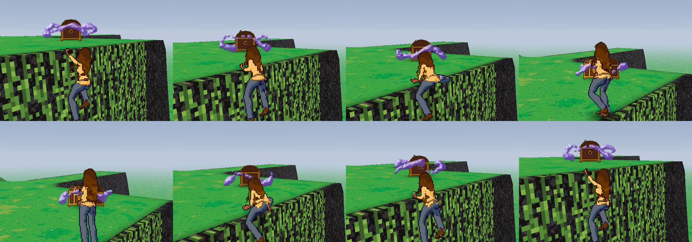
Climbing costs **stamina** - the yellow bar on the right, shown when it
is not full - 9 a second climbing and 3 hanging still; it
fills again 0.8 s after she stops, 25 a second. She needs 15 to take hold
(or to step down onto the vines), and at 0 she lets go and falls. **Space**, the dodge key or **C** let go.

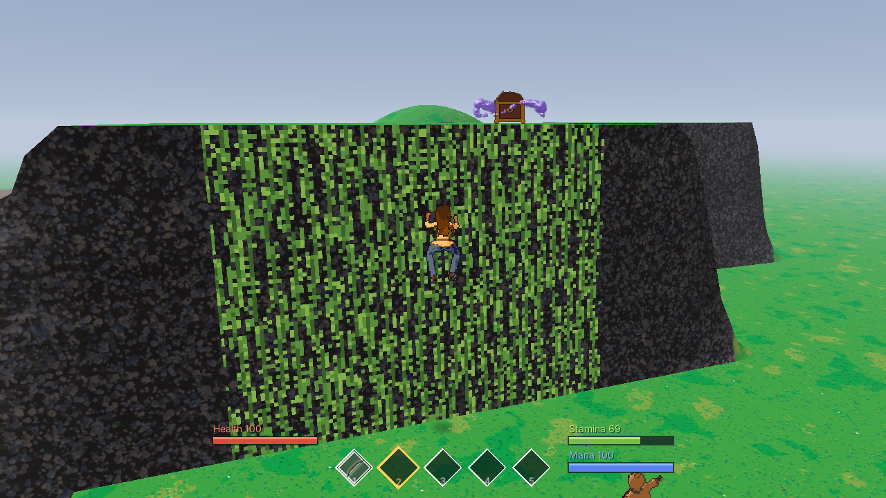
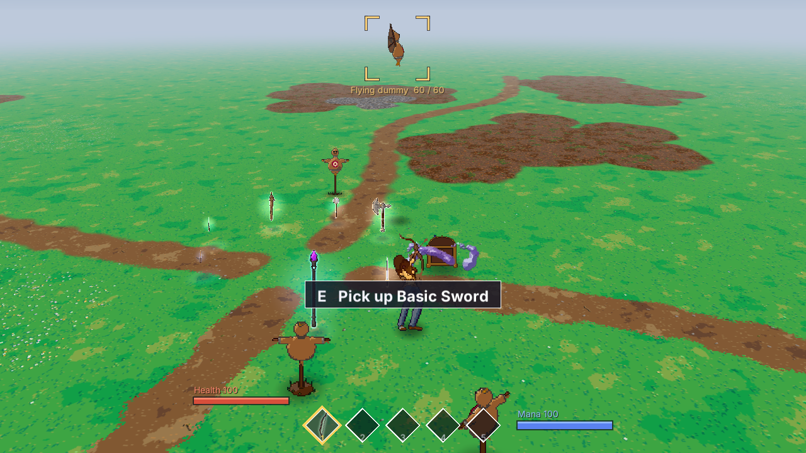

### The flying strike dummy

**Two flying strike dummies** (`combat/FlyingDummy`) - the training dummy's
body on burlap wings - circle 4 m up, out of a sword's reach, one over the
meadow's north side and one over the hollow. When she comes within 11 m it
hangs, screeching, and **dives** through where her chest is and climbs away
the other side: **8** if it strikes her, half behind a block, nothing if she
**parries** it (it is knocked back) or **rolls** through it. Low in its dive
a sword reaches it; otherwise shoot it - **aimed up** (below). Its health
gone, it tumbles out of the air, lies a while and beats back up whole. Its
shadow on the ground under it, and every arrow's, bolt's and spell's, shows
where it is.

```
assets/sprites/objects/flying_dummy/dummy/fly_<elev>_<dir>.png            16 frames, loops: flapping, bobbing
assets/sprites/objects/flying_dummy/dummy/swoop_<elev>_<dir>.png           8 frames, loops: diving, the wings swept back
assets/sprites/objects/flying_dummy/dummy/hit_<side>_<elev>_<dir>.png     12 frames: knocked away, the wings flung up
assets/sprites/objects/flying_dummy/dummy/fall_<side>_<elev>_<dir>.png    12 frames: tumbling over, the wings folding
assets/sprites/objects/flying_dummy/dummy/down_<side>_<elev>_<dir>.png     1 frame: lying on the ground
assets/sprites/objects/flying_dummy/dummy/rise_<side>_<elev>_<dir>.png    18 frames: righting itself, beating back up
```

drawn by [3D-Modeling](https://github.com/Larleeloo/3D-Modeling)'s
`items/flying_dummy/flying_dummy_sprites.py`.

### The lock-on

**L** locks on to whatever enemy is nearest the middle of the view within
**30 m** - a training dummy or a flier - with brackets round it, its name and
its health; **K** moves the lock on to the next one, left to right, and **L**
again lets go. Locked on, her shots and spells go for it wherever it is
(leading it as it flies), her swings turn to it, and the camera keeps it in
view. When it goes down the lock moves on to the next nearest, if there is
one.

### Aiming up

A shot at something well over her hands - **20°** up and more: a flier, or a
dummy on the plateau above her - is made from the **aimed-up** animations,
the bow drawn and loosed at the sky (`bow_draw_up`, `bow_fire_up`), the
crossbow raised (`crossbow_fire_up`), the staff and the wand cast upward
(`staff_attack_up`, `wand_attack_up`). Crouched, she shoots as before.

### The high ground

A shot or a spell at something **2.5 m** or more below her rolls **a die
more** ("High ground +1 die" over her head) and carries a quarter farther. A
swing reaches only what is about level with her - from half a metre below
her feet to 2.4 m above them.

### The automatic camera height

On the hills the camera **rises on the peaks** - looking down over the land
round her, drawn back a little - and **sinks in the hollows**, by how far she
stands above or below the ground about her (Pause → Settings → Camera height,
or **O**: automatic or fixed). It never dips into a hillside.

## Sound

The sound system is Larsons-Game-Engine's (`audio/`): its own **MP3 decoder**
(a pure-Java port of the public-domain minimp3, so no codec or library is
needed - WAV, AIFF and AU load through the JDK), a software **mixer** that
plays any number of sounds at once, each at its own pitch, volume and stereo
position, with every one-shot at a slightly different pitch each time, and
the **sound pack**: sound keys resolved to files by name. A machine with no
audio device is silent rather than broken. The decoder is **gapless**: it
reads the encoder's delay and padding from the MP3's LAME header and trims
them, so a sound starts on its first sample and a loop (the wind, a chest
standing open) goes round without a hiccup.

### What makes a sound

Everything that happens in the game is a **sound hook**, and every sound
belongs to one of nine **categories** (`audio/SoundCategory`), each with its
own volume:

| Category | What is in it |
|---|---|
| **Footsteps & movement** | a footstep each time a foot comes down - on the ground under it (grass, a dirt path, gravel or the forest floor), quieter the softer she goes - jumping, landing (louder the farther she fell), a hard landing, rolling out of a fall, crouching and standing, the dash and the combat roll, stepping over a ledge, each hand taking hold of the vines, letting go |
| **Voices** | each body's laugh, cry, surprise and anger, being hurt, knocked out, and out of breath |
| **Weapons** | every swing, chop, smash, thrust, shot and cast of all eight weapons, the parry, taking each weapon in hand, the heavy attack ready again |
| **Hits & magic** | the dice, a blow landing, arrows and bolts striking or sticking, spells cast, hitting, bursting on the ground or fizzling, venom, being struck, blocking, parrying, dodging |
| **Creatures** | the training dummies struck, falling and rising; the flying dummies' wings on their rounds, the screech before a dive, the dive, struck, falling, hitting the ground and beating back up |
| **World & loot** | the chests (shut and humming, thrown open, standing open, closing), the loot thrown out and landing, and its rarity ringing out from Uncommon to Mythic, picking things up and dropping them |
| **Ambient** | the breeze over everything (and a stream and crickets, ready for the places that need them) |
| **Music** | the songs, each looping where it plays: the main menu's |
| **Interface** | menus, the inventory, the wardrobe, the lock-on, screenshots, cutscene lines, and the level editor's tools |

The animations are hooks themselves (`audio/AnimationSound`, updated each
frame by `audio/WorldSounds`): an animation's sound starts with it, looping
for as long as a held animation holds and once for a one-shot. A footstep
falls on the gait itself - each walk, run and sprint cycle starts with the
right heel down and has the left down halfway, as the Blender gaits are
authored. Sounds in the world are placed: quieter the farther off, panned to
the side of the screen they are on. Combat, the player's falls and climbs,
the menus and the inventory play where they happen.

### Choosing your own sounds

**Pause → Sounds** lists every sound, a tab per category. Each row has a play
button, where its sound comes from now (the game's file, a file it shares
with sounds like it, yours, muted, or silent), and:

- **Choose…** - your computer's open-file dialog, for any MP3 or WAV (on
  Linux it needs `zenity` or `kdialog`); or **drop the file on the row**;
- **Mute** / **Unmute**;
- **Reset** - back to the game's own.

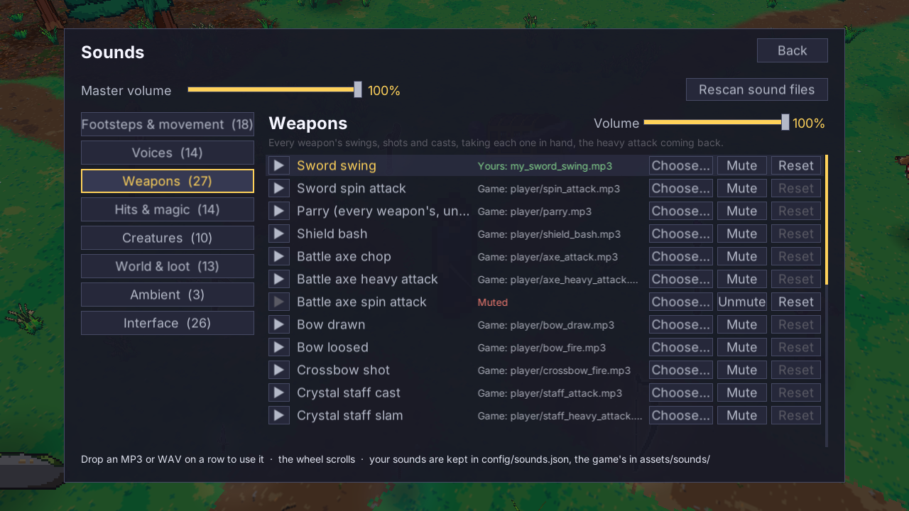

A master volume, a volume per category, and **Rescan sound files** (after
changing `assets/sounds/` with the game running) sit above the list. Your
choices and volumes are yours alone, saved as you make them
(`config/sounds.json`, `config/settings.json`).

### The sound pack

```
assets/sounds/
  SOUND_KEYS.txt          every sound in the game, by category, and the file to name it (kept up to date by the game)
  README.md               how to name and add sounds
  soundpack.json          volume, pitch, pitch variation, per-sound overrides
  player/                 footstep_grass.mp3 ... jump.mp3, land.mp3, dash.mp3, roll.mp3, climb_grip.mp3,
                          attack.mp3, axe_attack.mp3, bow_fire.mp3, wand_attack.mp3 ... (both bodies)
  player/feminine/        her voice: emote_laugh.mp3, hurt.mp3 ... and any of her 129 animations of her own
  player/masculine/       ... and his
  chests/                 idle.mp3, open.mp3, opened.mp3, close.mp3 (every chest; chests/<chest>/ for one's own)
  items/                  pickup.mp3, drop.mp3, equip.mp3, and items/<item>/equip.mp3 for each weapon
  combat/                 dice_roll.mp3, blow.mp3, arrow_hit.mp3, spell_cast.mp3, block.mp3, parry.mp3 ...
  combat/attack_dummy/    hit.mp3, fall.mp3, rise.mp3
  combat/flying_dummy/    fly.mp3, warn.mp3, swoop.mp3, hit.mp3, fall.mp3, down.mp3, rise.mp3
  world/                  loot_throw.mp3, loot_land.mp3, loot_uncommon.mp3 ... loot_mythic.mp3
  ambient/                wind.mp3, stream.mp3, crickets.mp3
  music/                  dream_on.mp3 ... one per song (seamless loops); main_menu.mp3, your own menu song
  ui/                     click.mp3, hover.mp3, pause.mp3, inventory_open.mp3, wear.mp3, error.mp3 ...
```

**Fallbacks** keep the pack small: a sound one folder up covers everything
like it until one has its own - `player/attack.mp3` is both bodies' sword
swing, `player/masculine/attack.mp3` his alone; a move falls back to the
move it is a version of (the axe's heavy attack to its chop, a crouched shot
to the standing one); a footstep on one ground to `player/footstep.mp3`;
`chests/open.mp3` is every chest's. A body's sounds are the body the
wardrobe wears, in any style.

The files there now, but for the music, are **placeholders**, every one made in code by
[`tools/sounds/make_placeholders.py`](tools/sounds/make_placeholders.py)
(Python with numpy and scipy, and ffmpeg) - filtered noise, struck and
plucked strings, formant voices - so they are the game's own, with no
licence to worry about. Replace any of them with a real recording of the same
name; `python3 tools/sounds/make_placeholders.py --list` lists them, and
naming some (`... player/jump ui/click`) makes just those again.

Other code can add sounds of its own (`SoundKeys.register`, the level
editor's objects): each gets a row in its category's tab, a line in the key
list, and the same fallbacks and volume.

### Music

The songs are medieval-style covers of the songs on the roadmap's Sound
milestone - lute, harp, recorder, fiddle, a portative organ's drone and a
hand drum - arranged for this game and not for sale. Each is listed in
`audio/Songs` and is a seamless loop at `assets/sounds/music/<song>.mp3`,
heard under its own sound key (`music/dream_on`); the full list, with what
each arrangement does, is in [`music/`](music/README.md).

Where they play:

- **The main menu** plays **"Dream On"** (Aerosmith), looping. Its key is
  `music/main_menu`, which falls back to `music/dream_on`: put your own
  `main_menu.mp3` in the pack (or choose one in Pause → Sounds → Music) and
  the menu plays that instead.
- **A level** plays the music its maker picked in Creative Mode's Level tool:
  one song looping, **Shuffle all** (every song once in a random order, then
  shuffled again, never the same one twice running), or **None**. The demo
  and every new level shuffle; a level saved before levels had music does
  too. It plays a little under the menu's level (`DemoScene.MUSIC_VOLUME`).
- **Creative Mode** itself is quiet but for the Level tool's song player:
  pick a song under **Listen to**, play or pause it, and drag the timeline to
  anywhere in it (it is silent while held and plays on from where it is let
  go); **Use this song** makes it the level's. The choice is saved in
  `level.json` (`"music": "dream_on"`) and undoes like any other change.

A scene names the music it wants as it opens and lets it go as it closes
(`audio/Music`). A song is read on a thread of its own, so nothing waits for
it, then fades in over 2.5 seconds; leaving fades it out over 1.5, and the
next scene's song (if it has one) starts once it is quiet. Going from one
menu straight into another keeps it playing, and a level entered again with
the same playlist carries on with it. In a playlist each song plays through
once, fades as it ends, and the next one (already read ahead) follows. A song
always plays at its own pitch, and like any sound it can be swapped for your
own MP3 or muted in **Pause → Sounds → Music**, with its own volume.

```
music/<song>_medieval.mid         an arrangement: open it in FL Studio (a track per instrument)
tools/music/<song>.py             writes that MIDI and renders assets/sounds/music/<song>.mp3
tools/music/medieval.py           the toolkit: parts, the MIDI file, rendering and the seamless loop
tools/music/arrange.py            chord names, tunes written as note names, and the band's ways of playing
```

`python3 tools/music/dream_on.py` makes both of a song's files (FluidSynth
and the FluidR3 General MIDI SoundFont render it; `--midi` writes just the
MIDI), and `python3 tools/music/all.py` makes every song's. To use an
arrangement edited in FL Studio instead, export it from there as a loop and
put it over the song's MP3 - see [`music/`](music/README.md).

## Cutscenes

A cutscene is a script of actors and lines, played over close-up layers:

```
assets/cutscenes/<scene>.cut                          the script (menu.cut: the main menu's)
assets/closeups/<layer>/<item>_px128/<clip>_side_se.png    one layer's clip, close up (and _px64)
```

- **Close-ups** are the wardrobe's items again, rendered waist-up and close
  from the front-left three-quarter view - a face about 50 pixels tall in a
  128-pixel frame instead of 12 - for five looping conversation clips:
  `listen`, `talk`, `explain`, `laugh` and `surprise`, with mouth shapes,
  blinks, brows, nods and gestures. Every item of a layer that can show in
  the frame has them (shoes, trousers and what the hands carry are below it
  or put away), each its own layer cut against the outfit like the game
  sprites, so **any character - the player's own included - can play a
  cutscene**, in any items and any colours. A character on the right of a
  two-shot is drawn mirrored, so the two face each other.
- **Actors** (`cutscene/Actor`) are a wardrobe each - a copy of the player's,
  or dressed in the script - playing clips, and what the scene does to their
  look: a layer's colour fading to another (an option or any `#rrggbb`), a
  flash, a tint (warm light, cold light) and a fade. All of it is palette and
  vertex-colour work at draw time; no sheet is ever re-uploaded.
- **The script** (`cutscene/Cutscene`): `actor`, `stand`, `say`, `clip`,
  `colour`, `wear`, `flash`, `tint`, `fade`, `wait`, `loop` - see
  [`assets/cutscenes/README.md`](assets/cutscenes/README.md). `say` plays the
  speaker's clip for the length of the line while the others listen.
- **The stage** (`cutscene/CutsceneStage`) draws it: a backdrop, the actors'
  layers in the game's draw order at whole-pixel zoom, and the line in a box
  with the speaker's name. Layers load through the sprite library (its memory
  budget, its decoders); an actor's other clips load ahead, and while a new
  clip is still loading the actor holds its last complete frame.

## The scenery

The demo's meadow is all pixel art, modelled, rendered and drawn in Blender by
the scripts in [3D-Modeling](https://github.com/Larleeloo/3D-Modeling)'s
`scenery/` folder, every pixel in the same 128-colour palette as the
characters:

- **An oak** - a fully textured tree, 48 frames of it swaying in the breeze
  (a four-second loop), drawn in 128 × 128-pixel frames twice the size of
  the characters' pixels, so it stands about 4.4 m tall and 4 m across.
- **Three grass tufts**, 32 × 32 pixels, each 24 frames blowing in the
  breeze. The wind rolls across the field as a gust: a tuft downwind sways a
  moment after one upwind, so the grass moves in waves rather than all at
  once.
- **Three rocks** - a boulder, a mossy rock and a cluster of stones -
  128 × 128 pixels, standing still.
- **The ground**: a 512 × 512 grass tile, its pixels the size of the
  characters', repeating seamlessly, sharp up close and smooth far off.

Like Minecraft's plants, a tree or a tuft is the same sprite on **two cards
crossed at right angles**, so it has body from every side and needs no
directions of its own. A rock is one card that turns to face the camera
instead, because from above a crossed rock reads as a star (a rock whose
profile says `"facing": "cross"` is crossed like the rest). The cards are cut
out at their pixels' edges and depth-tested against the characters, so she
walks behind a tree, in front of it and through the grass, but not into a
trunk or a rock. The trees and rocks cast shadows.

The meadow is planted from whatever is in `assets/scenery/` (a folder per
sprite: `sheet.png` and its `profile.json`; `ground/grass.png`), the same way
every run, clear of the spawn, the chest and the weapons. **P** (or Pause →
Settings → Scenery) hides it all. The folder's format is in
[assets/scenery/README.md](assets/scenery/README.md).

## Creative Mode

Creative Mode is the game's level editor - the platform the game's real areas
are built on. Type **1025** on the main menu to show its **Dev** tab (typed
again, the tab hides; it stays shown between runs). There: **New level**, **Copy
the demo** (the meadow and the highlands as a level, everything in them
editable), and every saved level with **Edit**, **Play**, **Copy** and
**Delete**.

<p align="center">
  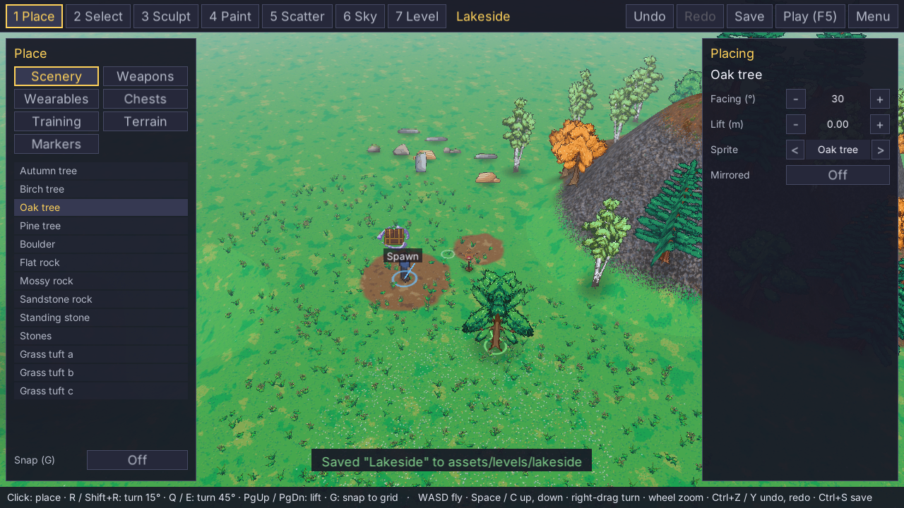
  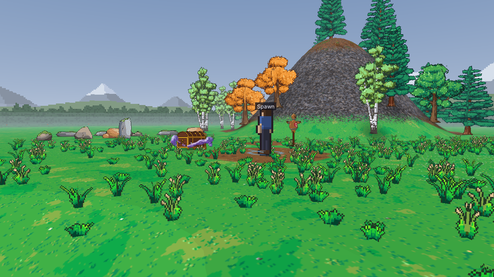
</p>
<p align="center">
  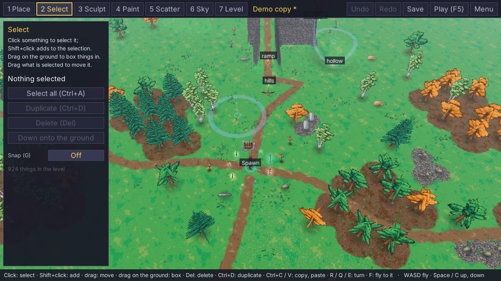
  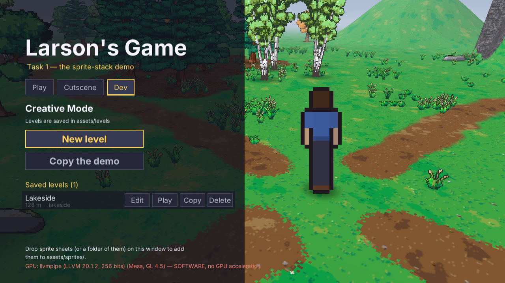
</p>

The editor shows the level as it will be played - the ground, the scenery, the
items turning, the dummies, the chests - with what you are about to place
standing under the pointer. Seven tools, on the number keys:

| Tool | What it does |
|---|---|
| **1 Place** | the palette: every tree, rock and tuft, every weapon and wearable, the chest, the training and flying dummies, climbing vines, sounds, the player's spawn and named spots. Click to place; R / Shift+R turn 15°, Q / E 45°, PgUp / PgDn lift, G snaps to a half-metre grid. The right panel sets what is placed next: its facing, lift and own settings (a dummy's health, an item's tier, a tree's sprite, a sound) |
| **2 Select** | click, Shift+click to add, drag on the ground to box things in; drag to move, R / Q / E to turn, Del to delete, Ctrl+D duplicate, Ctrl+C / Ctrl+V copy and paste (at the pointer), Ctrl+A everything, F flies to it. The right panel edits what is selected (more than one, it counts them by kind) |
| **3 Sculpt** | hold to raise, lower, smooth or flatten the ground (Shift: the other way; Ctrl+click picks the height to flatten to). Steeper than 45° is rock she cannot walk up - put vines on it to climb. The level's edge stays at the height of the flat ground round it |
| **4 Paint** | dirt, forest floor, gravel or flower meadow over the grass; Shift paints back to grass |
| **5 Scatter** | grass, trees or rocks - one sprite or a kind mixed - sown under the brush as the demo has them: trees 2.8 m apart, nothing inside a trunk or a rock, nothing on ground too steep. Shift pulls up what you are sowing |
| **6 Sky** | the colour overhead and at the horizon (the fog's colour), from the 128-colour palette; how far the fog reaches; and up to eight **distant backgrounds** round the horizon - mountains (snow on the peaks or not), rolling hills, a tree line, towers and spires, the sea - each with its colour, height, haze, an arc of the horizon or all the way round, and a seed for a different range |
| **7 Level** | its name, its size (64, 128, 192 or 256 m a side), its music (a song, Shuffle all, or None) with a player to listen first (play, pause, a timeline to drag), save, play, back to the menu |

`[` and `]` (or Shift+wheel) size the brush, Shift+`[` / `]` its strength.
Everywhere: **WASD** fly, **Space** / **C** up and down (Shift faster),
right-drag or the arrow keys turn the view, the wheel zooms, **Tab** steps
through the camera heights, **H** hides the panels, **Ctrl+Z** / **Ctrl+Y**
undo and redo (sixty steps), **Ctrl+S** saves, **Esc** goes back to the menu
(asking first when there is something unsaved).

**F5 play-tests** the level from the pointer (**Shift+F5**: from the spawn) -
the whole game, fighting, chests, climbing and all. **F5** again, or the pause
menu's **Back to the editor**, returns to the editor as you left it.

### Levels on disk

A level is a folder of `assets/levels/`, meant to be read and to sit in git:

```
assets/levels/<level>/
  level.json    its name, size, sky and backdrops, music, and every object - one a line
  height.png    the sculpted ground, 16-bit grey: a height every 0.5 m (value / 256 - 128 m)
  ground.png    the paint, a pixel every 0.25 m: red dirt, green forest floor, blue gravel, alpha meadow
```

```json
{
  "format": 1,
  "name": "Lakeside",
  "size": 128,
  "sky": {"zenith": "#4A6FA5", "horizon": "#BDC9DB", "fog": 70, "backdrops": [...]},
  "objects": [
    {"id": 1, "type": "spawn", "x": 0, "z": 0, "yaw": 0},
    {"id": 2, "type": "scenery", "x": 6.5, "z": -8, "yaw": 37.5, "sprite": "oak_tree"},
    {"id": 3, "type": "item", "x": 1.4, "z": -2.2, "yaw": 0, "item": "sword", "tier": "iron"},
    {"id": 4, "type": "dummy", "x": 3, "z": -2, "yaw": 200, "health": 100},
    {"id": 5, "type": "sound", "x": -12, "z": 8, "yaw": 0, "sound": "ambient/stream"}
  ]
}
```

The images are left out while the ground is flat and all grass. Keys and kinds
of object this game does not know are read and written back as they were, so
a level made by a newer game loses nothing in an older editor.

### Adding a kind of thing

Every kind of object - and every kind still to come: NPCs with their dialogue,
quests, enemies and their summon stations, biomes' critters - is one
registration in `level/ObjectTypes`:

```java
// for example, once there are NPCs:
ObjectTypes.register(new ObjectType("npc", "Villager", Category.MARKERS,
        List.of(Prop.text("name", "Name", "Villager"), Prop.text("dialogue", "Dialogue", "village_elder")),
        0.4, 1.7, 0xF0C080, false,
        (o, b) -> b.world().addNpc(new Npc(o.str("name", "Villager"), b.onGround(o), o.yaw()))));
```

Its props are edited in the editor's right panel and saved in `level.json`
with no more work; its spawner says what it is when the level is played. The
palette, the picking, undo, copy and paste, and saving take it as it is.

## GPU acceleration

**The whole game renders through OpenGL 3.3 core** (via LWJGL 3.3.3): the ground,
the scenery, every sprite layer and shadow, and the entire UI, text included.
AWT is only used off-screen — to decode PNGs, rasterise the font atlas once,
and generate the fallback sprites.

- Rendering is premultiplied-alpha throughout, and the 512-pixel sheets get
  trilinear mipmaps, so minified characters have clean edges without dark
  fringes. The 32-pixel fallback is sampled nearest-neighbour.
- 4× MSAA and vsync are on by default, and the game holds a steady
  **120 frames a second** - see [below](#120-frames-a-second).
- The renderer reports what it got — shown in the HUD, the Settings page and
  the console. On a software rasteriser (Mesa llvmpipe, "GDI Generic", Microsoft
  Basic Render) it still runs, and says so.

### 120 frames a second

The game aims for **120 fps with every frame the same length** (Pause →
Settings → Frame rate: 60, 120, 144 or uncapped; `-Dlarsons.fps=N` for one
run). The HUD's top line shows the frame rate, the average frame and the
longest frame of the last half second - a hitch shows there - and how frames
are being paced; `-Dlarsons.fps.log=true` prints the same to the console.

- **Pacing** (`core/FramePacer`). Vsync is used wherever it gives the target:
  a 120 Hz display is synced every refresh, a 240 Hz one every other. On a
  144 or 165 Hz display, or with vsync off, the game waits out each frame
  itself against a fixed 1/120 s cadence - sleeping while there is time,
  spinning the last fraction of a millisecond - so frames start within a few
  hundredths of a millisecond of their slot (with G-Sync, FreeSync or
  ProMotion they are also shown exactly so). A 60 Hz display shows 60: 120
  there needs vsync off (Pause → Settings → Vsync, saved; or
  `-Dlarsons.gpu.vsync=off` for one run) and tears. If the driver ignores vsync
  the cap takes over.
- **A fast display set to 60 Hz.** The refresh rate is the one the system
  runs the display at, and that is often 60 Hz on a 120 or 144 Hz screen (the
  system's default, a power-saving setting, the cable). The game reads the
  monitor's other modes too, and when it can go faster it says so - on the
  HUD ("the display is set to 60 Hz but can do 144"), in Pause → Settings and
  in the console - with the ways to get it: **F11** (or the Settings button)
  plays **full screen with the display switched to its fastest mode** while
  the game has it; the system's display settings raise it for good (Windows:
  Settings → System → Display → Advanced display → Choose a refresh rate); or
  vsync off. While frames keep to the cadence, animation steps by
  the cadence's period rather than the measured time, whose sub-millisecond
  wobble would otherwise show as stutter.
- **No GPU stalls.** The sprite and UI batch uploads each batch's vertices
  once, into a ring buffer mapped unsynchronized, instead of rewriting one
  buffer the GPU was still drawing from for every texture change; palette
  rows stay on the GPU from frame to frame and only new colours are sent.
- **Less overdraw.** Each sprite layer is drawn over only the box its pixels
  cover, not the whole frame card: close up, a 20-layer outfit was 20
  full-screen passes. (Sprites test depth against the scenery but no longer
  write it - billboards all face the camera, so far-to-near order is the
  same answer - which is what lets layers be separate quads.)
- **Loading never costs a frame.** Sheet uploads get about 2 ms of each
  frame, each one's cost predicted from its size and how fast uploads have
  been going; decoding runs on lower-priority threads.
- **No collector pauses.** `run`, `runGpu` and the IntelliJ profile use
  generational ZGC, whose pauses are well under a millisecond; the default
  collector stopped the game for up to ~50 ms while 512-pixel sheets
  decoded. For the jar, pass it yourself:
  `java -XX:+UseZGC -XX:+ZGenerational -jar build/libs/larsons-game.jar`
  (`-XX:+UseZGC` alone on JDK 23 and later).

On Mesa's software rasteriser (4 CPU cores, 1280 × 720, 4× MSAA, uncapped),
these took the demo from about 60 to about 110 fps and the closest camera
from about 22 to about 100 - on the CPU alone; a real GPU has plenty of room
at 120.

**The IntelliJ profile "Run Game (GPU)"** (`.idea/runConfigurations/Run_Game__GPU_.xml`)
runs the Gradle task `runGpu`, which on top of a plain `run`:

- asks for the **discrete GPU** on hybrid Linux laptops (`DRI_PRIME=1`, plus
  NVIDIA PRIME render offload when the NVIDIA driver is loaded). On Windows,
  set `java.exe` to *High performance* once in Settings → System → Display →
  Graphics; macOS switches to the discrete GPU by itself;
- turns on 4× MSAA explicitly (vsync is the saved choice in Pause → Settings, on until changed);
- sets `larsons.gpu=required`, so a software renderer is flagged in red.

Launch options, all forwarded by Gradle like the engine's `-Dlarsons.*` flags:

| Option | Default | |
|---|---|---|
| `-Dlarsons.gpu.msaa=4` | 4 | multisample anti-aliasing (0 = off) |
| `-Dlarsons.gpu.vsync=on` | saved (on) | wait for the display refresh, for this run (otherwise Pause → Settings → Vsync) |
| `-Dlarsons.fps=120` | 120 | the frame rate to hold, for this run (0 = uncapped); otherwise Pause → Settings → Frame rate |
| `-Dlarsons.fps.log=true` | off | print the frame rate, average and longest frame twice a second |
| `-Dlarsons.sprites.scale=1` | 1 | shrink sprite frames on load (0.5 = half) |
| `-Dlarsons.sprites.vramMB=1536` | 1536 | sprite-cache video memory budget |
| `-Dlarsons.assets=assets` | `./assets` | where `assets/sprites` is |
| `-Dlarsons.start=menu` | menu | `demo` to skip the main menu |
| `-Dlarsons.inventory.slots=25` | 25 | the player's inventory slots, the hotbar's five included |
| `-Dlarsons.script=…` | — | a scripted run (see below) |

## Project layout

```
src/main/java/com/larsons/game/
  Main.java                 entry point (headless AWT, macOS first-thread relaunch)
  core/                     Game (window, loop, overlays), FramePacer, Settings, Scene, Autopilot, Screenshot
  audio/                    the engine's sound system: Mp3Decoder, Mp3Tables, PcmClip, SoundLoader, SoundMixer,
                            Sounds, SoundPack, SoundKeys, SoundCategory, SoundDef, SoundStore; the hooks:
                            AnimationSound, SoundEmitter, WorldSounds; Music (a scene's song, faded in and out)
  gfx/                      the GPU layer: Window (GLFW), Shader, Texture, Batch, PaletteAtlas, Font,
                            GpuInfo
  math/                     Vec3, Mat4
  input/                    Input — keys, mouse, typed text, dropped files
  sprite/                   Facing, Elevation, AnimState, Slot, SpriteView, SpriteProfile,
                            SpriteNames, SheetImage, SheetTexture, SpriteLibrary, LayerStack, Wardrobe,
                            Variants, Palettes, ObjectSprites and ObjectStack (things that are not characters),
                            ItemSprites (turning items, icons), TierLook and PixelPalette (weapon tiers),
                            ScenerySprites and SceneryProfile (the trees, grass, rocks and ground)
  cutscene/                 CloseupLibrary, Actor, Cutscene (the script), CutsceneStage
  sprite/fallback/          the 32×32 fallback: Puppet (rigged box figure), PuppetRaster, FallbackSprites
  importer/                 SpriteImport — plan and save a drag-and-drop
  world/                    OrbitCamera, Player, World, ItemDef, Item, Tier, Rarity, Border, Loot, Inventory,
                            Chest, Scenery, SceneryLayout, SceneryRenderer, VoidRenderer (the ground, the sky
                            and its distant backgrounds), Sky, GroundMap and GroundTexture (what the ground is),
                            WorldRenderer, ItemRenderer, Wearable and Wearables (what is worn, as items),
                            Terrain and TerrainRenderer (the highlands' heightmap, its rock and vines)
  combat/                   Combat (the dice, swings, shots, mana, the borders' effects), CombatTuning, Move,
                            DiceRoll, Strike, Target, Dummy, FlyingDummy, Projectile; drawing: CombatRenderer, CombatHud,
                            CombatSprites, CombatColours
  scene/                    MainMenuScene, DemoScene, CutsceneScene, PauseMenu, WardrobePanel, InventoryPanel,
                            SoundsPanel, DebugCode, DemoLevel (the demo as a level)
  level/                    Creative Mode's levels: Level, LevelObject, ObjectType and ObjectTypes (every kind
                            of thing, by key), HeightField (the sculpted ground), LevelWorld (a level played),
                            LevelIO (its folder)
  editor/                   the level editor: CreativeScene, LevelView, Picking, Gizmos, Undo, Scatter, Widgets
  ui/                       Ui (immediate-mode GPU UI), MenuList, Theme, ImportPanel, FilePicker
  tools/                    SampleSprites
  util/                     Json
assets/sprites/             the sprite sheets (one folder per layer) and their contract; objects/: the chest,
                            the attack dummy and the flying dummy; items/<id>/spin_px128/: the turning items; combat/: the
                            dice, arrows, bolts, spells and sparks; tiers.json, pixel_palette.json
assets/combat/              combat.json: the fighting's numbers
assets/levels/              Creative Mode's levels, a folder each (level.json, height.png, ground.png)
assets/sounds/              the sound pack: the placeholder sounds by category and object, the music,
                            SOUND_KEYS.txt
tools/sounds/               make_placeholders.py: the placeholder sounds, made in code
music/                      the songs' MIDI files, for FL Studio (one a song: <song>_medieval.mid)
tools/music/                the songs' arrangements in code (one script a song) and their toolkit (medieval.py, arrange.py)
assets/scenery/             the trees, grass tufts, rocks and the ground tile, and their contract
assets/ui/                  inventory_background.png (432 × 768) when there is one
assets/closeups/            the cutscene close-ups (one folder per layer, like the sprites)
assets/sprites_masculine/,  the masculine body's sheets and close-ups, laid out the same
  assets/closeups_masculine/
assets/cutscenes/           cutscene scripts (menu.cut) and their language
.idea/runConfigurations/    Run Game (GPU), Tests
```

## What came from the engine

From [Larsons-Game-Engine](https://github.com/Larleeloo/Larsons-Game-Engine),
either **copied** or **adapted** to a game that is GPU-first and has a single
window:

| Here | From the engine | |
|---|---|---|
| `util/Json` | `util/Json` | copied — the dependency-free JSON parser/writer (plus typed getters) |
| `sprite/Facing` | `graphics/Facing` | copied — the eight directions, their keys, the mirrored-twin rule |
| `gradlew`, `gradle/wrapper`, `gradle/lwjgl-natives.gradle.kts` | same | copied — Gradle 9 wrapper, LWJGL 3.3.3 native selection |
| `build.gradle.kts` | same | adapted — `-Dlarsons.*` forwarding to forked JVMs, the runnable-jar task |
| `ui/Theme` | `ui/MenuTheme.dark()` | copied — the menu palette |
| `gfx/Window`, `gfx/GpuInfo` | `gl/GlContext`, `gl/GlWindow` | adapted — GL 3.3 core context hints, GLFW callbacks into latched input, the driver report, vsync |
| `core/MacLauncher` | `core/MacGlLauncher` | adapted — relaunch on macOS's first thread for a double-clicked jar |
| `math/Mat4` | `graphics/Mat4` | adapted — immutable column-major matrices, switched to OpenGL's −Z convention |
| `sprite/SheetImage` | `graphics/SpriteSheet` | adapted — left-to-right, top-to-bottom frame slicing |
| `sprite/AnimState` | `graphics/Animation` | adapted — delta-driven frame timing, looping vs. held one-shots |
| `sprite/fallback/*` | `graphics/DirectionalSprites` | adapted — generated per-facing fallback art (here from a 3D figure, for all three heights) |
| `input/Input` | `input/InputManager` | adapted — press latching, repeats, typed text |
| `ui/MenuList` | `ui/Menu` | adapted — keyboard and mouse menu navigation |
| `audio/Mp3Decoder`, `Mp3Tables`, `PcmClip`, `SoundLoader` | `audio/` same | copied — the pure-Java MP3 decoder (minimp3, public domain), WAV/AIFF/AU through the JDK, the decoded-clip cache; gapless here (the LAME header's delay and padding trimmed) |
| `audio/SoundMixer` | `audio/SoundMixer` | copied — the software mixer (pitch, overlap, loops, headless-safe), plus moving a playing sound's pan and a volume per category |
| `audio/Sounds`, `SoundDef`, `SoundStore`, `SoundPack` | same | adapted — play by key, fresh pitch, per-sound overrides, `soundpack.json`, `SOUND_KEYS.txt`; the pack in `assets/sounds/`, no synthesized voices or music |
| `audio/SoundKeys` | `audio/SoundKeys` | adapted — the game's catalogue: categories, a folder per body, chest and item, every animation a key, fallbacks from a move to the move it is a version of |
| `audio/WorldSounds` | `audio/SceneSounds` | adapted — the frame-by-frame hooks: here every animation, through `AnimationSound` |

The engine's Java2D backend, level system, creative mode and mini-games were
left behind: this game draws everything through its own OpenGL renderer.

## Tests and scripted runs

`./gradlew test` (or the **Tests** run configuration) runs the unit tests, none
of which need a GPU: view selection for all 8 × 3 views, the zone boundaries,
file-name parsing, sheet slicing and packing, the fallback character (all 144
views, and that body + held-out sword composites to exactly the picture of both
rendered together), the importer (copying, stitching, layer/name guessing), the
library's lookup and mirroring rules, palette sheets staying palette indices
(one texture whatever the colours), palette swaps and custom colours, the
palette rows a batch shares, cutscene scripts and their timeline, actors'
colour fades and flashes, the close-up folders, the camera and the player's
state machine, the dodges (a tap's dash and a hold's roll, carried on from the
same frame, their distances, the roll's safe frames and rolling through a
dummy, the cooldown, and the weapon in hand drawn in them); the inventory (slots, the hotbar, resizing, what the selected
slot puts in her hands - and that nothing else is -, dropping, sorting by name and by rarity, what she wears made hers and
taken off when it leaves), the debug code, the inventory screen's diamonds (every
slot placed, none overlapping, for any number), the chest's states and light,
rarity and the weapon chart (the drop rates, the borders, names and keys, a
chest's 3 to 7 items with one Rare or better), the weapon tiers' looks (a
Sharper Axe's black handle, a Crystal Sword's purple blade, a Perfect one's
gold, a bow's string never recoloured, all in the palette), the turning
items' sheets and icons, the loot beam, halo and border motes, and the
weapon in her hands drawn in its tier,
the object sheets (names, layer order, all 24 views of every state of the
chest), the sound catalogue (a sound for every animation of both bodies, every
sound in the category whose tab lists it, registered sounds), the pack's lookup
and fallbacks (a move to the move it is a version of, a footstep to any
footstep), your own sounds beating the game's and muting, the footstep's
ground, every listed sound having a placeholder that decodes gaplessly, its
key list being up to date, the music (a song read off the game loop, faded
in and out, coming back up when asked for again, the next one waiting for
the last, a muted one silent, the main menu's decoding to exactly its two
minutes with no seam), and the engine's
MP3 decoder tests; the fighting (`combat/CombatTest`): the dice per
rarity, swings' reach and arc, heavy and unarmed rolls, the wand's one-die heavy blow, the heavy attack's cooldown, every attack state
having a move, arrows arcing onto a dummy, bolts sticking, spells' colours
and mana, fizzling, Venom's 150 %, Mystic's damage and mana, Bonded's count,
and a dummy's hits, fall and rise; the heights (`world/TerrainTest`,
`world/HighlandsTest`, `combat/FlyingDummyTest`, `combat/LockOnAndHighGroundTest`):
the highlands meeting the meadow without a seam, the heights being the
triangles drawn, the ramp walkable and the rock not, the ramp slower, falls
and their hurt, the roll out of one, climbing to the top and stepping up
over the lip, stepping down over it from the top and climbing down, stopping
at the lip too tired to climb, letting go out of stamina, being knocked out, items and the chest on the slopes, the plateau chest's loot flying up onto it and its beams standing there, the flier's
rounds, its dive and what a roll, a block and a parry do to it, its fall and
rising, shots led to where it will be, the lock-on and its next, the
aimed-up bow and crossbow, and the high ground's die; and the scenery (its profiles, where each
frame is in its sheet, the sheets and the ground tile in `assets/scenery/`
keeping to their format, the meadow's layout - the same every run, nothing in
a clearing or on top of anything solid -, the wind, and the player kept out
of the trunks and rocks but not the grass); and Creative Mode (`level/LevelTest`,
`scene/DemoLevelTest`, `editor/EditorTest`): levels' objects and their numbers,
the sculpting brushes and the level's edge, resizing, a level's folder written
and read back the same - unknown kinds and keys kept -, the demo copied into a
level with everything in it and that level played as the demo, sound spots,
undo and redo of every kind of change, the scatter brush keeping trees apart
and off cliffs, and pointing at the ground and at things through the camera.

The game can also drive itself, for smoke tests and screenshots on a headless
machine:

```bash
xvfb-run ./gradlew run -Dlarsons.script="scene demo; wait 1; pitch 12; state walk; \
  wait 0.5; shot walk-side.png; key escape; click 640 267; shot wardrobe.png; quit"
```

Commands: `wait`, `scene`, `shot`, `key`, `click`, `drop <path>`,
`importsave [layer/name]`, `importclose`, `quit`, and in the demo `pitch`,
`yaw`, `zoom`, `state`, `face`, `move`, `jump`, `dash`, `roll` (the way she is
scripted to move, else the way she faces), `attack`, `draw` / `loose` (the
bow), `crouch [on|off]`, `heavy`, `spin`, `parry`, `block on|off`, `bash`,
`emote <laugh|cry|surprise|angry>`, `stance <sword|axe|bow|crossbow|staff|wand|mace|dagger|free>` (`free`: empty hands), `teleport`, `pickup`,
`dropitem`, `inventory [open|close]`, `hotbar <1-5>`, `slots <n>`, `give <item> [tier|rarity]
[border]` (`give battle_axe crystal venom`), `seed <n>` (the chest's loot and the dice from a seed),
`chest` (open or shut it), `chest goto`, `dummy goto [n] [metres] [front|back|left|right]` (stand
by dummy n, facing it), `dummy add <x> <z>`, `goto <place|spawn>` (the
highlands' `ramp`, `plateau`, `ledge`, `cliff`, `hill`, `hollow`), `lock [on|off|next]`, `flier swoop|under|lock [n]`
(dive at her now / stand under flier n / lock on to it), `health <n>`, `stamina <n>`, `fall <metres> [roll]` (fall from
that high, rolling out of it), `climb [down|top]`, `autocamera on|off`, `mana <n>`, `cooldown <seconds>` (the heavy attack's), `sort name|rarity`,
`debug [on|off]` (the num-pad code), `clearground`, `pause`, `resume`, `hud`, `scenery` (or `props`), `style` (`rendered`, `px128`,
`px64`), `wear <layer> [item]` (no item: take it off), `colour <layer> [option]`
(an option or any `#rrggbb`; the body's colour is the skin tone; no option:
the item's own colours) and
`hand` (`auto`, `right`, `left`). Opening the wardrobe saves the outfit to
`config/wardrobe.json` when it closes, a scripted run included.

`scene` also takes `creative` (a new level), `edit:<folder>` and
`play:<folder>` (a level of `assets/levels/`). In the level editor: `tool
<place|select|sculpt|paint|scatter|sky|level>`, `entry <sprite|item|kind|label>`
(the palette's), `place <x> <z> [degrees]`, `cursor <x> <z>`, `look <x> <z>
[distance pitch yaw]`, `select <x> <z>` (the nearest), `delete`, `duplicate`,
`turn <degrees>`, `sculpt <raise|lower|smooth|flatten> <x> <z> <radius>
<strength> [seconds] [height]`, `paint <0 grass … 4 meadow> <x> <z> <radius>`,
`scatter <set> <x> <z> <radius> [thickness]`, `sky zenith|horizon <#rrggbb>`,
`sky fog <m>`, `backdrop <mountains|hills|trees|spires|ocean|clear> [#colour
height haze seed from to]`, `name`, `size`, `save`, `undo`, `redo`, `ui
on|off`, `fog game|thin`, `playtest [x z]` and `leave`.

---

## The plan

This is a descriptive plan for a new game that uses mechanics from Larson's Game
Engine. Each section is broken up into chunks, or tasks to be done.

### Task 1: Create the game layout ✅

- This game is a **3D environment with 2D entities** for the player and items.
- The player renders from **8 directions** like the sprites from Larson's Game
  Engine, and from **3 vertical rendering zones** for the different
  third-person heights you can view the character from:

  | Zone | Rendered at | Used while the camera is |
  |---|---|---|
  | side | 0° | 0° – 33° above the character |
  | middle | 45° | 34° – 75° |
  | top (birds-eye) | 90° | 75° – 90° |

  Zoom in/out is a feature.
- All characters (playable or otherwise) are rendered as a series of
  **stackable sprite sheets**. The elements for each character line up with
  their animations: a sprite sheet for a held sword renders in-hand for a player
  character. The character and sword sheets have the same number of frames
  (30 fps, 512 × 512 frames) for any given animation state, and the sword
  follows the character's movements when held. The sword is cut out where the
  player's hand is, so it renders correctly in the stack of sprite sheets. The
  sheets are pre-rendered in Blender.
- **Items** are 2D sprites as well that hover with a shadow on the ground. They
  always face the camera from any angle.
- All other **environmental elements** (trees, rocks, houses, etc.) are
  rendered in 3D. *Since then the trees, the grass and the rocks have become
  pixel-art sprites rendered in Blender and the house is gone - see
  [The scenery](#the-scenery).*

**To do**

- [x] Create a blank 3D void area that can render the animations (all 8 points
      and 3 heights for each) for the character sprite in the states idle, walk,
      run, sprint, jump and attack — *the Demo scene; preview any state with
      `[ ]`, turn with `, .` or `T`, change height with `Tab` - and since then
      50 more states: crouching, pick-ups, emotes, the sword's and shield's
      moves and the battle axe's, bow's and crossbow's stances*
- [x] Create room for cosmetics as sprite-sheet layers over the base character
      sheet — shirts, pants, underwear, bras, shoes, hairs, noses, eyes, mouths,
      ears, earrings, wristwear, gloves, hats, carried items (left and right
      hand) and "other" — all editable from a generic pause menu — *24 layers
      under `assets/sprites/` (belts, necklaces, a left wrist, sheaths, eyebrows
      and makeup since), edited in Pause → Wardrobe*
- [x] Render one pick-up-able item in the scene — *a sword that hovers over its
      shadow and renders in hand when equipped (E / G)*
- [x] Create a fallback profile for each animation for when the base player
      character is not provided — roughly 32 × 32 pixels, scaled up; cosmetics
      left blank if not provided — *generated from a rigged box figure for all
      144 views, with a matching sword layer*
- [x] Make a main menu scene that only loads "demo" for the blank void scene
- [x] Create a drag-and-drop file system for saving sprite sheets to the
      repository — *drop on the window; saved to `assets/sprites/`*
- [x] Copy over all pertinent code and enable GPU acceleration for the entire
      game — *OpenGL 3.3 core for everything; see
      [What came from the engine](#what-came-from-the-engine)*
- [x] Create an IntelliJ profile to run the game with GPU acceleration on —
      *Run Game (GPU)*
- [x] Refine the README.md with added features and polish the formatting

### Task 2: An inventory, a treasure chest and sound ✅

**To do**

- [x] Create an inventory system that can handle a variable number of slots
      and is opened with **I** — *`world/Inventory`, any size
      (`-Dlarsons.inventory.slots`); the screen lays out however many there
      are*
- [x] Give it 5 hotbar slots, navigated with the scroll wheel or 1 – 5 — *what
      is in the selected slot is in her hands; picking up puts an item in the
      hotbar first*
- [x] Stop handling animations with the number keys — *the weapons are chosen
      from the hotbar, the emotes are F1 – F4, stopping a preview is
      Backspace*
- [x] Draw the inventory as square diamond-shaped slots with a white border
      over the screen, on a background loaded from the assets folder —
      *`assets/ui/inventory_background.png`, 432 × 768*
- [x] Add an ornate treasure chest on the ground, viewable from 8 directions
      and 3 heights like the player — *`assets/sprites/objects/ornate_chest/`,
      modelled and drawn in 3D-Modeling*
- [x] Give it an opening animation the player triggers and an idle animation,
      at 128 × 128 pixels, with swirling magical smoke circling it — *idle,
      open, opened and close, and the smoke as two layers of its own*
- [x] Light it up from inside when it opens — *the lining and the hoard lit,
      light rising out of it, the smoke tinted, a pool of light on the ground*
- [x] Attach sound hooks to its animations, using the engine's MP3 sound
      system and sound asset storage — *`audio/`, `assets/sounds/chests/`*
- [x] Give every player animation, masculine and feminine, sound asset
      storage — *`assets/sounds/player/feminine/` and `masculine/`, a sound
      key and a hook for all 56 states*
- [x] Make the chest a loot chest for in-game items — *3 to 7 items of six
      rarities, at least one Rare, thrown out in beams of light; see
      [Items, rarity and loot](#items-rarity-and-loot)*

### Task 3: TBD
